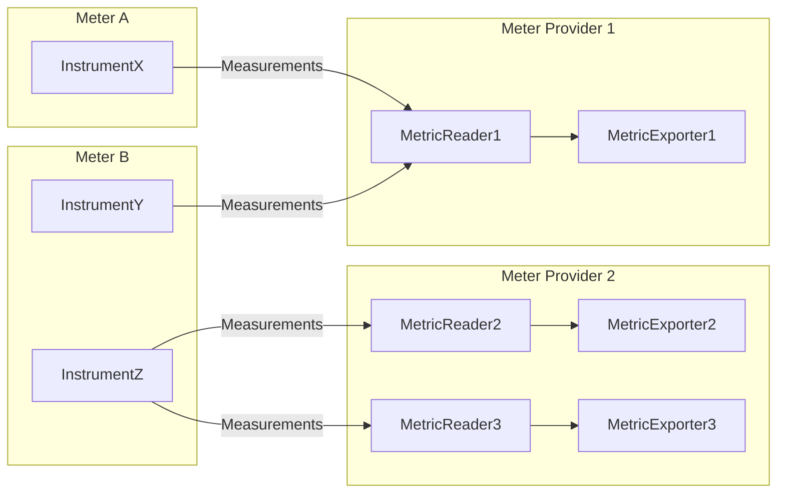
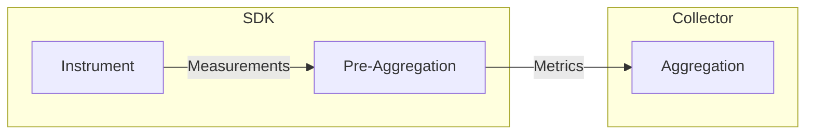
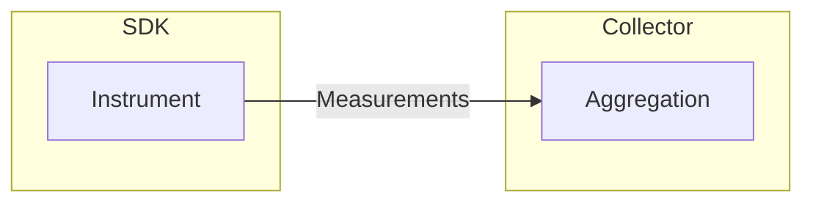

Дотримуйтесь цих найкращих практик, щоб отримати максимальну вигоду від OpenTelemetry .NET для метрик.

## Версія пакунка {#package-version}

Використовуйте [System.Diagnostics.Metrics](https://learn.microsoft.com/dotnet/api/system.diagnostics.metrics) APIs з останньою стабільною версією пакунка [System.Diagnostics.DiagnosticSource](https://www.nuget.org/packages/System.Diagnostics.DiagnosticSource/), незалежно від версії середовища виконання .NET, що використовується:

- Якщо ви використовуєте останню стабільну версію OpenTelemetry .NET SDK, вам не потрібно турбуватися про версію пакунка `System.Diagnostics.DiagnosticSource`, оскільки це вже враховано для вас через залежність пакунка.
- Команда .NET runtime дотримується високих стандартів зворотної сумісності для `System.Diagnostics.DiagnosticSource`, навіть під час великих версій, тому сумісність тут не є проблемою.
- Ознайомтеся з [.NET офіційним документом](https://learn.microsoft.com/dotnet/core/diagnostics/compare-metric-apis#systemdiagnosticsmetrics) для отримання додаткової інформації про `System.Diagnostics.Metrics`.

## Metrics API

### Meter

Уникайте надто частого створення [`System.Diagnostics.Metrics.Meter`](https://learn.microsoft.com/dotnet/api/system.diagnostics.metrics.meter). `Meter` є досить дорогим і призначений для повторного використання в усьому застосунку. Для більшості застосунків його можна моделювати як статичне поле тільки для читання або як синглтон за допомогою введення залежностей.

Використовуйте розділене крапками [UpperCamelCase](https://en.wikipedia.org/wiki/Camel_case) як [`Meter.Name`](https://learn.microsoft.com/dotnet/api/system.diagnostics.metrics.meter.name). У багатьох випадках використання повного імені класу може бути хорошим варіантом. Наприклад:

```csharp
static readonly Meter MyMeter = new("MyCompany.MyProduct.MyLibrary", "1.0");
```

### Інструменти {#instruments}

Зрозумійте та виберіть правильний тип інструмента.

> [!NOTE]
>
> .NET runtime надав кілька типів інструментів на основі [OpenTelemetry Specification](/docs/specs/otel/metrics/api/#instrument). Вибір правильного типу інструмента для вашого випадку використання є критично важливим для забезпечення правильних семантик і продуктивності. Ознайомтеся з розділом [Вибір інструмента](/docs/specs/otel/metrics/supplementary-guidelines#instrument-selection) з додатковими вказівками для отримання додаткової інформації.

| OpenTelemetry Specification                                                            | .NET Instrument Type                                                                                                        |
| -------------------------------------------------------------------------------------- | --------------------------------------------------------------------------------------------------------------------------- |
| [Asynchronous Counter](/docs/specs/otel/metrics/api/#asynchronous-counter)             | [`ObservableCounter<T>`](https://learn.microsoft.com/dotnet/api/system.diagnostics.metrics.observablecounter-1)             |
| [Asynchronous Gauge](/docs/specs/otel/metrics/api/#asynchronous-gauge)                 | [`ObservableGauge<T>`](https://learn.microsoft.com/dotnet/api/system.diagnostics.metrics.observablegauge-1)                 |
| [Asynchronous UpDownCounter](/docs/specs/otel/metrics/api/#asynchronous-updowncounter) | [`ObservableUpDownCounter<T>`](https://learn.microsoft.com/dotnet/api/system.diagnostics.metrics.observableupdowncounter-1) |
| [Counter](/docs/specs/otel/metrics/api/#counter)                                       | [`Counter<T>`](https://learn.microsoft.com/dotnet/api/system.diagnostics.metrics.counter-1)                                 |
| [Gauge](/docs/specs/otel/metrics/api/#gauge)                                           | [`Gauge<T>`](https://learn.microsoft.com/dotnet/api/system.diagnostics.metrics.gauge-1)                                     |
| [Histogram](/docs/specs/otel/metrics/api/#histogram)                                   | [`Histogram<T>`](https://learn.microsoft.com/dotnet/api/system.diagnostics.metrics.histogram-1)                             |
| [UpDownCounter](/docs/specs/otel/metrics/api/#updowncounter)                           | [`UpDownCounter<T>`](https://learn.microsoft.com/dotnet/api/system.diagnostics.metrics.updowncounter-1)                     |

Уникайте надто частого створення інструментів (наприклад, `Counter<T>`). Інструменти є досить дорогими і призначені для повторного використання в усьому застосунку. Для більшості застосунків інструменти можна моделювати як статичні поля, доступні тільки для читання, або як синглтони за допомогою інʼєкції залежностей.

Уникайте недійсних імен інструментів.

> [!NOTE]
>
> OpenTelemetry не збиратиме метрики з інструментів, які використовують недійсні імена. Дізнайтеся про дійсну синтаксичну структуру в [специфікації OpenTelemetry](/docs/specs/otel/metrics/api/#instrument-name-syntax).

Уникайте зміни порядку теґів під час звітування про вимірювання. Наприклад:

> [!WARNING]
>
> Останній рядок коду має погану продуктивність, оскільки теґи не дотримуються однакового порядку:

```csharp
counter.Add(2, new("name", "apple"), new("color", "red"));
counter.Add(3, new("name", "lime"), new("color", "green"));
counter.Add(5, new("name", "lemon"), new("color", "yellow"));
counter.Add(8, new("color", "yellow"), new("name", "lemon")); // bad perf
```

Використовуйте TagList правильно, щоб досягти найкращої продуктивності. Існує два різних способи передачі теґів до API інструменту:

- Передайте теґи безпосередньо в API інструменту:

  ```csharp
  counter.Add(100, new("Key1", "Value1"), new("Key2", "Value2"));
  ```

- Використовуйте [`TagList`](https://learn.microsoft.com/dotnet/api/system.diagnostics.taglist):

  ```csharp
  var tags = new TagList
  {
      { "DimName1", "DimValue1" },
      { "DimName2", "DimValue2" },
      { "DimName3", "DimValue3" },
      { "DimName4", "DimValue4" },
  };

  counter.Add(100, tags);
  ```

Як правило:

- При звітуванні про вимірювання з 3 теґами або менше, передайте теґи безпосередньо в API інструменту.
- При звітуванні про вимірювання з 4 до 8 теґів (включно), використовуйте [`TagList`](https://learn.microsoft.com/dotnet/api/system.diagnostics.taglist?#remarks) щоб уникнути виділення памʼяті, якщо уникнення тиску на GC є основною метою продуктивності. Для коду з високою продуктивністю, який вважає зменшення використання ЦП більш важливим (наприклад, для зменшення затримки, економії батареї тощо), ніж оптимізація виділення памʼяті, використовуйте профайлер і стрес-тест, щоб визначити, який підхід є кращим.
- При звітуванні про вимірювання з більш ніж 8 теґами, два підходи мають дуже схожу продуктивність ЦП і виділення купи. `TagList` рекомендується через його кращу читабельність і зручність підтримання.

> [!NOTE]
>
> При передачі вимірювань з більш ніж 8 теґами API виділяє памʼять на гарячому шляху коду. Ви ПОВИННІ намагатися, щоб кількість теґів була менше або дорівнювала 8. Якщо ви перевищуєте цю кількість, перевірте, чи можна деякі теґи моделювати як ресурс, як [показано тут](#metrics-enrichment).

## Управління MeterProvider {#meterprovider-management}

Уникайте частого створення екземплярів `MeterProvider`. `MeterProvider` є досить дорогим і призначений для повторного використання в усьому застосунку. Для більшості застосунків достатньо одного екземпляра `MeterProvider` на процес. Наприклад:



Керуйте життєвим циклом екземплярів `MeterProvider`, якщо вони створені вами.

Як загальне правило:

- Якщо ви створюєте застосунок з [інʼєкцією залежностей (DI, dependency injection)](https://learn.microsoft.com/dotnet/core/extensions/dependency-injection) (наприклад, [ASP.NET Core](https://learn.microsoft.com/aspnet/core) та [.NET Worker](https://learn.microsoft.com/dotnet/core/extensions/workers)), у більшості випадків ви повинні створити екземпляр `MeterProvider` і дозволити DI керувати його життєвим циклом. Ознайомтеся з [Початком роботи з метриками OpenTelemetry .NET за 5 хвилин — застосунок ASP.NET Core](/docs/languages/dotnet/metrics/getting-started-aspnetcore/) для отримання додаткової інформації.
- Якщо ви створюєте застосунок без DI, створіть екземпляр `MeterProvider` і керуйте життєвим циклом явно. Ознайомтеся з [Початком роботи з метриками OpenTelemetry .NET за 5 хвилин — консольний застосунок](/docs/languages/dotnet/metrics/getting-started-console/) для отримання додаткової інформації.
- Якщо ви забудете звільнити екземпляр `MeterProvider` перед завершенням застосунку, метрики можуть бути втрачені через відсутність належного скидання.
- Якщо ви звільните екземпляр `MeterProvider` занадто рано, будь-які подальші вимірювання не будуть зібрані.

## Управління памʼяттю {#memory-management}

В OpenTelemetry [вимірювання](/docs/specs/otel/metrics/api/#measurement) передаються через API метрик. SDK [агрегує](/docs/specs/otel/metrics/sdk/#aggregation) метрики за допомогою певних алгоритмів і стратегій управління памʼяттю для досягнення високої продуктивності та ефективності. Ось правила, яких дотримується OpenTelemetry .NET під час реалізації логіки агрегації метрик:

1. [**Pre-Aggregation**](#pre-aggregation): агрегація відбувається в межах SDK.
2. [**Обмеження кардинальності**](#cardinality-limits): логіка агрегації враховує [обмеження кардинальності](/docs/specs/otel/metrics/sdk/#cardinality-limits), тому SDK не використовує невизначену кількість памʼяті, коли відбувається вибух кардинальності.
3. [**Попереднє виділення памʼяті**](#memory-preallocation): памʼять, що використовується логікою агрегації, виділяється під час ініціалізації SDK, тому SDK не повинен виділяти памʼять на льоту. Це робиться для уникнення спрацьовування збору сміття в гарячих кодових шляхах.

### Приклад {#example}

Розглянемо наступний приклад:

- Протягом часового інтервалу (T0, T1]:
  - value = 1, name = `apple`, color = `red`
  - value = 2, name = `lemon`, color = `yellow`
- Протягом часового інтервалу (T1, T2]:
  - не було отримано жодного фрукта
- Протягом часового інтервалу (T2, T3]:
  - value = 5, name = `apple`, color = `red`
  - value = 2, name = `apple`, color = `green`
  - value = 4, name = `lemon`, color = `yellow`
  - value = 2, name = `lemon`, color = `yellow`
  - value = 1, name = `lemon`, color = `yellow`
  - value = 3, name = `lemon`, color = `yellow`

Якщо ми агрегуємо та експортуємо метрики за допомогою [Кумулятивної агрегації тимчасовості](/docs/specs/otel/metrics/data-model/#temporality):

- (T0, T1]
  - attributes: {name = `apple`, color = `red`}, count: `1`
  - attributes: {verb = `lemon`, color = `yellow`}, count: `2`
- (T0, T2]
  - attributes: {name = `apple`, color = `red`}, count: `1`
  - attributes: {verb = `lemon`, color = `yellow`}, count: `2`
- (T0, T3]
  - attributes: {name = `apple`, color = `red`}, count: `6`
  - attributes: {name = `apple`, color = `green`}, count: `2`
  - attributes: {verb = `lemon`, color = `yellow`}, count: `12`

Якщо ми агрегуємо та експортуємо метрики за допомогою [Дельта агрегації тимчасовості](/docs/specs/otel/metrics/data-model/#temporality):

- (T0, T1]
  - attributes: {name = `apple`, color = `red`}, count: `1`
  - attributes: {verb = `lemon`, color = `yellow`}, count: `2`
- (T1, T2]
  - nothing since we do not have any measurement received
- (T2, T3]
  - attributes: {name = `apple`, color = `red`}, count: `5`
  - attributes: {name = `apple`, color = `green`}, count: `2`
  - attributes: {verb = `lemon`, color = `yellow`}, count: `10`

### Попередня агрегація {#pre-aggregation}

Розглядаючи [приклад з фруктами](#example), ми бачимо, що під час `(T2, T3]` було зафіксовано 6 вимірювань. Замість того, щоб експортувати кожну окрему подію вимірювання, SDK агрегує їх і експортує лише узагальнені результати. Цей підхід, як показано на наступній діаграмі, називається попередньою агрегацією:



Попереднє агрегування має кілька переваг:

1. Хоча обсяг обчислень залишається незмінним, обсяг переданих даних може бути значно зменшено за допомогою попереднього агрегування, що покращує загальну ефективність.
2. Попереднє агрегування дозволяє застосовувати [обмеження кардинальності](#cardinality-limits) під час ініціалізації SDK, в поєднанні з [попереднім виділенням памʼяті](#memory-preallocation), вони роблять поведінку збору метрик більш передбачуваною (наприклад, сервер під атакою відмови в обслуговуванні все ще надаватиме постійний обсяг метрик, а не затоплюватиме систему спостереження великим обсягом подій вимірювання).

Є випадки, коли користувачі можуть захотіти експортувати необроблені події вимірювання замість використання попереднього агрегування, як показано на наступній діаграмі. OpenTelemetry наразі не підтримує цей сценарій, якщо вас це цікавить, будь ласка, приєднайтеся до обговорення, відповівши на цей [запит на функцію](https://github.com/open-telemetry/opentelemetry-specification/issues/617).



### Обмеження кардинальності {#cardinality-limits}

Кількість унікальних комбінацій атрибутів називається кардинальністю. Якщо взяти [приклад з фруктами](#example) і знати, що ми можемо мати тільки яблука/лимони як назву та червоний/жовтий/зелений як колір, то можна сказати, що кардинальність дорівнює 6. Незалежно від того, скільки яблук і лимонів ми маємо, ми завжди можемо використовувати наступну таблицю, щоб підсумувати загальну кількість фруктів за назвою та кольором.

| Назва | Колір  | Кількість |
| ----- | ------ | --------- |
| apple | red    | 6         |
| apple | yellow | 0         |
| apple | green  | 2         |
| lemon | red    | 0         |
| lemon | yellow | 12        |
| lemon | green  | 0         |

Іншими словами, нам відомо, скільки памʼяті та мережі потрібно для збору та передачі цих метрик, незалежно від шаблону трафіку.

У реальних застосунках кардинальність може бути надзвичайно високою. Уявіть, якщо у нас є довготривала служба, і ми збираємо метрики з 7 атрибутами, і кожен атрибут може мати 30 різних значень. Врешті-решт, нам, можливо, доведеться запамʼятати повний набір усіх 21,870,000,000 комбінацій! Цей вибух кардинальності є добре відомою проблемою в області метрик. Наприклад, це може призвести до несподівано високих витрат у системі спостереження або навіть бути використано хакерами для запуску атаки відмови в обслуговуванні.

[Обмеження кардинальності](/docs/specs/otel/metrics/sdk/#cardinality-limits) — це механізм обмеження, який дозволяє системі збору метрик працювати передбачувано та надійно у разі надмірної кардинальності, незалежно від того, чи це сталося внаслідок зловмисної атаки, чи через помилки розробника під час написання коду.

OpenTelemetry має стандартне обмеження кардинальності `2000` на метрику. Це обмеження можна налаштувати на рівні окремої метрики за допомогою [View API](/docs/specs/otel/metrics/sdk/#view) та параметра `MetricStreamConfiguration.CardinalityLimit`.

Станом на `1.10.0`, як тільки метрика досягне обмеження кардинальності, будь-яке нове вимірювання, яке не може бути незалежно агреговане, буде автоматично агреговане за допомогою [атрибута переповнення](/docs/specs/otel/metrics/sdk/#overflow-attribute).

> [!NOTE]
>
> У версіях SDK `1.6.0` — `1.9.0` атрибут переповнення був експериментальною функцією, яку можна було активувати, встановивши змінну середовища `OTEL_DOTNET_EXPERIMENTAL_METRICS_EMIT_OVERFLOW_ATTRIBUTE=true`.

Станом на `1.10.0`, коли використовується [тимчасовість агрегації дельти](/docs/specs/otel/metrics/data-model/#temporality), можна вибрати менше обмеження кардинальності, оскільки SDK відновить невикористані точки метрик.

> [!NOTE]
>
> У версіях SDK `1.7.0` — `1.9.0`, відновлення точок метрик було експериментальною функцією, яку можна було активувати, встановивши змінну середовища `OTEL_DOTNET_EXPERIMENTAL_METRICS_RECLAIM_UNUSED_METRIC_POINTS=true`.

### Попереднє виділення памʼяті {#memory-preallocation}

OpenTelemetry .NET SDK має на меті уникнути виділення памʼяті в гарячих кодових шляхах. Коли це поєднується з [правильним використанням Metrics API](#metrics-api), можна уникнути виділення памʼяті в купі в гарячих кодових шляхах.

Вам слід вимірювати виділення памʼяті в гарячих кодових шляхах і, ідеально, уникати будь-якого виділення памʼяті в купі під час використання API та SDK метрик, особливо коли ви використовуєте метрики для вимірювання продуктивності вашого застосунку (наприклад, ви не хочете витрачати 2 секунди на [збирання сміття](https://learn.microsoft.com/dotnet/standard/garbage-collection/) під час вимірювання операції, яка зазвичай займає 10 мілісекунд).

## Кореляція метрик {#metrics-correlation}

В OpenTelemetry метрики можуть бути повʼязані з [трейсами](/docs/languages/dotnet/traces/) через [екземпляри](/docs/specs/otel/metrics/sdk/#exemplar). Перегляньте [Екземпляри](/docs/languages/dotnet/metrics/exemplars/) для отримання додаткової інформації.

## Збагачення метрик {#metrics-enrichment}

Коли метрики збираються, вони зазвичай зберігаються в [базі даних часових рядів](https://en.wikipedia.org/wiki/Time_series_database). З точки зору зберігання та споживання метрики можуть бути багатовимірними. Взявши приклад з [фруктами](#example), ми маємо два вимірювання — "назва" та "колір". Для базових сценаріїв всі вимірювання можуть бути повідомлені під час виклику [Metrics API](#metrics-api), однак для менш тривіальних сценаріїв вимірювання можуть надходити з різних джерел:

- [Вимірювання](/docs/specs/otel/metrics/api/#measurement) повідомляються через [Metrics API](#metrics-api).
- Додаткові теґи, надані під час створення інструмента. Наприклад, перевантаження [`Meter.CreateCounter<T>(name, unit, description, tags)`](https://learn.microsoft.com/dotnet/api/system.diagnostics.metrics.meter.createcounter).
- Додаткові теґи, надані під час створення вимірювача. Наприклад, перевантаження [`Meter(name, version, tags, scope)`](https://learn.microsoft.com/dotnet/api/system.diagnostics.metrics.meter.-ctor).
- [Ресурси](/docs/specs/otel/resource/sdk), налаштовані на рівні `MeterProvider`.
- Додаткові атрибути, надані експортером або колектором. Наприклад, [роботи та екземпляри](https://prometheus.io/docs/concepts/jobs_instances/) у Prometheus.

> [!NOTE]
>
> Підтримка теґів рівня інструменту ще не реалізована в OpenTelemetry .NET, оскільки [специфікація OpenTelemetry](/docs/specs/otel/metrics/api/#instrument) її не підтримує.

Як правило:

- Якщо вимірювання є статичним протягом усього життєвого циклу процесу (наприклад, імʼя машини, дата-центр):
  - Якщо вимірювання застосовується до всіх метрик, змоделюйте його як ресурс, або ще краще, дозвольте колектору додати ці вимірювання, якщо це можливо (наприклад, колектор, що працює в тому ж дата-центрі, повинен знати імʼя дата-центру, а не покладатися на кожен екземпляр служби для звітування про імʼя дата-центру).
  - Якщо вимірювання застосовується до підмножини метрик (наприклад, версія клієнтської бібліотеки), змоделюйте його як теґи рівня вимірювача.
- Якщо значення вимірювання є динамічним, звітуйте про нього через [Metrics API](#metrics-api).

> [!NOTE]
>
> Відбулися дискусії щодо додавання нової концепції під назвою «MeasurementProcessor», яка дозволяє динамічно додавати/видаляти виміри з вимірювань. Ця ідея не отримала підтримки через складність та наслідки для продуктивності. Більш детальну інформацію можна знайти в цьому [PR #1938](https://github.com/open-telemetry/opentelemetry-specification/pull/1938).

## Загальні проблеми, які призводять до відсутності метрик {#common-issues-that-lead-to-missing-metrics}

- `Meter`, що використовується для створення інструментів, не додано до `MeterProvider`. Використовуйте метод `AddMeter`, щоб увімкнути обробку для потрібних метрик.
