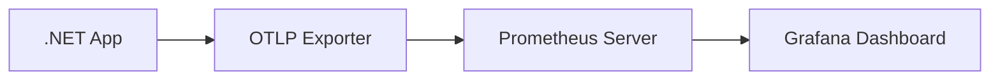

Цей посібник покаже вам, як експортувати метрики OpenTelemetry до Prometheus і візуалізувати їх у Grafana.

## Попередні вимоги {#prerequisites}

- [.NET SDK](https://dotnet.microsoft.com/download) встановлений на вашому компʼютері
- [Prometheus](https://prometheus.io/download/) завантажений (ми розглянемо установку)
- [Grafana](https://grafana.com/docs/grafana/latest/installation/) завантажений (ми розглянемо установку)

## Створення .NET застосунку з OTLP експортом {#creating-a-net-application-with-otlp-export}

Спочатку дотримуйтесь [Початок роботи з Console](/docs/languages/dotnet/metrics/getting-started-console/) посібника, щоб зрозуміти основи збору метрик.

Створіть новий консольний застосунок:

```shell
dotnet new console --output getting-started-prometheus-grafana
cd getting-started-prometheus-grafana
```

Встановіть пакунок OpenTelemetry OTLP Exporter:

```shell
dotnet add package OpenTelemetry.Exporter.OpenTelemetryProtocol
```

Оновіть файл `Program.cs` наступним кодом:

```csharp
using System;
using System.Diagnostics.Metrics;
using System.Threading;
using OpenTelemetry;
using OpenTelemetry.Exporter;
using OpenTelemetry.Metrics;

// Визначте вимірювач
var myMeter = new Meter("MyCompany.MyProduct.MyLibrary", "1.0");

// Створіть лічильник
var myFruitCounter = myMeter.CreateCounter<long>("MyFruitCounter");

// Налаштуйте OpenTelemetry MeterProvider з OTLP експортом
using var meterProvider = Sdk.CreateMeterProviderBuilder()
    .AddMeter("MyCompany.MyProduct.MyLibrary")
    .AddOtlpExporter((exporterOptions, metricReaderOptions) =>
    {
        exporterOptions.Endpoint = new Uri("http://localhost:9090/api/v1/otlp/v1/metrics");
        exporterOptions.Protocol = OtlpExportProtocol.HttpProtobuf;
        metricReaderOptions.PeriodicExportingMetricReaderOptions.ExportIntervalMilliseconds = 1000;
    })
    .Build();

Console.WriteLine("Press any key to exit");

// Продовжуйте генерувати метрики, поки користувач не натисне клавішу
while (!Console.KeyAvailable)
{
    myFruitCounter.Add(1, new("name", "apple"), new("color", "red"));
    myFruitCounter.Add(2, new("name", "lemon"), new("color", "yellow"));
    myFruitCounter.Add(1, new("name", "lemon"), new("color", "yellow"));
    myFruitCounter.Add(2, new("name", "apple"), new("color", "green"));
    myFruitCounter.Add(5, new("name", "apple"), new("color", "red"));
    myFruitCounter.Add(4, new("name", "lemon"), new("color", "yellow"));

    Thread.Sleep(300);
}

// Видаліть постачальника метрик перед завершенням роботи застосунку.
// Це призведе до очищення залишкових метрик і вимкнення конвеєра метрик.
meterProvider.Dispose();
```

Коли ви запустите цей застосунок, він спробує експортувати метрики до Prometheus за адресою `http://localhost:9090/api/v1/otlp/v1/metrics`. Спочатку це не вдасться, оскільки ми ще не налаштували Prometheus, що ми зробимо далі.

## Налаштування Prometheus {#setting-up-prometheus}

Prometheus — це система моніторингу та оповіщення з відкритим вихідним кодом, яка може збирати та зберігати метрики.

### Встановлення та запуск Prometheus {#installing-and-running-prometheus}

1. Завантажте Prometheus з [офіційного сайту](https://prometheus.io/download/)
2. Розпакуйте його в будь-яке місце на вашому компʼютері
3. Запустіть Prometheus з увімкненим приймачем OTLP:

```shell
./prometheus --web.enable-otlp-receiver
```

> [!NOTE]
>
> Прапорець `--web.enable-otlp-receiver` дозволяє Prometheus отримувати метрики використовуючи OpenTelemetry Protocol (OTLP).

### Перегляд метрик у Prometheus {#viewing-metrics-in-prometheus}

1. Запустіть свій .NET застосунок (тепер він повинен успішно експортувати метрики до Prometheus)
2. Відкрийте вебоглядач і перейдіть за адресою [http://localhost:9090/graph](http://localhost:9090/graph)
3. У рядку запиту введіть `MyFruitCounter_total` і натисніть Виконати

Ви повинні побачити графік, що показує зростання значень лічильника для кожної комбінації назви фрукта та кольору.

## Налаштування Grafana {#setting-up-grafana}

Grafana надає більш потужні можливості візуалізації, ніж базовий інтерфейс Prometheus.

### Встановлення та запуск Grafana {#installing-and-running-grafana}

1. Встановіть Grafana, дотримуючись [офіційних інструкцій](https://grafana.com/docs/grafana/latest/installation/)
2. Запустіть сервер Grafana (команда відрізняється залежно від ОС)
3. Відкрийте [http://localhost:3000](http://localhost:3000) у вашому вебоглядачі
4. Увійдіть за допомогою облікових типових даних (імʼя користувача: `admin`, пароль: `admin`) та встановіть новий пароль, коли буде запропоновано

### Налаштування Prometheus як джерела даних {#configuring-prometheus-as-a-data-source}

1. У Grafana наведіть курсор на значок Налаштування (шестірня) у лівій бічній панелі та натисніть "Джерела даних"
2. Натисніть "Додати джерело даних"
3. Виберіть "Prometheus"
4. Встановіть URL на `http://localhost:9090`
5. Натисніть "Зберегти та протестувати" внизу

### Налаштування інформаційної панелі {#creating-a-dashboard}

1. Натисніть значок "+" у лівій бічній панелі та виберіть "Інформаційна панель" (dashboard)
2. Натисніть "Додати нову панель"
3. У редакторі запитів введіть запит PromQL, наприклад `rate(MyFruitCounter_total[5m])`, щоб побачити швидкість збільшення за секунду за останні 5 хвилин
4. Натисніть "Застосувати", щоб додати панель до вашої інформаційної панелі
5. Збережіть свою інформаційну панель, натиснувши значок збереження у верхньому правому куті

## Розуміння потоку метрик {#understanding-the-metrics-flow}



1. Ваш застосунок .NET збирає метрики за допомогою інструментів OpenTelemetry.
2. OTLP Exporter надсилає ці метрики до Prometheus за допомогою протоколу OTLP.
3. Prometheus зберігає метрики у своїй базі даних часових рядів.
4. Grafana запитує Prometheus і візуалізує метрики в інформаційних панелях.

## Дізнатися більше {#learn-more}

- [Документація Prometheus](https://prometheus.io/docs/introduction/overview/)
- [Документація Grafana](https://grafana.com/docs/grafana/latest/)
- [Шпаргалка PromQL](https://promlabs.com/promql-cheat-sheet/)
- [Специфікація OpenTelemetry Protocol (OTLP)](/docs/specs/otel/protocol/otlp/)
