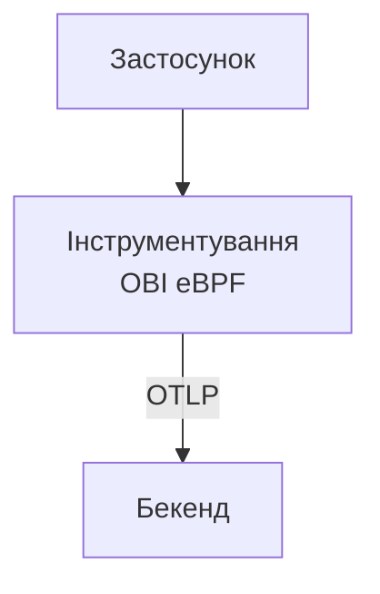
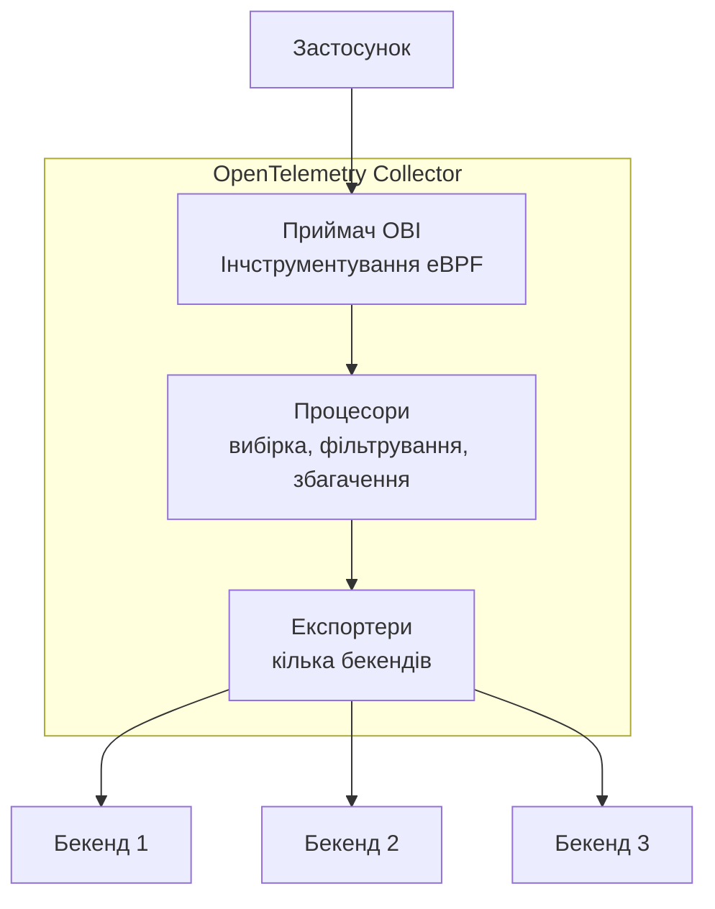

Починаючи з версії v0.5.0, OBI може працювати як компонент-приймач у рамках [OpenTelemetry Collector](/docs/collector). Ця інтеграція дозволяє використовувати потужний конвеєр обробки Collector, одночасно користуючись перевагами інструментування eBPF OBI без коду.

## Огляд {#overview}

Використання OBI як приймача Collector поєднує переваги обох інструментів:

**Від OBI**:

- Інструментування без коду з використанням eBPF
- Автоматичне виявлення сервісів
- Низькі накладні витрати на спостереження

**Від OpenTelemetry Collector**:

- Уніфікований конвеєр телеметрії
- Різноманітні процесори (вибірка, фільтрування, перетворення)
- Кілька експортерів (бекенди, формати)
- Централізована конфігурація

## Коли використовувати режим приймача колектора {#when-to-use-collector-receiver-mode}

### Приклади ефективного використання {#good-use-cases}

- **Централізована обробка**: ви хочете, щоб усі телеметричні дані проходили через єдиний конвеєр
- **Складна обробка**: потрібні розширені функції вибірки, фільтрування або збагачення, які надає колектор
- **Кілька бекендів**: надсилання даних на кілька платформ спостереження
- **Вимоги до відповідності**: необхідна обробка телеметрії для редагування даних або видалення PII
- **Спрощене розгортання**: єдиний бінарний файл замість окремих процесів OBI + Collector

### Коли використовувати замість цього окремий OBI {#when-to-use-standalone-obi-instead}

- **Прості розгортання**: достатньо прямого експорту до одного бекенду
- **Edge середовища**: обмежені ресурси, де запуск повного Collector є занадто важким
- **Тестування/розробка**: швидке налаштування без конфігурації Collector

## Порівняння архітектури {#architecture-comparison}

### Автономний OBI {#standalone-obi}



### OBI як приймач колектора {#obi-as-collector-receiver}



## Конфігурація {#configuration}

### Створення власного колектора з приймачем OBI {#build-a-custom-collector-with-obi-receiver}

Для використання OBI як приймача колектора вам потрібно створити власний бінарний файл колектора, який включає компонент приймача OBI. Це робиться за допомогою [OpenTelemetry Collector Builder (OCB)](/docs/collector/extend/ocb/), інструменту, який генерує власний бінарний файл колектора з вашими вказаними компонентами. Якщо у вас не встановлено OCB, див. [інструкції з встановлення](/docs/collector/extend/ocb/#install-the-opentelemetry-collector-builder).

**Вимоги:**

- [Go](https://go.dev) 1.25 чи новіше
- [OCB](/docs/collector/extend/ocb/) встановлено і він доступний у вашій змінній PATH
- Локальна копія репозиторію [OpenTelemetry eBPF Instrumentation](https://github.com/open-telemetry/opentelemetry-ebpf-instrumentation) версії v0.6.0 чи новіше
- [Docker](https://docs.docker.com/get-started/get-docker/) (для створення файлів eBPF) або компілятор C, clang, та заголовки eBPF

**Кроки створення:**

1. Згенеруйте файли eBPF у вашій локальній теці з сирцями OBI:

   ```shell
   cd /path/to/obi
   make docker-generate
   # або, якщо у вас встановлено локально build tools:
   # make generate
   ```

   Цей крок має бути виконаний перед збіркою за допомогою `ocb`. Він генерує необхідні типи привʼязок eBPF, які потрібні приймачу OBI.

2. Створіть `builder-config.yaml`:

   ```yaml
   dist:
     name: otelcol-obi
     description: OpenTelemetry Collector with OBI receiver
     output_path: ./dist

   exporters:
     - gomod: go.opentelemetry.io/collector/exporter/debugexporter v0.142.0
     - gomod: go.opentelemetry.io/collector/exporter/otlpexporter v0.142.0

   processors:
     - gomod: go.opentelemetry.io/collector/processor/batchprocessor v0.142.0

   receivers:
     - gomod: go.opentelemetry.io/obi v0.6.0
       import: go.opentelemetry.io/obi/collector

   providers:
     - gomod: go.opentelemetry.io/collector/confmap/provider/envprovider v1.18.0
     - gomod: go.opentelemetry.io/collector/confmap/provider/fileprovider v1.18.0
     - gomod: go.opentelemetry.io/collector/confmap/provider/httpprovider v1.18.0
     - gomod: go.opentelemetry.io/collector/confmap/provider/httpsprovider v1.18.0
     - gomod: go.opentelemetry.io/collector/confmap/provider/yamlprovider v1.18.0

   replaces:
     - go.opentelemetry.io/obi => /path/to/obi
   ```

   Замініть `/path/to/obi` на відповідний шлях до теки де знаходяться ваші сирці OBI. Секція `replaces:` говорить `ocb` що потрібно використовувати локальні сирці OBI замість того щоб викачувати їх з загального публічного репо, що є потрібним оскільки опублікований моду OBI не включає згенерований код BPF.

   **Вибір версії**: Вам треба вказати версію для кожного компонента. В нашому прикладі вище використовуються версії що є сумісними з OBI v0.6.0. Якщо ви використовуєте іншу версію OBI або бажаєте використовувати новіші версії компонентів, перевірте файл `go.mod` у вашому репозиторії OBI, щоб побачити, від яких версій компонентів колектора він залежить, а потім оновіть версії у вашому конфігураційному файлі builder відповідно.

3. Зберіть власний Collector:

   ```shell
   ocb --config builder-config.yaml
   ```

   Скомпільований двійковий файл буде знаходитись у `./dist/otelcol-obi`.

### Конфігурація колектора з приймачем OBI {#collector-configuration-with-obi-receiver}

Створіть конфігурацію OpenTelemetry Collector, що включає приймач OBI:

```yaml
# collector-config.yaml
receivers:
  # Приймач OBI для інструментування eBPF
  obi:
    # Слухати порт 9999 для інструментування HTTP трафіку
    open_port: '9999'

    # Вмикає збір метрік обʼєктів мережі та застосунка
    meter_provider:
      features: [network, application]

    # Опціонально: конфігурація виявлення Сервісів
    # discovery:
    #   poll_interval: 30s

processors:
  # Пакетна обробка телеметрії для покращення ефективності
  batch:
    timeout: 1s
    send_batch_size: 1024

exporters:
  # Локальний експорт трейсів для відлагодження
  debug:
    verbosity: detailed

  # Експорт до загального бекенду OTLP
  otlp:
    endpoint: https://backend.example.com:4317
    headers:
      api-key: ${env:OTLP_API_KEY}

service:
  pipelines:
    # Конвеєр трейсів з інструментуваннями OBI
    traces:
      receivers: [obi]
      processors: [batch]
      exporters: [debug, otlp]

    # Конвеєр метрік
    metrics:
      receivers: [obi]
      processors: [batch]
      exporters: [debug, otlp]
```

### Запуск колектора {#run-the-collector}

```shell
sudo ./otelcol-obi --config collector-config.yaml
```

OBI вимагає розширених привілеїв для інструментування процесів з використанням eBPF. Колектор потрібно запускати через `sudo` або мати відповідні Linux capabilities (CAP_SYS_ADMIN, CAP_DAC_READ_SEARCH, CAP_NET_RAW, CAP_SYS_PTRACE, CAP_PERFMON, CAP_BPF) для:

- Приєднання проб eBPF до процесів, що працюють
- Доступу до памʼяті процесів та системної інформації
- Встановлення блокування памʼяті для програм eBPF
- Захоплення мережевої телеметрії та телеметрії застосунків

Без цих дозволів OBI не зможе інструментувати процеси та зазнає збою під час запуску.

## Порівняння функцій: Режим приймача та самостійна робота {#feature-comparison-receiver-mode-vs-standalone}

| Функція                  | Самостійний OBI | OBI як приймач        |
| ------------------------ | --------------- | --------------------- |
| eBPF instrumentation     | ✅ Yes          | ✅ Yes                |
| Service discovery        | ✅ Yes          | ✅ Yes                |
| Traces collection        | ✅ Yes          | ✅ Yes                |
| Metrics collection       | ✅ Yes          | ✅ Yes                |
| JSON log enrichment      | ✅ Yes          | ✅ Yes                |
| Direct OTLP export       | ✅ Yes          | ❌ No (via Collector) |
| Collector processors     | ❌ No           | ✅ Yes                |
| Multiple exporters       | ⚠️ Limited      | ✅ Full support       |
| Tail sampling for traces | ❌ No           | ✅ Yes                |
| Data transformation      | ⚠️ Basic        | ✅ Advanced           |
| Resource overhead        | Lower           | Moderate              |
| Configuration complexity | Simple          | More complex          |
| Single binary deployment | ✅ Yes          | ✅ Yes                |

## Розширені налаштування {#advanced-configurations}

### Розгортання Kubernetes DaemonSet з кількома просторами імен {#multi-namespace-kubernetes-daemonset-deployment}

Для розгортання Колектора з приймачем OBI на кожному вузлі, вам потрібно додати власний двійковий файл колектора до образу контейнера:

1. Створіть `Dockerfile`:

   ```dockerfile
   FROM alpine:latest

   # Встановлення потрібних інструментів
   RUN apk --no-cache add ca-certificates

   # Копіюємо власний двійковий файл колектора, створений за допомогою OCB
   COPY dist/otelcol-obi /otelcol-obi

   # Даємо права на виконання
   RUN chmod +x /otelcol-obi

   ENTRYPOINT ["/otelcol-obi"]
   ```

2. Створюємо та публікуємо образ:

   ```shell
   docker build -t my-registry/otelcol-obi:v0.6.0 .
   docker push my-registry/otelcol-obi:v0.6.0
   ```

3. Розгортаємо DaemonSet:

   ```yaml
   # otel-collector-daemonset.yaml
   apiVersion: apps/v1
   kind: DaemonSet
   metadata:
     name: otel-collector-obi
     namespace: monitoring
   spec:
     selector:
       matchLabels:
         app: otel-collector-obi
     template:
       metadata:
         labels:
           app: otel-collector-obi
       spec:
         hostNetwork: true
         hostPID: true
         containers:
           - name: otel-collector
             image: my-registry/otelcol-obi:v0.6.0
             args:
               - --config=/conf/collector-config.yaml
             securityContext:
               privileged: true
               capabilities:
                 add:
                   - SYS_ADMIN
                   - SYS_PTRACE
                   - NET_RAW
                   - DAC_READ_SEARCH
                   - PERFMON
                   - BPF
                   - CHECKPOINT_RESTORE
             volumeMounts:
               - name: config
                 mountPath: /conf
               - name: sys
                 mountPath: /sys
                 readOnly: true
               - name: proc
                 mountPath: /host/proc
                 readOnly: true
             resources:
               limits:
                 memory: 1Gi
                 cpu: '1'
               requests:
                 memory: 512Mi
                 cpu: 500m
         volumes:
           - name: config
             configMap:
               name: otel-collector-config
           - name: sys
             hostPath:
               path: /sys
           - name: proc
             hostPath:
               path: /proc
   ```

### Прибираємо чутливі дані {#filtering-sensitive-data}

Для використання цієї конфігурації вам потрібно додати процесори `attributes` та `filter` до вашого `builder-config.yaml`:

```yaml
processors:
  - gomod:
      github.com/open-telemetry/opentelemetry-collector-contrib/processor/attributesprocessor
      v0.142.0
  - gomod:
      github.com/open-telemetry/opentelemetry-collector-contrib/processor/filterprocessor
      v0.142.0
```

Далі використовувати процесори Колектора для прибирання чутливих даних перед експортом:

```yaml
receivers:
  obi:
    discovery:
      poll_interval: 30s

processors:
  batch:
    timeout: 1s
    send_batch_size: 1024

  # Прибираємо чутливі дані
  attributes:
    actions:
      - key: http.url
        action: delete
      - key: user.email
        action: delete
      - key: credit_card
        pattern: \d{4}[- ]?\d{4}[- ]?\d{4}[- ]?\d{4}
        action: hash

  # Видаляємо відрізки з чутливими операціями
  filter:
    traces:
      span:
        - attributes["operation"] == "process_payment"
        - attributes["internal"] == true

exporters:
  debug:
    verbosity: detailed

  # Експорт до бекенду OTLP
  otlp:
    endpoint: backend.example.com:4317

service:
  pipelines:
    traces:
      receivers: [obi]
      processors: [attributes, filter, batch]
      exporters: [debug, otlp]
```

### Вибірка наприкінці {#tail-based-sampling}

Реалізуйте інтелектуальну вибірку за допомогою Колектора. Цей приклад вимагає процесора `tail_sampling` з contrib. Додайте його до вашого `builder-config.yaml`:

```yaml
processors:
  - gomod:
      github.com/open-telemetry/opentelemetry-collector-contrib/processor/tailsamplingprocessor
      v0.142.0
```

Приклад налаштувань:

```yaml
receivers:
  obi:
    open_port: '9999'

processors:
  batch:
    timeout: 1s
    send_batch_size: 1024

  # Вибірка на прикінці залишає:
  # - Всі трасування з помилками
  # - Повільні трасування (> 1s)
  # - 5% успішних швидких трасувань
  tail_sampling:
    policies:
      - name: errors
        type: status_code
        status_code:
          status_codes: [ERROR]
      - name: slow_traces
        type: latency
        latency:
          threshold_ms: 1000
      - name: sample_success
        type: probabilistic
        probabilistic:
          sampling_percentage: 5

exporters:
  debug:
    verbosity: detailed

  otlp:
    endpoint: backend.example.com:4317

service:
  pipelines:
    traces:
      receivers: [obi]
      processors: [tail_sampling, batch]
      exporters: [debug, otlp]
```

## Зауваження щодо продуктивності {#performance-considerations}

### Використання ресурсів {#resource-usage}

Використання ресурсів для OBI як приймача Collector значно варіюється в залежності від:

- **Обсягу телеметрії**: кількості інструментованих сервісів та кількості запитів
- **Складності конвеєра**: кількості та типу налаштованих процесорів
- **Налаштувань експортерів**: розміру пакетів, глибини запитів та кількості бекендів
- **Обсягу виявлення сервісів**: кількості процесів робота яких відстежується

Так само як і [самостійний OBI](/docs/zero-code/obi/), інструментування eBPF забезпечує [мінімальні накладні витрати](/docs/zero-code/obi/#requirements). Конвеєр Колектора додає додаткові вимоги до ресурсів, які залежать від вашої конфігурації.

**Рекомендації**:

- Почніть з обмеження ресурсів як в [прикладі розгортання Kubernetes](#multi-namespace-kubernetes-daemonset-deployment) та підлаштуйте їх на основі ваших спостережень
- Увімкніть [самомоніторинг Колектора](#optimization-tips) для відстеження реального споживання ресурсів
- Використовуйте [опції налаштування продуктивності](/docs/zero-code/obi/configure/tune-performance/) для оптимізації компонента OBI eBPF
- Відстежуйте використання памʼяті та CPU в промисловому використані та коригуйте запити/обмеження ресурсів відповідно

### Поради з оптимізації {#optimization-tips}

1. **Використовуйте процесор пакетної обробки**: завжди додавайте процесор пакетної обробки для зменшення накладних витрат на експорт
2. **Обмежте кількість процесорів конвеєра**: кожен процесор додає затримку та використання CPU

3. **Налаштовуйте буферизацію**: підлаштовуйте розмір черги для великих середовищ:

   ```yaml
   exporters:
     otlp:
       sending_queue:
         enabled: true
         num_consumers: 10
         queue_size: 5000
   ```

4. **Стежте за метриками Колектора**: вмикає самомоніторинг Колектора:

   ```yaml
   service:
     telemetry:
       metrics:
         address: :8888
   ```

## Обмеженнях {#limitations}

- **Тільки один вузол**: приймач OBI інструментує лише локальні процеси (на тому вузлі де працює Колектор)
- **Потрібен привілейований доступ**: колектор має запускатись з можливостями eBPF
- **Працює тільки на Linux**: eBPF існує тільки для Linux; Windows та macOS не підтримуються
- **Перезапуск Колектора**: зміни в налаштуваннях OBI вимагають перезапуску Колектора

## Розвʼязання проблем {#troubleshooting}

### Проблеми збірки {#build-issues}

#### Помилка: "API incompatibility" або "unknown revision" {#error-api-incompatibility-or-unknown-revision-errors}

Якщо ви зіткнулись з помилкою несумісності API або помилкою "unknown revision" під час збирання Колектора:

1. Переконайтесь, що сирці в теці OBI є свіжими:

   ```shell
   cd /path/to/obi
   git pull origin main  # або ваша гілка
   ```

2. Переконайтесь, що ви не встановили конкретні версії для компонентів колектора в конфігурації збирання, або що вони відповідають версіям вказаним у файлі `go.mod` для OBI.

3. Перевірте ваш файл `go.mod` OBI, щоб дізнатись від яких версій компонентів він залежить:

   ```shell
   grep "go.opentelemetry.io/collector" go.mod
   ```

   Після чого вкажіть тіж самі версії у файлі `builder-config.yaml` для інших компонентів.

### Помилки під час запуску {#runtime-issues}

#### Помилка: "Required system capabilities not present" або "operation not permitted" {#error-required-system-capabilities-not-present-or-operation-not-permitted}

OBI вимагає підвищених привілеїв для роботи. У вас є два варіанти:

##### Варіант 1: Запуск з sudo (найпростіший) {#option-1-run-with-sudo-simplest}

```shell
sudo ./otelcol-obi --config collector-config.yaml
```

##### Варіант 2: Наданні можливостей (capabilities) (більш безпечно){#option-2-grant-capabilities-to-the-binary-more-secure}

Використовуйте `setcap` для використання тільки потрібних можливостей:

```shell
sudo setcap cap_sys_admin,cap_sys_ptrace,cap_dac_read_search,cap_net_raw,cap_perfmon,cap_bpf,cap_checkpoint_restore=ep ./otelcol-obi
```

Після чого виконайте запуск без використання sudo:

```shell
./otelcol-obi --config collector-config.yaml
```

Перевірте, що можливості були надані:

```shell
getcap ./otelcol-obi
```

**В Kubernetes:**

Переконайтесь що контекст безпеки Пода має відповідні можливості Linux:

```yaml
securityContext:
  capabilities:
    add:
      - SYS_ADMIN
      - SYS_PTRACE
      - BPF
      - NET_RAW
      - CHECKPOINT_RESTORE
      - DAC_READ_SEARCH
      - PERFMON
```

#### Помилка: "failed to create OBI receiver: permission denied" {#error-failed-to-create-obi-receiver-permission-denied}

Ця означає, що у Колектора немає необхідних можливостей. Переконайтесь, що ви запускаєте його з `sudo` або з правильним контекстом безпеки Kubernetes, показаним вище.

#### Відсутність телеметрії від інструментованих застосунків {#no-telemetry-from-instrumented-apps}

1. Перевірте налаштування приймача OBI:

   ```yaml
   receivers:
     obi:
       discovery:
         poll_interval: 30s
       instrument:
         - exe_path: /path/to/app # чи є цей шлях коректним
   ```

2. Перевірте виявлення сервісів в логах Колектора:

   ```shell
   grep "discovered service" collector.log
   ```

3. Переконайтесь, що eBPF програми завантажуються з використанням [bpftool](https://github.com/libbpf/bpftool):

   ```shell
   # В контейнері Колектора
   bpftool prog show
   ```

#### Значне споживання памʼяті {#high-memory-usage}

**Причина**: Велика кількість телеметрії чи інструментовано забагато процесів

**Вирішення**:

1. **Встановіть потрібний розмір пакетної обробки** для зменшення накладних витрат на пересилання даних:

   ```yaml
   processors:
     batch:
       timeout: 200ms
       send_batch_size: 512
       send_batch_max_size: 1024
   ```

2. **Будьте більш вибірковими з інструментуванням** - інструментуйте обмежену кількість сервісів за допомогою OBI:

   ```yaml
   receivers:
     obi:
       instrument:
         targets:
           - service_name: 'web-app'
           - service_name: 'api-service'
   ```

   Це допоможе зменшити обсяг телеметрії тільки вказаними сервісами замість всіх процесів.

## Міграція з самостійного OBI {#migration-from-standalone-obi}

### Крок 1: Створення власного Колектора{#step-1-build-custom-collector}

Дивіться розділ [конфігурація](#configuration) для побудови Колектора з приймачем OBI.

### Крок 2: Конвертація конфігурації OBI {#step-2-convert-obi-config}

Перетворіть вашу конфігурацію самостійного OBI в формат Колектора:

**Самостійний OBI**:

```yaml
# obi-config.yaml
otel_traces_export:
  endpoint: http://backend:4318

open_port: 8080
```

**Колектор з приймачем OBI**:

```yaml
# collector-config.yaml
receivers:
  obi:
    instrument:
      - open_port: 8080

exporters:
  otlp:
    endpoint: backend:4317

service:
  pipelines:
    traces:
      receivers: [obi]
      processors: [batch]
      exporters: [otlp]
```

### Крок 3: Розгортання та перевірка {#step-3-deploy-and-verify}

1. Зупиніть самостійний OBI
2. Запустіть Колектор з приймачем OBI
3. Перевірте потік телеметрії у вашому бекенді

## Що далі? {#whats-next}

- Знайдіть [процесор Колектора](https://github.com/open-telemetry/opentelemetry-collector-contrib/tree/main/processor) для перетворення даних
- Дізнайтесь про [патерни розгортання Колектора](/docs/collector/deploy)
- Налаштуйте [стратегії вибору](/docs/zero-code/obi/configure/sample-traces/) для трейсів
- Встановіть [виявлення сервісів](/docs/zero-code/obi/configure/service-discovery/) для автоматичного інструментування сервісів
