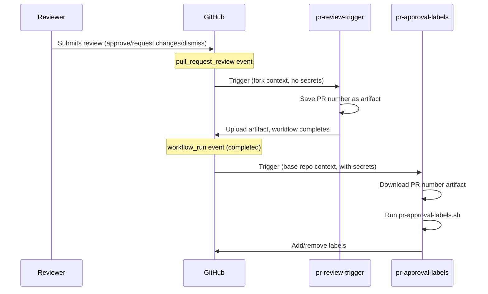
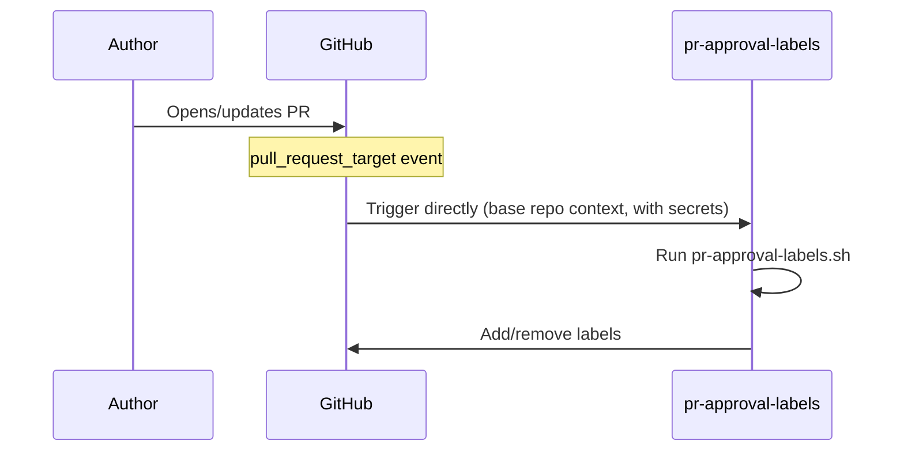
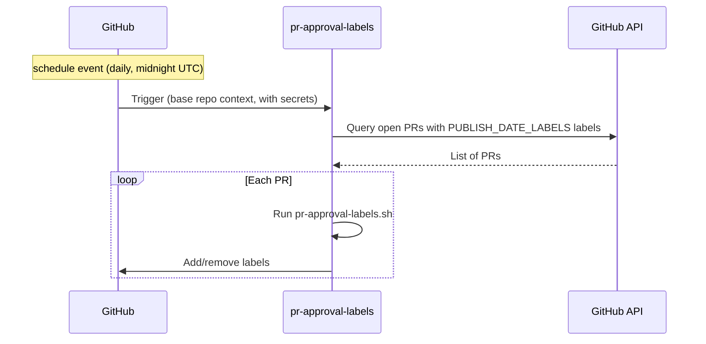

Файли робочих процесів знаходяться в теці [`.github/workflows/`](https://github.com/open-telemetry/opentelemetry.io/tree/main/.github/workflows).

## Мітки PR {#pr-approval-labels}

Два робочих процеси працюють разом для автоматичного керування мітками для затвердження PR:

| Файл                               | Тригер                                            | Привілеї                                                            |
| ---------------------------------- | ------------------------------------------------- | ------------------------------------------------------------------- |
| [`pr-review-trigger.yml`][trigger] | `pull_request_review`                             | Мінімальні (no secrets)                                             |
| [`pr-approval-labels.yml`][labels] | `pull_request_target`, `workflow_run`, `schedule` | Токен GitHub App для редагування міток та читання на рівні org/team |

[trigger]: https://github.com/open-telemetry/opentelemetry.io/blob/main/.github/workflows/pr-review-trigger.yml
[labels]: https://github.com/open-telemetry/opentelemetry.io/blob/main/.github/workflows/pr-approval-labels.yml

### Управління мітками {#labels-managed}

- **`missing:docs-approval`** — додається, коли очікується затвердження з боку команди [`docs-approvers`][docs-approvers]; вилучається одразу після отримання затвердження.
- **`missing:sig-approval`** — додається, коли очікується затвердження з боку команди SIG (визначається змінами у файлах та [`.github/component-owners.yml`][owners]); вилучається одразу після отримання затвердження від членів SIG або коли компоненти SIG не зачіпаються.
- **`ready-to-be-merged`** — додається, коли отримані всі необхідні затвердження; в іншому випадку вилучається. Для PR, що містять мітку [`PUBLISH_DATE_LABELS`](#publish-date-gating), ця мітка також обмежується датою публікації, знайденій в змінених файлах.

[docs-approvers]: https://github.com/orgs/open-telemetry/teams/docs-approvers
[owners]: https://github.com/open-telemetry/opentelemetry.io/blob/main/.github/component-owners.yml

### Дата публікації {#publish-date-gating}

Скрипт сканує кожен змінений файл на наявність рядка, що починається з `date:` (зазвичай з front matter вмісту Markdown). Якщо він знаходить дату в майбутньому, мітка `ready-to-be-merged` утримується до настання цієї дати (UTC). Це допомагає запобігти злиттю вмісту до запланованої дати публікації.

Перевірка застосовується до PR, що містять будь-яку мітку, зазначену в масиві `PUBLISH_DATE_LABELS` у скрипті (наразі: `blog`, автоматично застосовується до будь-якого PR, що стосується `content/en/blog/**`). Додавання мітки до цього масиву розширює перевірку на інші типи PR.

Якщо PR містить кілька файлів з різними датами, мітка блокується за останньою датою — весь вміст повинен бути готовий до злиття.

#### Режими роботи скрипту {#script-operating-modes}

Скрипт працює в одному з двох режимів, які обираються через встановлення змінної `PR`:

- **Режим окремих PR** — обробляє окремий PR. Використовується тригерами `pull_request_target` та `workflow_run.
- **Пакетний режим** — запитує GitHub про всі відкриті PR, що містять будь-яку мітку `PUBLISH_DATE_LABELS`, і обробляє кожну з них. Використовується тригером `schedule` (щодня о півночі за UTC), тому PR, дата публікації якого настає вночі, автоматично отримує статус `ready-to-be-merged` без необхідності нового коміту.

### Для чого два робочі процеси? {#why-two-workflows}

Подія GitHub `pull_request_review` немає опції `_target`. Це означає, шо робочий процес запускається отриманням рецензування на **fork PR** і виконується в контексті форку і не маж доступу до секретів базового репозиторію.

Щоб обійти це обмеження, система використовує [`workflow_run` chaining pattern](https://docs.github.com/en/actions/writing-workflows/choosing-when-your-workflow-runs/events-that-trigger-workflows#workflow_run):

1. **`pr-review-trigger`** виконується для кожної рецензії (затвердження чи відхилення). Відбувається збереження номеру PR у вигляді артефакту — секрети не потрібні.
2. **`pr-approval-labels`** запускається через `workflow_run` (коли попередній робочий процес відпрацював). Він запускається в контексті базового репозиторію з повним доступом до GitHub App token, завантажує артефакт та оновлює міти.

У разі змін вмісту (`opened`, `reopened`, `synchronize`), `pr-approval-labels` запускається безпосередньо через `pull_request_target`.

### Модель безпеки {#security-model}

- **`pr-review-trigger`**: спеціально є мінімальним — немає секретів, прав доступу й так далі. Ігнорує коментарі `review.state == "commented"`, оскільки коментарі на впливають на затвердження.
- **`pr-approval-labels`**: запускається з токеном GitHub App (`OTELBOT_DOCS_APP_ID` / `OTELBOT_DOCS_PRIVATE_KEY`), що має права на читання на рівні org/team та редагує мітки PR. Використання `pull_request_target` та `workflow_run` дозволяє бути впевненим, що виконання відбувається у контексті базового репозиторію.

## Директиви виправлення PR {#pr-fix-directives}

Файл [`pr-actions.yml`][pr-actions] дозволяє учасникам запускати певні `fix` скрипти шляхом додавання коментарів до PR:

- **`/fix`** запускає `npm run fix`.
- **`/fix:<name>`** запускає `npm run fix:<name>` (наприклад, `/fix:format`).
- **`/fix:all`** переадресує на `/fix` оскільки семантика команд була змінена ([#9291][]).
- **`/fix:ALL`** переадресує на `fix:all`, тож супровідники можуть запускати `fix:all`.

[#9291]: https://github.com/open-telemetry/opentelemetry.io/pull/9291

Вони запускаються у двоступеневому конвеєрі:

1. **`generate-patch`** (недовірений): перевіряє гілку PR, виконує команду виправлення, обрізає посилання refcache та завантажує артефакт патча (`pr-fix.patch`) розміром до 1024 КБ.
2. **`apply-patch`** (довірений): запускається з токеном GitHub App, застосовує патч і відправляє коміт до гілки PR.

Якщо директива не вносить жодних змін, окреме завдання `notify-noop` залишає коментар, що нічого не потрібно було зберігати.

[pr-actions]: https://github.com/open-telemetry/opentelemetry.io/blob/main/.github/workflows/pr-actions.yml

## Інші робочі процеси {#other-workflows}

Репозиторій також містить кілька інших робочих процесів:

| Робочий процес             | Призначення                                               |
| -------------------------- | --------------------------------------------------------- |
| `check-links.yml`          | Перевірка посилань за допомогою htmltest                  |
| `check-text.yml`           | Перевірка термінології Textlint                           |
| `check-i18n.yml`           | Перевірка локалізації front matter                        |
| `check-spelling.yml`       | Перевірка орфографії                                      |
| `auto-update-registry.yml` | Автоматичне оновлення версій пакетів реєстру              |
| `auto-update-versions.yml` | Автоматичне оновлення версій компонентів OTel             |
| `build-dev.yml`            | Збірка для розробки та попередній перегляд                |
| `label-prs.yml`            | Автоматичне позначення PRs на основі шляхів файлів        |
| `component-owners.yml`     | Призначення рецензентів на основі власності на компоненти |
