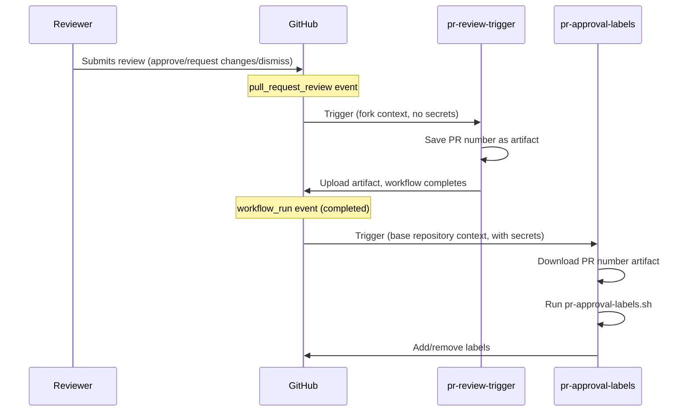
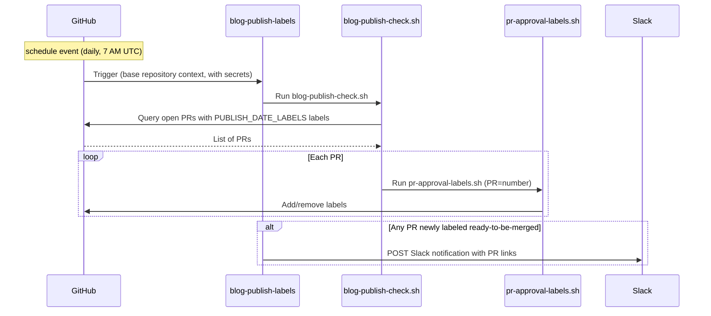

Файли робочих процесів знаходяться в теці [`.github/workflows/`](https://github.com/open-telemetry/opentelemetry.io/tree/main/.github/workflows).

## Мітки PR {#pr-approval-labels}

Наступні робочі процеси працюють разом для автоматичного керування мітками для затвердження PR:

| Файл                               | Тригер                                            | Привілеї                                                            |
| ---------------------------------- | ------------------------------------------------- | ------------------------------------------------------------------- |
| [`pr-review-trigger.yml`][trigger] | `pull_request_review`                             | Мінімальні (no secrets)                                             |
| [`pr-approval-labels.yml`][labels] | `pull_request_target`, `workflow_run`, `schedule` | Токен GitHub App для редагування міток та читання на рівні org/team |
| [`blog-publish-labels.yml`][blog]  | `schedule` (daily 7 AM UTC)                       | App token + `SLACK_WEBHOOK_URL` secret                              |

[trigger]: https://github.com/open-telemetry/opentelemetry.io/blob/main/.github/workflows/pr-review-trigger.yml
[labels]: https://github.com/open-telemetry/opentelemetry.io/blob/main/.github/workflows/label-manager.yml
[blog]: https://github.com/open-telemetry/opentelemetry.io/blob/main/.github/workflows/blog-publish-labels.yml

### Управління мітками {#labels-managed}

- **`missing:docs-approval`** — додається, коли очікується затвердження з боку команди [`docs-approvers`][docs-approvers]; вилучається одразу після отримання затвердження.
- **`missing:sig-approval`** — додається, коли очікується затвердження з боку команди SIG (визначається змінами у файлах та [`.github/component-owners.yml`][owners]); вилучається одразу після отримання затвердження від членів SIG або коли компоненти SIG не зачіпаються.
- **`ready-to-be-merged`** — додається, коли отримані всі необхідні затвердження; в іншому випадку вилучається. Для PR, що містять мітку [`PUBLISH_DATE_LABELS`](#publish-date-gating) (зараз: `blog`), ця мітка також обмежується датою публікації, знайденій в змінених файлах.

[docs-approvers]: https://github.com/orgs/open-telemetry/teams/docs-approvers
[owners]: https://github.com/open-telemetry/opentelemetry.io/blob/main/.github/component-owners.yml

### Дата публікації {#publish-date-gating}

Скрипт сканує кожен змінений файл на наявність рядка, що починається з `date:` (зазвичай з front matter вмісту Markdown). Якщо він знаходить дату в майбутньому, мітка `ready-to-be-merged` утримується до настання цієї дати (UTC). Це допомагає запобігти злиттю вмісту до запланованої дати публікації.

Перевірка застосовується до PR, що містять будь-яку мітку, зазначену у змінній середовища `PUBLISH_DATE_LABELS`, яка задається у кожному файлі YAML робочого процесу (наразі: `blog`). Додавання мітки розширює дію перевірки на інші типи PR.

Якщо PR містить кілька файлів з різними датами, мітка блокується за останньою датою — весь вміст повинен бути готовий до злиття.

#### Режими роботи скрипту {#script-operating-modes}

Скрипт [`pr-approval-labels.sh`][script] обробляє один PR (встановлюється через змінну середовища `PR`). Він викликається файлом `pr-approval-labels.yml` при подіях PR та файлом [`blog-publish-check.sh`][batch-script] у пакетному режимі.

[script]: https://github.com/open-telemetry/opentelemetry.io/blob/main/.github/scripts/pr-approval-labels.sh
[batch-script]: https://github.com/open-telemetry/opentelemetry.io/blob/248cc6f/.github/scripts/blog-publish-check.sh

Скрипт [`blog-publish-check.sh`][batch-script] відповідає за пакетну обробку: він
перевіряє всі відкриті PR, що містять будь-яку мітку `PUBLISH_DATE_LABELS`, і запускає
`pr-approval-labels.sh` для кожного з них. Використовується тригером
[`blog-publish-labels.yml`](#blog-publish-labels) `schedule` (щодня о 7
ранку за UTC), тому PR, дата публікації якого настає вночі, автоматично отримує
`ready-to-be-merged` без необхідності нового коміту.

### Для чого два робочі процеси? {#why-two-workflows}

Подія GitHub `pull_request_review` немає опції `_target`. Це означає, що робочий процес запускається отриманням рецензування на **fork PR** і виконується в контексті форку і не має доступу до секретів базового репозиторію.

Щоб обійти це обмеження, система використовує [`workflow_run` chaining pattern](https://docs.github.com/en/actions/writing-workflows/choosing-when-your-workflow-runs/events-that-trigger-workflows#workflow_run):

1. **`pr-review-trigger`** виконується для кожної рецензії (затвердження чи відхилення). Відбувається збереження номеру PR у вигляді артефакту — секрети не потрібні.
2. **`pr-approval-labels`** запускається через `workflow_run` (коли попередній робочий процес відпрацював). Він запускається в контексті базового репозиторію з повним доступом до GitHub App token, завантажує артефакт та оновлює міти.

У разі змін вмісту (`opened`, `reopened`, `synchronize`), `pr-approval-labels` запускається безпосередньо через `pull_request_target`.



### Модель безпеки {#security-model}

- **`pr-review-trigger`**: спеціально є мінімальним — немає секретів, прав доступу й так далі. Ігнорує коментарі `review.state == "commented"`, оскільки коментарі на впливають на затвердження.
- **`pr-approval-labels`**: запускається з токеном GitHub App (`OTELBOT_DOCS_APP_ID` / `OTELBOT_DOCS_PRIVATE_KEY`), що має права на читання на рівні org/team та редагує мітки PR. Використання `pull_request_target` та `workflow_run` дозволяє бути впевненим, що виконання відбувається у контексті базового репозиторію.
- **`blog-publish-labels`**: запускається за розкладом з токеном GitHub App та секретом `SLACK_WEBHOOK_URL`. Завжди виконується у довіреному контексті базового репозиторію (події розкладу не мають варіанту для форків).

## Мітки публікацій у блозі {#blog-publish-labels}

Робочий процес [`blog-publish-labels.yml`][blog] запускається щодня о 7:00 за UTC. Він виконує скрипт [`blog-publish-check.sh`][batch-script], який перебирає всі відкриті PR із міткою `blog` і для кожного з них викликає скрипт `pr-approval-labels.sh`. Коли до будь-якого з них застосовується новий статус `ready-to-be-merged`, надсилається сповіщення у Slack. Ви також можете запустити його вручну за допомогою `workflow_dispatch` із вхідним параметром `force_notify`, щоб надіслати тестове сповіщення у Slack. Коли `force_notify` має значення `true`, крок позначення міткою повністю пропускається («сухий запуск») — надсилається лише тестовий вміст повідомлення у Slack.

| Файл робочого процесу             | Тригер                                                                                        | Необхідні секрети                               |
| --------------------------------- | --------------------------------------------------------------------------------------------- | ----------------------------------------------- |
| [`blog-publish-labels.yml`][blog] | `schedule` (щодня о 7:00 за UTC), `workflow_dispatch` (ручне тестування через `force_notify`) | `OTELBOT_DOCS_PRIVATE_KEY`, `SLACK_WEBHOOK_URL` |

Сповіщення в Slack надсилається лише тоді, коли мітка переходить з відсутньої до присутньої під час цього запуску — повторні щоденні запуски для вже промаркованого PR не надсилають повторні сповіщення. При ручному запуску робочого процесу встановіть `force_notify` у `true`, щоб надіслати одноразове тестове сповіщення (мітки не застосовуються), щоб ви могли перевірити форматування Slack.

### Налаштування вебхука Slack {#slack-webhook-setup}

Робочий процес використовує **Slack Workflow Builder webhook trigger**, що дозволяє не інженерам керувати форматом повідомлення без зміни коду робочого процесу.

**Створення вебхука:**

1. У Slack: **Інструменти → Workflow Builder → Новий робочий процес → Почати з нуля**
2. Виберіть тригер: **Webhook**
3. Оголосіть одну змінну — назва: `pr_list`, тип: **Текст**
4. Додайте крок: **Надіслати повідомлення** до потрібного каналу, з тілом:

   ```text
   :newspaper: *Blog posts ready to publish*

   The following PRs have reached their publish date and all required
   approvals — they are ready to be merged:

   {{pr_list}}

   Have a great day! :sunny:
   ```

   Далі натисніть **Додати кнопку** і налаштуйте:
   - **Назва**: `Review and merge`
   - **Колір**: Primary (зелений)
   - **Дія**: Відкрити посилання
   - **URL**:
     `https://github.com/open-telemetry/opentelemetry.io/issues?q=is%3Apr+state%3Aopen+label%3Ablog+label%3Aready-to-be-merged`

5. **Опублікуйте** робочий процес і скопіюйте URL вебхука
6. Додайте його до репозиторію: **Налаштування → Секрети та змінні → Дії → Новий секрет репозиторію**, назва: `SLACK_WEBHOOK_URL`

**Payload, що надсилається робочим процесом:**

```json
{
  "pr_list": "• #123: Add blog post: OTel 1.0 — https://github.com/.../pull/123\n• #456: Announce: new SIG — https://github.com/.../pull/456"
}
```

Кожен PR є пунктом списку з його заголовком та URL. Slack автоматично створює посилання для простих URL. Кілька PR, позначених в один день, обʼєднуються в одне повідомлення — один виклик вебхука незалежно від кількості готових PR.



## Директиви виправлення PR {#pr-fix-directives}

Файл [`pr-actions.yml`][pr-actions] дозволяє учасникам запускати певні `fix` скрипти шляхом додавання коментарів до PR:

- **`/fix`** запускає `npm run fix`.
- **`/fix:<name>`** запускає `npm run fix:<name>` (наприклад, `/fix:format`).
- **`/fix:all`** переадресує на `/fix` оскільки семантика команд була змінена ([#9291][]).
- **`/fix:ALL`** переадресує на `fix:all`, тож супровідники можуть запускати `fix:all`.

Директива повинна бути першим рядком коментаря; будь-які наступні рядки ігноруються, тож ви можете додати пояснення після неї. Сам робочий процес запускається на будь-який коментар, тіло якого починається з `/fix` (наприклад, `/fixup` потрапляє в конвеєр і отримує зворотний звʼязок про недійсну директиву, тоді як коментар, що починається з пробілу, або з `/fix` лише на пізнішому рядку, не запускає робочий процес взагалі).

[#9291]: https://github.com/open-telemetry/opentelemetry.io/pull/9291

Вони запускаються у чотириступеневому конвеєрі:

1. **`ack`** (надійний): як тільки отримує вказівку, відповідає коментарем 🔄 «у процесі виконання», що містить посилання на коментар із вказівкою та на сам запуск.
2. **`generate-patch`** (ненадійний): перевіряє гілку PR, запускає команду виправлення, очищає кеш посилань і завантажує артефакт латки (`site.patch`), до 1024 КБ.
3. **`apply-patch`** (надійний): викликає робочий процес [`reusable-apply-patch.yml`][] — отримується з основної гілки, ніколи не з PR, який застосовує латку за допомогою токена GitHub App і додає коміт у гілку PR. Пропускається, якщо команда не внесла змін.
4. **`report`** (надійний): замінює підтвердження на остаточний результат, коли це можливо, або публікує новий коментар з результатом, коли підтвердження не існує, наприклад, для закритих PR. Кожна директива зазвичай відповідає одному коментарю, який посилається на директиву та на запуск, який її створив. Це охоплює всі директиви, які запускають робочий процес, включаючи недійсні директиви (такі як `/fixup` або `/fix please`), бездіяльні запуски та помилки, що виникають до створення будь-якого латки.

Директиви виконуються лише для відкритих PR (включаючи чернетки PR): у закритому або обʼєднаному PR команда виправлення ніколи не запускається, а завдання звіту пояснює причину. Стан PR береться з корисного навантаження тригера, тому жоден виконавець не витрачається на саме виправлення.

Конвеєр працює лише в канонічному репозиторії `open-telemetry`, де існують облікові дані бота. Fork PR працюють нормально, події `issue_comment` спрацьовують у базовому репозиторії, але робочий процес пропускає себе всередині форків.

Директиви дотримуються семантики «останнього переможного варіанту»: новий коментар `/fix` у PR скасовує поточний запуск цього PR (який все одно видає результат ⚠️), оскільки паралельні запуски виправлення на одній гілці не мають сенсу — другий push все одно завершиться невдачею, щойно гілка буде переміщена.

Парсер директив знаходиться у [scripts/gh/pr-fix/][], генерування латок — у дії [npm-script-patch][], а коментарі з визнанням та результатами створюються за допомогою [scripts/gh/patch-report/][]; всі вони проходять модульне тестування за допомогою команди `npm run test:local-tools`.

[pr-actions]: https://github.com/open-telemetry/opentelemetry.io/blob/main/.github/workflows/pr-actions.yml
[`reusable-apply-patch.yml`]: https://github.com/open-telemetry/opentelemetry.io/blob/main/.github/workflows/reusable-apply-patch.yml
[npm-script-patch]: https://github.com/open-telemetry/opentelemetry.io/tree/main/.github/actions/npm-script-patch
[scripts/gh/pr-fix/]: https://github.com/open-telemetry/opentelemetry.io/tree/main/scripts/gh/pr-fix
[scripts/gh/patch-report/]: https://github.com/open-telemetry/opentelemetry.io/tree/main/scripts/gh/patch-report

## Прибирання {#housekeeping}

Робочий процес [`housekeeping.yml`][housekeeping] запускається для затверджених команд виправлення — зазвичай [`fix-and-test:all`](../npm-scripts/), або скрипт npm, що запускається вручну (лише для супровідників) — щодня о 21:37 за UTC, приблизно через 12 годин після виконання інших щоденних автоматизованих завдань, і публікує всі отримані зміни у вигляді PR. Це другий виклик дій з повторного використання латок, а також потік планового обслуговування, що став поштовхом для створення [#6592][].

Він запускає триступеневий конвеєр:

1. **`generate-patch`**: запускає команди прибирання через дію [npm-script-patch][] і завантажує зміни як артефакт латки. На відміну від конвеєра `/fix`, весь запуск є надійним: тригери розкладу та виклику завжди виконують код зі стандартної гілки. Невдала команда призводить до невдачі завдання, але будь-які виправлення, які вона створила, все одно публікуються з попередженням про часткові результати в тілі PR.
2. **`publish-patch`**: викликає робочий процес [`reusable-patch-pr.yml`][], аналог [`reusable-apply-patch.yml`][] для процесів виклику без контексту PR, який примусово робить push латки в стабільну гілку `otelbot/housekeeping`, відтворювану з `main` на кожному запуску, і відкриває для неї PR, якщо він ще не відкритий. Таким чином, одночасно існує не більше одного PR для прибирання, завжди містить останні результати. Будь-які коміти, направлені в гілку, вручну або через `/fix`, будуть перезаписані наступним запуском, тому зливайте PR негайно, якщо ви робити push комітів в нього. Пропускається, коли команда не створила змін, залишаючи будь-який відкритий PR для прибирання без змін. Автоматичне злиття безпечне для PR прибирання за умови, що застарілі схвалення скасовуються при push комітів: необхідні огляди залишаються контролем над контентом, отриманим від машини та інтернету, навіть при примусових pushes.
3. **`report-failure`**: створює тікет відстеження у разі невдачі через [звітність про невдачі робочого процесу](#workflow-failure-reporting); коли виправлення були опубліковані, тікет посилається на PR для прибирання.

> [!NOTE]
>
> Робочий процес [`refcache-refresh.yml`][] також запускається щодня та торкається `refcache.json`, Отже, ці два PR від ботів можуть конфліктувати залежно від порядку злиття. Конфлікти вирішуються автоматично, оскільки обидві гілки синхронізуються з `main` під час кожного запуску. Перенесення refcache-refresh у модуль багаторазових дій з накладення латок — що усуває такі конфлікти за самою своєю суттю — відстежується в [плані проєкту][project plan].

[#6592]: https://github.com/open-telemetry/opentelemetry.io/issues/6592
[housekeeping]: https://github.com/open-telemetry/opentelemetry.io/blob/main/.github/workflows/housekeeping.yml
[project plan]: https://github.com/open-telemetry/opentelemetry.io/blob/main/projects/2026/pr-fix-reusable-actions.plan.md
[`refcache-refresh.yml`]: https://github.com/open-telemetry/opentelemetry.io/blob/main/.github/workflows/refcache-refresh.yml
[`reusable-patch-pr.yml`]: https://github.com/open-telemetry/opentelemetry.io/blob/main/.github/workflows/reusable-patch-pr.yml

## Автоматичне злиття локалізацій {#locale-auto-merge}

Робочий процес [locale-auto-merge.yml][] дозволяє кураторам локалі вмикати функцію [GitHub auto-merge][] для PR, що стосуються виключно локалі, за допомогою директиви `/auto-merge` (або `/auto-merge:enable` / `/auto-merge:disable`) в коментарі до PR —правила розміщення дивіться у допоміжному файлі [README][locale-auto-merge-script]. Він працює як бот DOCS, який має привілеї, необхідні для перемикання опції «обʼєднати, коли буде готово» в умовах захисту гілки; CODEOWNERS та необхідні перевірки залишаються жорстким барʼєром для обʼєднання.

Тонкий робочий процес делегує завдання помічнику в [scripts/gh/locale-auto-merge/][locale-auto-merge-script], який перед дією застосовує два обмеження: кожен змінений файл повинен належати локалі, а коментатор повинен бути членом команди `docs-<loc>-maintainers` для кожної локалі, якої торкається PR. Правила придатності та авторизації помічника (і як їх перевірити локально) знаходяться в його [README][locale-auto-merge-script]; його модульні та інтеграційні тести виконуються за допомогою `npm run test:local-tools`. Використання для учасників описано в [посібнику з локалізації][localization-auto-merge].

[GitHub auto-merge]: https://docs.github.com/en/pull-requests/collaborating-with-pull-requests/incorporating-changes-from-a-pull-request/automatically-merging-a-pull-request
[locale-auto-merge.yml]: https://github.com/open-telemetry/opentelemetry.io/blob/main/.github/workflows/locale-auto-merge.yml
[locale-auto-merge-script]: https://github.com/open-telemetry/opentelemetry.io/tree/main/scripts/gh/locale-auto-merge
[localization-auto-merge]: /docs/contributing/localization/#auto-merge

## Гілки інтеграції специфікацій {#spec-integration-branches}

Два заплановані робочі процеси відстежують невипущені зміни з вихідних репозиторіїв специфікацій та забезпечують актуальність чернетки PR («гілки інтеграції») відповідно до наступної версії розробки:

| Файл робочого процесу                     | Вихідний репозиторій          | Slag гілки |
| ----------------------------------------- | ----------------------------- | ---------- |
| [update-spec-integration-branch.yml][]    | `opentelemetry-specification` | `spec`     |
| [update-semconv-integration-branch.yml][] | `semantic-conventions`        | `semconv`  |

[update-spec-integration-branch.yml]: https://github.com/open-telemetry/opentelemetry.io/blob/main/.github/workflows/update-spec-integration-branch.yml
[update-semconv-integration-branch.yml]: https://github.com/open-telemetry/opentelemetry.io/blob/main/.github/workflows/update-semconv-integration-branch.yml

Обидва робочі процеси делегують крок "вибір наступної версії + гілки" спільному Node-помічнику, [scripts/gh/specs/pick-branch/cli.mjs][]. Помічник:

- Використовує наявну гілку `otelbot/<slug>-integration-vX.Y.Z-dev`, якщо вона існує і версія ще не випущена; в іншому випадку підвищує мінорну версію останнього тегу випуску.
- Записує `VERSION` і `BRANCH` у `$GITHUB_ENV` для наступних кроків.
- Відкриває відстежувальне питання (мітка `<slug>-integration-warning`, дедуплікація) при виявленні проблем, таких як кілька застарілих інтеграційних гілок.

[scripts/gh/specs/pick-branch/cli.mjs]: https://github.com/open-telemetry/opentelemetry.io/tree/main/scripts/gh/specs/pick-branch

### Режими запуску {#run-modes}

Помічник автоматично обирає між режимом dry-run та write і виводить банер `[mode]`, пояснюючи свій вибір:

| Контекст              | Стандартна поведінка | Перевизначення      |
| --------------------- | -------------------- | ------------------- |
| GitHub Actions        | write                | pass `--dry-run`    |
| Local (anywhere else) | dry-run              | pass `--no-dry-run` |

Локально, dry-run все ще виконує всі команди `git`/`gh` лише для читання (щоб перевірка дедуплікації питань виконувалася), але пропускає записи. З `--no-dry-run` помічник використовує ваші локальні облікові дані `gh`; якщо `GITHUB_ENV` не встановлено, `VERSION`/`BRANCH` виводяться лише в stdout. Спробуйте:

```sh
node scripts/gh/specs/pick-branch/cli.mjs --spec=otel
node scripts/gh/specs/pick-branch/cli.mjs --spec=semconv --no-dry-run
node scripts/gh/specs/pick-branch/cli.mjs --help
```

Чиста логіка та розбір аргументів CLI знаходяться в `index.mjs` і покриваються файлами `*.test.mjs` у тій же теці (`npm run test:local-tools` для їх запуску).

## Повідомлення про помилки робочого процесу {#workflow-failure-reporting}

[`reusable-report-failure.yml`][report-failure] відкриває (або коментує) відстежувану проблему, коли робочий процес, що викликає, не вдається. Як його підключити, необовʼязкові вхідні дані та поведінка контексту процесу, що викликає, документуються в заголовку файлу робочого процесу; логіка проблеми знаходиться в [scripts/gh/report-failure/][report-failure-script]
(`npm run test:local-tools`).

[report-failure]: https://github.com/open-telemetry/opentelemetry.io/blob/main/.github/workflows/reusable-report-failure.yml
[report-failure-script]: https://github.com/open-telemetry/opentelemetry.io/tree/main/scripts/gh/report-failure

## Інші робочі процеси {#other-workflows}

Репозиторій також містить кілька інших робочих процесів:

| Робочий процес             | Призначення                                                     |
| -------------------------- | --------------------------------------------------------------- |
| `check-links.yml`          | Перевірка посилань за допомогою htmltest                        |
| `check-text.yml`           | Перевірка термінології Textlint                                 |
| `check-i18n.yml`           | Перевірка локалізації front matter                              |
| `check-spelling.yml`       | Перевірка орфографії                                            |
| `test.yml`                 | Запуск тестів (виключає `test:base`)                            |
| `auto-update-registry.yml` | Автоматичне оновлення версій пакетів реєстру                    |
| `auto-update-versions.yml` | Автоматичне оновлення версій компонентів OTel                   |
| `build-dev.yml`            | Збірка для розробки та попередній перегляд                      |
| `lint-scripts.yml`         | Перевірка скриптів за допомогою ShellCheck                      |
| `label-manager.yml`        | Керування мітками PR (мітки компонентів та процес затвердження) |
| `component-owners.yml`     | Призначення рецензентів на основі власності на компоненти       |
