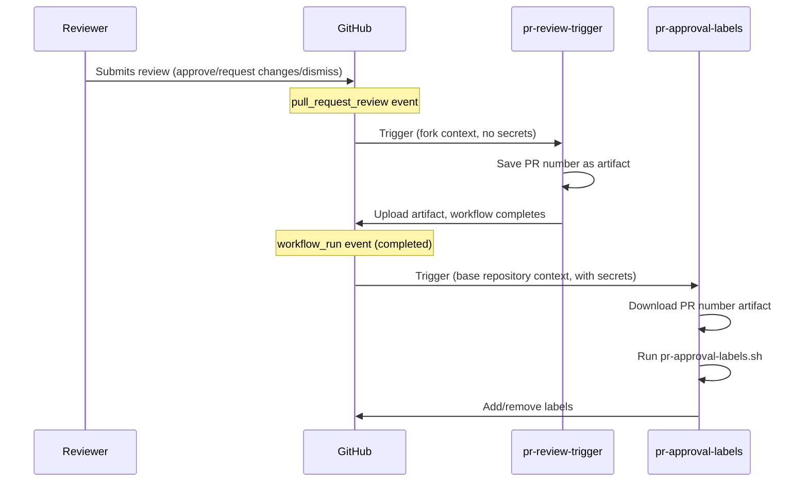
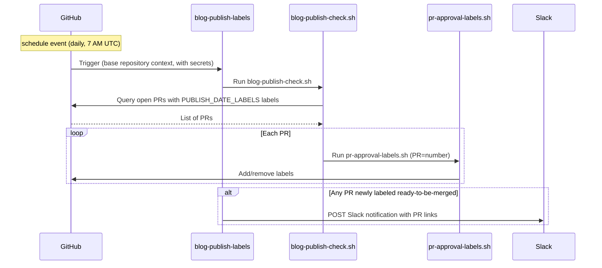

Файли робочих процесів знаходяться в теці [`.github/workflows/`](https://github.com/open-telemetry/opentelemetry.io/tree/main/.github/workflows).

## Мітки PR {#pr-approval-labels}

Наступні робочі процеси працюють разом для автоматичного керування мітками для затвердження PR:

| Файл                               | Тригер                                            | Привілеї                                                            |
| ---------------------------------- | ------------------------------------------------- | ------------------------------------------------------------------- |
| [`pr-review-trigger.yml`][trigger] | `pull_request_review`                             | Мінімальні (no secrets)                                             |
| [`pr-approval-labels.yml`][labels] | `pull_request_target`, `workflow_run`, `schedule` | Токен GitHub App для редагування міток та читання на рівні org/team |
| [`blog-publish-labels.yml`][blog]  | `schedule` (daily 7 AM UTC)                       | App token + `SLACK_WEBHOOK_URL` secret                              |

[trigger]: https://github.com/open-telemetry/opentelemetry.io/blob/main/.github/workflows/pr-review-trigger.yml
[labels]: https://github.com/open-telemetry/opentelemetry.io/blob/main/.github/workflows/label-manager.yml
[blog]: https://github.com/open-telemetry/opentelemetry.io/blob/main/.github/workflows/blog-publish-labels.yml

### Управління мітками {#labels-managed}

- **`missing:docs-approval`** — додається, коли очікується затвердження з боку команди [`docs-approvers`][docs-approvers]; вилучається одразу після отримання затвердження.
- **`missing:sig-approval`** — додається, коли очікується затвердження з боку команди SIG (визначається змінами у файлах та [`.github/component-owners.yml`][owners]); вилучається одразу після отримання затвердження від членів SIG або коли компоненти SIG не зачіпаються.
- **`ready-to-be-merged`** — додається, коли отримані всі необхідні затвердження; в іншому випадку вилучається. Для PR, що містять мітку [`PUBLISH_DATE_LABELS`](#publish-date-gating) (зараз: `blog`), ця мітка також обмежується датою публікації, знайденій в змінених файлах.

[docs-approvers]: https://github.com/orgs/open-telemetry/teams/docs-approvers
[owners]: https://github.com/open-telemetry/opentelemetry.io/blob/main/.github/component-owners.yml

### Дата публікації {#publish-date-gating}

Скрипт сканує кожен змінений файл на наявність рядка, що починається з `date:` (зазвичай з front matter вмісту Markdown). Якщо він знаходить дату в майбутньому, мітка `ready-to-be-merged` утримується до настання цієї дати (UTC). Це допомагає запобігти злиттю вмісту до запланованої дати публікації.

Перевірка застосовується до PR, що містять будь-яку мітку, зазначену у змінній середовища `PUBLISH_DATE_LABELS`, яка задається у кожному файлі YAML робочого процесу (наразі: `blog`). Додавання мітки розширює дію перевірки на інші типи PR.

Якщо PR містить кілька файлів з різними датами, мітка блокується за останньою датою — весь вміст повинен бути готовий до злиття.

#### Режими роботи скрипту {#script-operating-modes}

Скрипт [`pr-approval-labels.sh`][script] обробляє один PR (встановлюється через змінну середовища `PR`). Він викликається файлом `pr-approval-labels.yml` при подіях PR та файлом [`blog-publish-check.sh`][batch-script] у пакетному режимі.

[script]: https://github.com/open-telemetry/opentelemetry.io/blob/main/.github/scripts/pr-approval-labels.sh
[batch-script]: https://github.com/open-telemetry/opentelemetry.io/blob/248cc6f/.github/scripts/blog-publish-check.sh

Скрипт [`blog-publish-check.sh`][batch-script] відповідає за пакетну обробку: він
перевіряє всі відкриті PR, що містять будь-яку мітку `PUBLISH_DATE_LABELS`, і запускає
`pr-approval-labels.sh` для кожного з них. Використовується тригером
[`blog-publish-labels.yml`](#blog-publish-labels) `schedule` (щодня о 7
ранку за UTC), тому PR, дата публікації якого настає вночі, автоматично отримує
`ready-to-be-merged` без необхідності нового коміту.

### Для чого два робочі процеси? {#why-two-workflows}

Подія GitHub `pull_request_review` немає опції `_target`. Це означає, що робочий процес запускається отриманням рецензування на **fork PR** і виконується в контексті форку і не має доступу до секретів базового репозиторію.

Щоб обійти це обмеження, система використовує [`workflow_run` chaining pattern](https://docs.github.com/en/actions/writing-workflows/choosing-when-your-workflow-runs/events-that-trigger-workflows#workflow_run):

1. **`pr-review-trigger`** виконується для кожної рецензії (затвердження чи відхилення). Відбувається збереження номеру PR у вигляді артефакту — секрети не потрібні.
2. **`pr-approval-labels`** запускається через `workflow_run` (коли попередній робочий процес відпрацював). Він запускається в контексті базового репозиторію з повним доступом до GitHub App token, завантажує артефакт та оновлює міти.

У разі змін вмісту (`opened`, `reopened`, `synchronize`), `pr-approval-labels` запускається безпосередньо через `pull_request_target`.



### Модель безпеки {#security-model}

- **`pr-review-trigger`**: спеціально є мінімальним — немає секретів, прав доступу й так далі. Ігнорує коментарі `review.state == "commented"`, оскільки коментарі на впливають на затвердження.
- **`pr-approval-labels`**: запускається з токеном GitHub App (`OTELBOT_DOCS_APP_ID` / `OTELBOT_DOCS_PRIVATE_KEY`), що має права на читання на рівні org/team та редагує мітки PR. Використання `pull_request_target` та `workflow_run` дозволяє бути впевненим, що виконання відбувається у контексті базового репозиторію.
- **`blog-publish-labels`**: запускається за розкладом з токеном GitHub App та секретом `SLACK_WEBHOOK_URL`. Завжди виконується у довіреному контексті базового репозиторію (події розкладу не мають варіанту для форків).

## Мітки публікацій у блозі {#blog-publish-labels}

Робочий процес [`blog-publish-labels.yml`][blog] запускається щодня о 7:00 за UTC. Він виконує скрипт [`blog-publish-check.sh`][batch-script], який перебирає всі відкриті PR із міткою `blog` і для кожного з них викликає скрипт `pr-approval-labels.sh`. Коли до будь-якого з них застосовується новий статус `ready-to-be-merged`, надсилається сповіщення у Slack. Ви також можете запустити його вручну за допомогою `workflow_dispatch` із вхідним параметром `force_notify`, щоб надіслати тестове сповіщення у Slack. Коли `force_notify` має значення `true`, крок позначення міткою повністю пропускається («сухий запуск») — надсилається лише тестовий вміст повідомлення у Slack.

| Файл робочого процесу             | Тригер                                                                                        | Необхідні секрети                               |
| --------------------------------- | --------------------------------------------------------------------------------------------- | ----------------------------------------------- |
| [`blog-publish-labels.yml`][blog] | `schedule` (щодня о 7:00 за UTC), `workflow_dispatch` (ручне тестування через `force_notify`) | `OTELBOT_DOCS_PRIVATE_KEY`, `SLACK_WEBHOOK_URL` |

Сповіщення в Slack надсилається лише тоді, коли мітка переходить з відсутньої до присутньої під час цього запуску — повторні щоденні запуски для вже промаркованого PR не надсилають повторні сповіщення. При ручному запуску робочого процесу встановіть `force_notify` у `true`, щоб надіслати одноразове тестове сповіщення (мітки не застосовуються), щоб ви могли перевірити форматування Slack.

### Налаштування вебхука Slack {#slack-webhook-setup}

Робочий процес використовує **Slack Workflow Builder webhook trigger**, що дозволяє не інженерам керувати форматом повідомлення без зміни коду робочого процесу.

**Створення вебхука:**

1. У Slack: **Інструменти → Workflow Builder → Новий робочий процес → Почати з нуля**
2. Виберіть тригер: **Webhook**
3. Оголосіть одну змінну — назва: `pr_list`, тип: **Текст**
4. Додайте крок: **Надіслати повідомлення** до потрібного каналу, з тілом:

   ```text
   :newspaper: *Blog posts ready to publish*

   The following PRs have reached their publish date and all required
   approvals — they are ready to be merged:

   {{pr_list}}

   Have a great day! :sunny:
   ```

   Далі натисніть **Додати кнопку** і налаштуйте:
   - **Назва**: `Review and merge`
   - **Колір**: Primary (зелений)
   - **Дія**: Відкрити посилання
   - **URL**:
     `https://github.com/open-telemetry/opentelemetry.io/issues?q=is%3Apr+state%3Aopen+label%3Ablog+label%3Aready-to-be-merged`

5. **Опублікуйте** робочий процес і скопіюйте URL вебхука
6. Додайте його до репозиторію: **Налаштування → Секрети та змінні → Дії → Новий секрет репозиторію**, назва: `SLACK_WEBHOOK_URL`

**Payload, що надсилається робочим процесом:**

```json
{
  "pr_list": "• #123: Add blog post: OTel 1.0 — https://github.com/.../pull/123\n• #456: Announce: new SIG — https://github.com/.../pull/456"
}
```

Кожен PR є пунктом списку з його заголовком та URL. Slack автоматично створює посилання для простих URL. Кілька PR, позначених в один день, обʼєднуються в одне повідомлення — один виклик вебхука незалежно від кількості готових PR.



## Директиви виправлення PR {#pr-fix-directives}

Файл [`pr-actions.yml`][pr-actions] дозволяє учасникам запускати певні `fix` скрипти шляхом додавання коментарів до PR:

- **`/fix`** запускає `npm run fix`.
- **`/fix:<name>`** запускає `npm run fix:<name>` (наприклад, `/fix:format`).
- **`/fix:all`** переадресує на `/fix` оскільки семантика команд була змінена ([#9291][]).
- **`/fix:ALL`** переадресує на `fix:all`, тож супровідники можуть запускати `fix:all`.

[#9291]: https://github.com/open-telemetry/opentelemetry.io/pull/9291

Вони запускаються у двоступеневому конвеєрі:

1. **`generate-patch`** (недовірений): перевіряє гілку PR, виконує команду виправлення, обрізає посилання refcache та завантажує артефакт патча (`pr-fix.patch`) розміром до 1024 КБ.
2. **`apply-patch`** (довірений): запускається з токеном GitHub App, застосовує патч і відправляє коміт до гілки PR.

Якщо директива не вносить жодних змін, окреме завдання `notify-noop` залишає коментар, що нічого не потрібно було зберігати.

[pr-actions]: https://github.com/open-telemetry/opentelemetry.io/blob/main/.github/workflows/pr-actions.yml

## Інші робочі процеси {#other-workflows}

Репозиторій також містить кілька інших робочих процесів:

| Робочий процес             | Призначення                                               |
| -------------------------- | --------------------------------------------------------- |
| `check-links.yml`          | Перевірка посилань за допомогою htmltest                  |
| `check-text.yml`           | Перевірка термінології Textlint                           |
| `check-i18n.yml`           | Перевірка локалізації front matter                        |
| `check-spelling.yml`       | Перевірка орфографії                                      |
| `test.yml`                 | Запуск тестів (виключає `test:base`)                      |
| `auto-update-registry.yml` | Автоматичне оновлення версій пакетів реєстру              |
| `auto-update-versions.yml` | Автоматичне оновлення версій компонентів OTel             |
| `build-dev.yml`            | Збірка для розробки та попередній перегляд                |
| `lint-scripts.yml`         | Перевірка скриптів за допомогою ShellCheck                |
| `label-manager.yml`        | Керування мітками PR (component labels & approval flow)   |
| `component-owners.yml`     | Призначення рецензентів на основі власності на компоненти |
