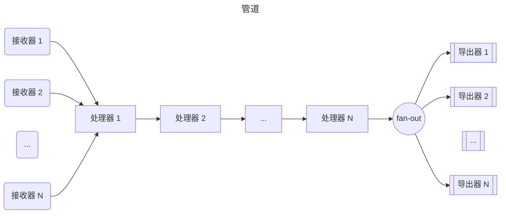
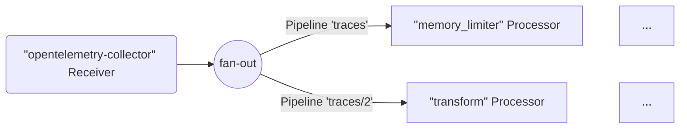
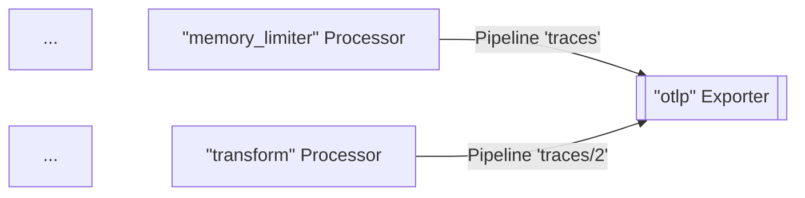
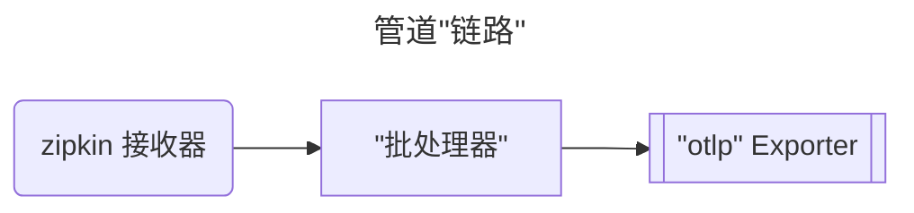
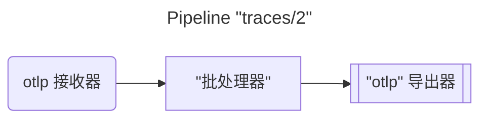
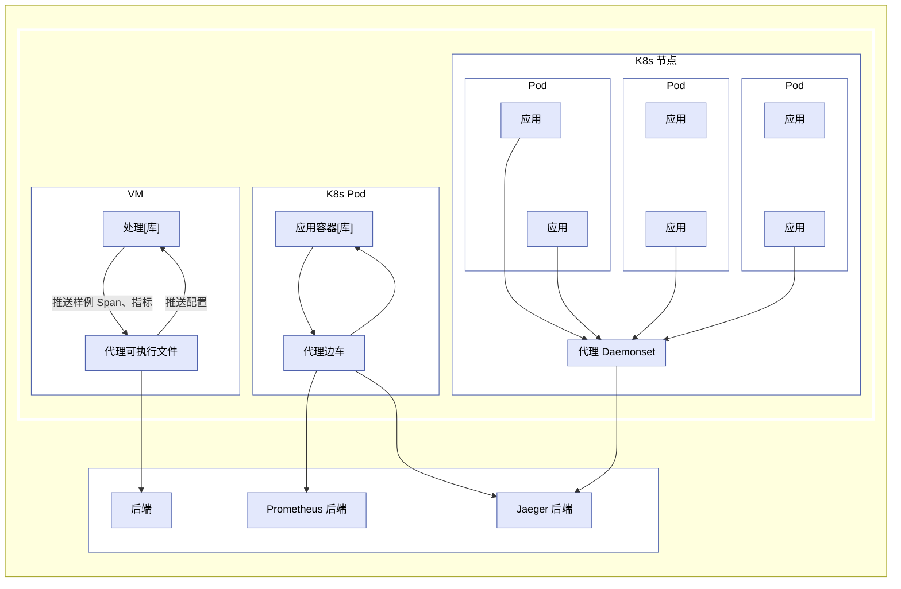
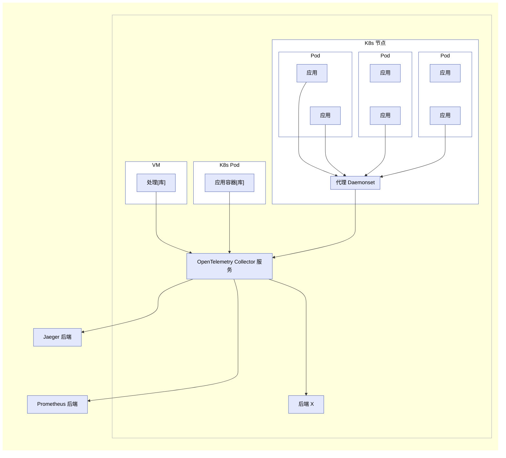

OpenTelemetry Collector 是一个可执行文件，它可以接收遥测数据、处理这些数据，并将其导出到多个目标，例如可观测性后端。

Collector 支持多种流行的开源协议用于接收和发送遥测数据，并提供可扩展的架构以支持更多协议的添加。

数据的接收、处理和导出通过[管道](#pipelines)完成。你可以将 Collector 配置为拥有一个或多个管道。

每个管道包括以下部分：

- 一组用于收集数据的[接收器](#receivers)
- 一系列可选的[处理器](#processors)，用于从接收器获取数据并进行处理
- 一组[导出器](#exporters)，用于从处理器获取数据并将其发送到 Collector 之外

同一个接收器可以被包含在多个管道中，多个管道也可以包含相同的导出器。

## 管道 {#pipelines}

管道定义了数据在 Collector 中的传递路径：从接收、处理（或修改）再到导出。

管道可以处理三种遥测数据类型：链路、指标和日志。数据类型是由其配置定义的管道属性。
用于管道的接收器、处理器和导出器必须支持该特定的数据类型，否则在加载配置时会报告
`pipeline.ErrSignalNotSupported` 异常。

下图表示了一个典型的管道：



一个管道可以包含一个或多个接收器。所有接收器接收到的数据会被推送到第一个处理器，
处理器对数据进行处理后再推送给下一个处理器。如果启用了采样或过滤，处理器也可以丢弃数据。
这种处理会持续进行，直到最后一个处理器将数据推送到导出器。
每个导出器都会接收到每个数据元素的一份副本。最后一个处理器使用一个 `fanoutconsumer` 将数据发送到多个导出器。

管道是在 Collector 启动时根据配置中定义的管道构建的。

一个典型的管道配置如下所示：

```yaml
service:
  pipelines: # 可包含多个子段，每个表示一个管道
    traces: # 管道类型
      receivers: [otlp, zipkin]
      processors: [memory_limiter, batch]
      exporters: [otlp, zipkin]
```

上述示例定义了一个 trace 类型的管道，包含两个接收器、两个处理器和两个导出器。

### 接收器 {#receivers}

接收器通常监听一个网络端口并接收遥测数据。它们也可以主动获取数据，如爬取程序。
通常一个接收器被配置为将接收到的数据发送到一个管道。
但你也可以将相同的接收器配置为将相同的数据发送到多个管道。
可以通过在多个管道的 `receivers` 键中列出相同的接收器来实现这一点：

```yaml
receivers:
  otlp:
    protocols:
      grpc:
        endpoint: localhost:4317

service:
  pipelines:
    traces: # 一个 “traces” 类型的管道
      receivers: [otlp]
      processors: [memory_limiter, batch]
      exporters: [otlp]
    traces/2: # 另一个 “traces” 类型的管道
      receivers: [otlp]
      processors: [transform]
      exporters: [otlp]
```

在上述示例中，`otlp` 接收器会将相同的数据发送到 `traces` 管道和 `traces/2` 管道。

> 配置中使用复合键名的形式为 `type[/name]`。

当 Collector 加载这个配置后，结果如下图所示（部分处理器和导出器为简洁起见省略）：



{}

当同一个接收器在多个管道中被引用时，Collector 在运行时只创建一个接收器实例，
该实例将数据发送到一个 fan-out consumer。该 fan-out consumer 进一步将数据发送到每个管道的第一个处理器。
数据从接收器传递到 fan-out consumer，再传递到处理器，使用的是同步函数调用。
这意味着如果某个处理器阻塞了调用，与该接收器连接的其他管道也会被阻塞接收相同数据，
接收器本身也会停止处理并转发新接收到的数据。

{}

### 导出器 {#exporters}

导出器通常将它们接收到的数据转发到网络上的某个目的地，但它们也可以将数据发送到其他地方。
例如，`debug` 导出器将遥测数据写入日志目标。

配置允许在同一个管道中包含多个相同类型的导出器。例如，可以定义两个 `otlp` 导出器，每个导出到不同的 OTLP 端点：

```yaml
exporters:
  otlp/1:
    endpoint: example.com:4317
  otlp/2:
    endpoint: localhost:14317
```

导出器通常从一个管道获取数据。但也可以配置多个管道将数据发送到同一个导出器：

```yaml
exporters:
  otlp:
    protocols:
      grpc:
        endpoint: localhost:14250

service:
  pipelines:
    traces: # 一个 “traces” 类型的管道
      receivers: [zipkin]
      processors: [memory_limiter]
      exporters: [otlp]
    traces/2: # 另一个 “traces” 类型的管道
      receivers: [otlp]
      processors: [transform]
      exporters: [otlp]
```

在上述示例中，`otlp` 导出器同时从 `traces` 和 `traces/2` 管道中获取数据。当
Collector 加载该配置后，结果如下图所示（为简洁起见省略部分处理器和接收器）：



### 处理器 {#processors}

一个管道可以包含多个按顺序连接的处理器。第一个处理器从该管道中配置的一个或多个接收器获取数据，
最后一个处理器将数据发送到该管道中配置的一个或多个导出器。
中间的所有处理器只从前一个处理器接收数据，并仅将数据发送给下一个处理器。

处理器可以在转发数据之前对其进行转换，例如添加或删除 Span 上的属性。
它们也可以决定不转发数据（例如，`probabilisticsampler` 处理器），从而丢弃数据或生成新数据。

在多个管道的 `processors` 键中可以引用相同名称的处理器。在这种情况下，
每个管道都会获得该处理器的一个独立实例，配置相同，但状态独立。
这些处理器不会在不同管道之间共享。例如，如果多个管道都使用了 `batch` 处理器，
那么每个管道都有自己的 `batch` 实例，配置是相同的，但实例是独立的。请参见以下配置：

```yaml
processors:
  batch:
    send_batch_size: 10000
    timeout: 10s

service:
  pipelines:
    traces: # 一个 “traces” 类型的管道
      receivers: [zipkin]
      processors: [batch]
      exporters: [otlp]
    traces/2: # 另一个 “traces” 类型的管道
      receivers: [otlp]
      processors: [batch]
      exporters: [otlp]
```

当 Collector 加载该配置时，结果如下所示：





请注意，尽管这两个 `batch` 处理器使用相同的配置（`send_batch_size: 10000`），但它们是独立的实例。

> 同一个处理器名称不能在同一个管道的 `processors` 键中被多次引用。

## 以代理运行 {#running-as-an-agent}

在典型的虚拟机（VM）或容器中，用户应用作为某些进程或 Pod 运行，并集成了 OpenTelemetry 库。
此前，这些库负责完成所有的记录、收集、采样和聚合链路、指标和日志，
然后通过库内置的导出器将数据导出到其他持久化存储后端，或显示在本地的
zpages 页面上。这种模式存在几个缺点，例如：

1. 每种 OpenTelemetry 库都必须用其对应的语言重新实现导出器和 zpages；
2. 某些编程语言（例如 Ruby 或 PHP）中，在进程内进行统计聚合较为困难；
3. 若想启用 OpenTelemetry 的 Span、统计或指标导出，应用用户需要手动添加库导出器并重新部署可执行程序。
   这在发生事故后希望立即借助 OpenTelemetry 进行排查时尤为困难；
4. 应用用户还需要负责导出器的配置与初始化，这一过程容易出错（例如设置了错误的凭据或被监控资源），
   用户也可能不愿意“污染”自己的业务代码。

为了解决上述问题，你可以将 OpenTelemetry Collector 作为一个代理运行。
代理作为守护进程在 VM 或容器中运行，并可以独立于库进行部署。一旦代理部署并运行，
它应该能从库中接收链路、指标和日志，并将其导出到其他后端。
我们还可以赋予代理将配置（如采样概率）推送回库的能力。
对于无法在进程内进行聚合的语言，它们可以发送原始测量数据，由代理完成聚合。



> 对其他库的开发者和维护者：你可以通过添加特定的接收器，配置代理以接受来自其他追踪/监控库的数据，如
> Zipkin、Prometheus 等。详见[接收器](#receivers)。

## 以网关运行 {#running-as-a-gateway}

OpenTelemetry Collector 还可以作为网关实例运行，接收来自一个或多个代理、库或其他任务/代理所导出的
Span 和指标，只要它们使用 Collector 支持的协议之一。Collector 会根据配置将数据发送到指定的导出器。
以下图示总结了这种部署架构：



OpenTelemetry Collector 也可以用其他配置进行部署，例如从其他代理或客户端以接收器支持的某种格式来接收数据。
