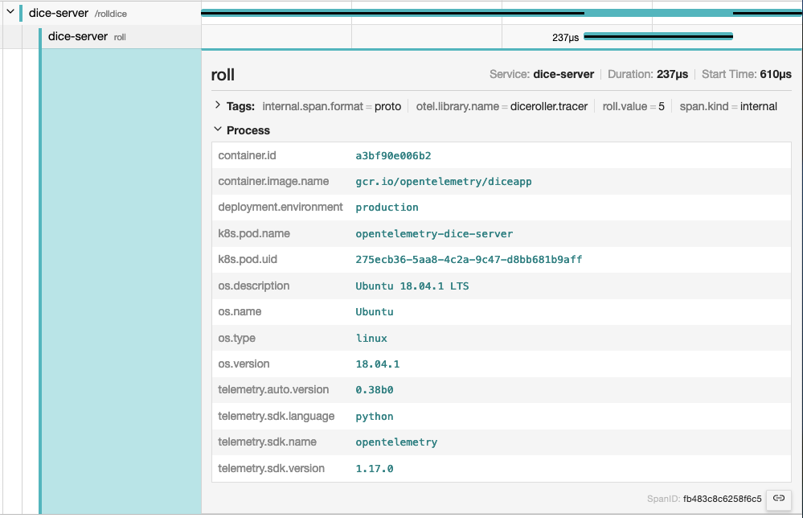

## 介绍 {#introduction}

{}

如果你使用 [Jaeger](https://www.jaegertracing.io/) 作为可观测性后端，
资源属性会被归类显示在 **Process（进程）** 标签页下：



资源在初始化时被添加到 `TracerProvider` 或 `MetricProvider` 中，
并且这一绑定在创建之后无法更改。一旦资源被设置，
通过该 Provider 创建的所有 `Tracer` 或 `Meter` 所生成的 span 与 metric 都会自动关联此资源信息。

## 带默认值的语义属性 {#semantic-attributes-with-sdk-provided-default-value}

OpenTelemetry SDK 提供了一些默认的资源属性。其中之一是 `service.name`，
它表示服务的逻辑名称。默认情况下，SDK 会为该属性设置值为 `unknown_service`，
因此建议你**显式设置**该值，可以通过代码设定，或设置环境变量 `OTEL_SERVICE_NAME` 来实现。

此外，SDK 还会自动提供以下属性用于标识自身：

- `telemetry.sdk.name`
- `telemetry.sdk.language`
- `telemetry.sdk.version`

## 资源探测器（Resource Detectors）{#resource-detectors}

大多数语言特定的 SDK 提供了一套资源探测器（Resource Detectors），
可用于从环境中自动检测资源信息。常见的资源探测器包括：

- [操作系统（Operating System）](/docs/specs/semconv/resource/os/)
- [主机（Host）](/docs/specs/semconv/resource/host/)
- [进程与运行时（Process and Process Runtime）](/docs/specs/semconv/resource/process/)
- [容器（Container）](/docs/specs/semconv/resource/container/)
- [Kubernetes](/docs/specs/semconv/resource/k8s/)
- [云厂商特有属性（Cloud-Provider-Specific Attributes）](/docs/specs/semconv/resource/#cloud-provider-specific-attributes)
- [更多资源类型](/docs/specs/semconv/resource/)

## 自定义资源属性 {#custom-resources}

你也可以自定义资源属性。可以通过代码提供，或者通过设置环境变量 `OTEL_RESOURCE_ATTRIBUTES` 来传入。

如果适用，建议参考[资源属性的语义约定](/docs/specs/semconv/resource)。

例如，你可以通过设置 `deployment.environment.name` 来指明部署环境的名称：

```shell
env OTEL_RESOURCE_ATTRIBUTES=deployment.environment.name=production yourApp
```
