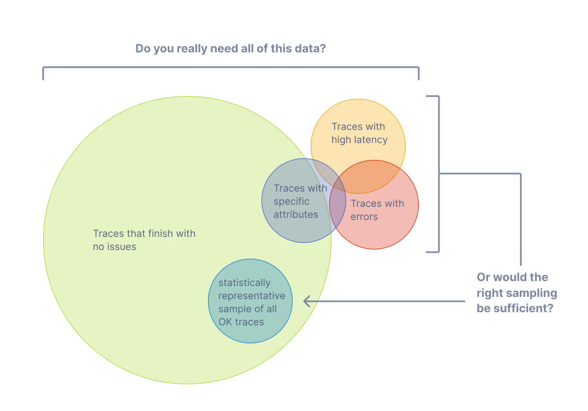

通过[链路](/docs/concepts/signals/traces)，你可以观测请求在分布式系统中从一个服务传递到另一个服务的过程。
链路追踪对于系统的高层次分析和深入分析都非常实用。

然而，如果你的大多数请求都是成功的，并且在可接受的延迟范围内完成且没有错误，那么你无需收集
100% 的链路数据也能有意义地观测你的应用和系统。你只需要正确的采样即可。

## 术语 {#terminology}

在讨论采样时，使用一致的术语非常重要。一个链路或 Span 被认为是“已采样”或“未采样”：

- **已采样**：一个链路或 Span 被处理并导出。由于它被采样器选中作为总体的代表，因此被认为是“已采样”的。
- **未采样**：一个链路或 Span 未被处理或导出。由于它未被采样器选中，因此被认为是“未采样”的。

有时，这些术语的定义会被混淆。你可能会发现有人说他们在“采样出数据”或认为未被处理或导出的数据被认为是“已采样”的。
这些说法是不正确的。

## 为什么要采样？ {#why-sampling}

采样是降低可观测性成本而不失去可见性的最有效方法之一。虽然还有其他降低成本的方法，
如过滤或聚合数据，但这些方法不符合代表性概念，而代表性在对应用或系统行为进行深入分析时至关重要。

代表性是一个原则，指的是一个较小的群体可以准确地代表一个较大的群体。此外，
代表性是可以通过数学方式验证的，这意味着你可以高度确信一个较小的数据样本能够准确地代表较大的群体。

此外，产生的数据越多，你实际所需的代表性样本数据就越少。对于高吞吐量系统，
1% 或更低的采样率通常就能非常准确地代表其余 99% 的数据。

### 何时进行采样 {#when-to-sample}

如果你满足以下任一条件，请考虑进行采样：

- 你每秒生成 1000 个或更多链路。
- 你的大多数链路数据代表的是健康流量，数据变化很小。
- 你有一些通用的标准，如错误或高延迟，通常意味着系统出现问题。
- 你拥有一些特定领域的标准，可以用来判断除错误和延迟之外的相关数据。
- 你可以描述一些通用规则来决定哪些数据应被采样或丢弃。
- 你可以区分服务，以便对高吞吐量服务和低吞吐量服务进行不同的采样。
- 你有方法将未采样的数据（用于“以防万一”的场景）路由到低成本的存储系统中。

最后，请考虑你的整体预算。如果你的可观测性预算有限，但可以投入时间来进行有效的采样，那么采样通常是值得的。

### 何时不进行采样 {#when-not-to-sample}

采样可能并不适合你。如果你满足以下任一条件，你可能想避免采样：

- 你生成的数据非常少（每秒几十个小型链路或更少）。
- 你仅以聚合形式使用可观测性数据，因此可以预先对数据进行聚合。
- 你受制于法律或合规规定而无法丢弃数据（且无法将未采样数据路由到低成本存储中）。

最后，请考虑与采样相关的以下三种成本：

1. 有效采样数据所需的计算成本，例如尾部采样代理。
2. 随着更多应用、系统和数据的加入，维护有效采样方法的工程间接成本。
3. 使用无效采样技术而错过关键信息的机会成本。

采样虽然能有效降低可观测性成本，但如果操作不当，也可能引入其他意想不到的成本。
根据你的可观测性后端、数据性质以及采样尝试的有效性，分配更多资源用于可观测性
（无论是使用供应商服务还是自托管计算资源）可能反而更便宜。

## 头部采样 {#head-sampling}

头部采样是一种尽早做出采样决策的采样技术。是否采样一个 Span 或链路的决策不是通过检查整个链路来做出的。

例如，最常见的一种头部采样形式是[一致概率采样](/docs/specs/otel/trace/tracestate-probability-sampling/#consistent-sampling-decision)。
这也被称为确定性采样。在这种情况下，采样决策基于链路 ID 和希望采样的链路百分比。
这确保了整个链路被采样（不会漏掉任何 Span）并以一致的速率进行采样，例如采样所有链路的 5%。

头部采样的优点包括：

- 易于理解
- 易于配置
- 高效
- 可以在链路收集管道中的任意点进行

头部采样的主要缺点是无法基于整个链路中的数据做出采样决策。例如，
仅通过头部采样无法确保采样所有包含错误的链路。对于这种情况和许多其他情况，你需要使用尾部采样。

## 尾部采样 {#tail-sampling}

尾部采样是指通过考虑链路中的全部或大多数 Span 来做出是否采样该链路的决策。
尾部采样使你可以根据链路中不同部分的特定标准来采样链路，而这是头部采样无法做到的。

你可以使用尾部采样执行以下操作：

- 始终采样包含错误的链路
- 基于整体延迟采样链路
- 基于一个或多个 Span 中特定属性的存在或属性值采样链路；例如，采样更多来自新部署服务的链路
- 根据某些条件对链路应用不同的采样率，例如分别处理来自低吞吐量服务与高吞吐量服务的链路

如你所见，尾部采样在采样数据的方式上提供了更高程度的灵活性。
对于必须采样遥测数据的大型系统而言，几乎总是需要使用尾部采样以平衡数据量和数据的实用性。

目前，尾部采样有以下三个主要缺点：

1. 尾部采样可能难以实现。具体取决于你可用的采样技术类型，它不总是那种“一次配置永久生效”的事情。
   随着系统的变化，采样策略也需要变化。对于大型复杂的分布式系统，实现采样策略的规则本身也可能很复杂。
2. 尾部采样可能难以运行。实现尾部采样的组件必须是有状态的系统，能够接受并存储大量数据。
   根据流量模式，这可能需要几十个甚至上百个计算节点，并且这些节点对资源的使用方式各不相同。
   此外，如果尾部采样器无法跟上接收数据的速率，它可能需要“退回”到计算开销更小的采样技术。
   因此，必须监控尾部采样组件，以确保它们拥有做出正确采样决策所需的资源。
3. 当前尾部采样器通常是特定厂商的技术。如果你使用的是付费可观测性供应商，
   最有效的尾部采样选项可能仅限于该供应商所提供的。

最后，对于某些系统，尾部采样可能与头部采样结合使用。例如，
一组产生极高链路数据量的服务可能首先使用头部采样来采样一小部分链路，
然后在遥测管道的后续阶段使用尾部采样在导出到后端前做出更复杂的采样决策。
这通常是为了保护遥测管道不被超负荷使用。

## 支持 {#support}

### Collector

OpenTelemetry Collector 包含以下采样处理器：

- [概率采样处理器](https://github.com/open-telemetry/opentelemetry-collector-contrib/tree/main/processor/probabilisticsamplerprocessor)
- [尾部采样处理器](https://github.com/open-telemetry/opentelemetry-collector-contrib/tree/main/processor/tailsamplingprocessor)

### 语言 SDK {#language-sdks}

有关 OpenTelemetry API & SDK 各语言实现的采样支持，请参见各自的文档页面：

{}

### 供应商 {#vendors}

许多[供应商](/ecosystem/vendors)提供包含头部采样、尾部采样以及其他功能的综合采样解决方案，
以支持复杂的采样需求。这些解决方案也可能针对特定供应商的后端进行优化。
如果你正在将遥测数据发送至某个供应商，建议使用其采样解决方案。
