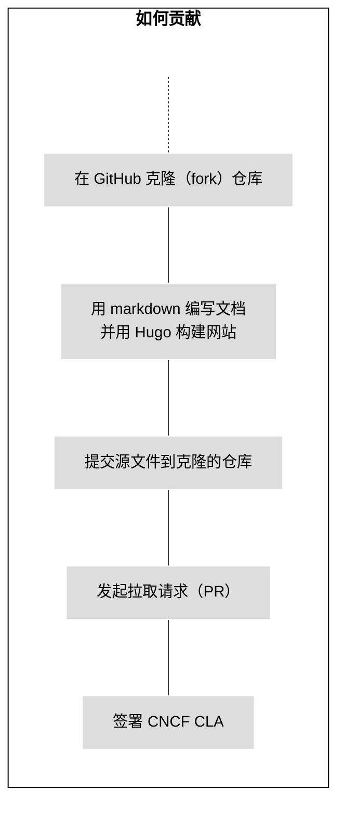
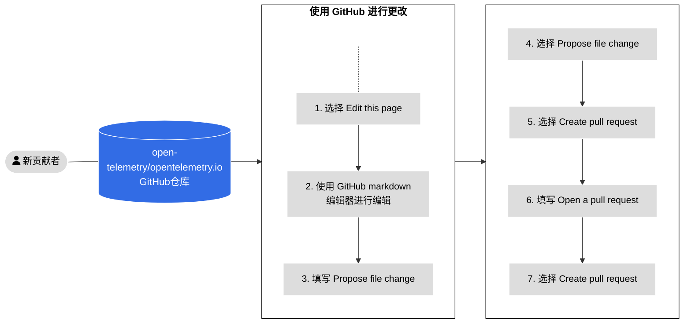
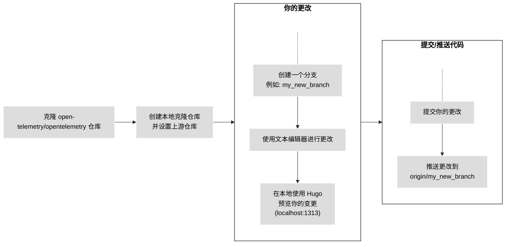
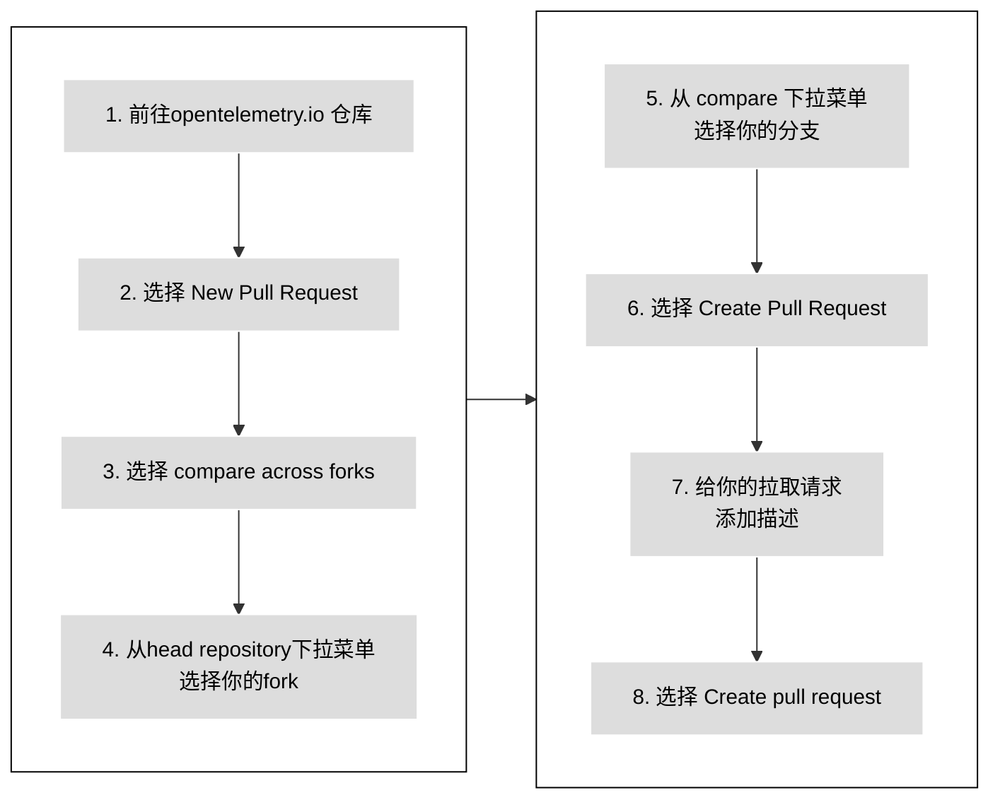

下面的指引描述了如何为 OpenTelemetry 文档做贡献。关于如何为 OpenTelemetry 项目作出贡献，请参阅[OpenTelemetry 贡献者指南](https://github.com/open-telemetry/community/blob/main/CONTRIBUTING.md)，其中提供了有关贡献者许可协议和行为准则的详细信息。从某种程度上讲，每种语言实现、收集器和约定 [仓库](https://github.com/open-telemetry/) 都有自己特定的贡献指南。

对于文档中的问题，你可以提一个关于 OpenTelemetry 的问题（issue），或者向[`opentelemetry.io` GitHub 仓库](https://github.com/open-telemetry/opentelemetry.io)发起一个带有变更的拉取请求（pull request）。

OpenTelemetry 文档贡献者可以：

- 改进现有内容。
- 添加新的内容。
- 更新 OpenTelemetry 注册表（Registry）。
- 改进构建网站的代码。

## 要求

在贡献之前，你需要了解以下的技术和工具：

- [git](https://git-scm.com/)
- [GitHub](https://github.com/)
- Markdown ([CommonMark](https://commonmark.org/))
- YAML

有关如何在本地构建和测试 OpenTelemetry 文档网站的技术细节，请参阅 [CONTRIBUTING.md](https://github.com/open-telemetry/opentelemetry.io/blob/main/CONTRIBUTING.md) 文档。

### 签署 CNCF CLA {#sign-the-cla}

所有 OpenTelemetry 贡献者**必须**阅读[贡献者指南](https://github.com/open-telemetry/community/blob/main/CONTRIBUTING.md) 并[签署贡献者授权同意书 (Contributor License Agreement, CLA)](https://docs.linuxfoundation.org/lfx/easycla/contributors)。

未签署 CLA 的贡献者发起的拉取请求将无法通过自动化测试。你提供的姓名和邮箱必须与你的 `git config` 中的姓名和邮箱，并且你的 git 姓名和邮箱必须与 CLA 中使用的姓名和电子邮件相匹配。

## 贡献新的内容



_图 1. 贡献新的内容。_

上图描述了如何贡献新的文档。

要贡献新的内容页面或改进现有的内容页面，请发起拉取请求 (PR)：

- 如果你的更改很小，或者你不太熟悉Git的使用，请阅读[使用 GitHub 进行更改](#changes-using-github) 来学习如何编辑一个页面。
- 如果你的更改较大，请阅读[在本地分支进行更改](#fork-the-repo) 来学习如何在你电脑本地进行更改。

{}

可以将你的拉取请求变成草稿状态以表明内容未准备好接受评审。此时维护者仍可以发表评论或进行高级别的评审，但他们不会全面评审内容直到你删除草稿状态。

{}

### 使用 GitHub 进行更改 {#changes-using-github}

如果你对 Git 工作流程不太熟悉，这里有一种更简单的方法来发起拉取请求。图 2 概述了步骤，详细信息如下。



_图 2. 使用 GitHub 发起拉取请求的流程。_

1. 在发现问题的页面上，选择右侧导航面板中的 **Edit this page** 选项。
2. 如果你不是该项目的成员，GitHub 会建议你创建仓库的分支。选择 **Fork this repository**。
3. 在 GitHub 编辑器中进行更改。
4. 填写 **Propose file change** 表格。
5. 选择 **Propose changes**。
6. 选择 **Create pull request**。
7. 进入 **Open a pull request** 页面，填写描述可以帮助评审人理解你的更改内容。
8. 选择 **Create pull request**。

合并拉取请求需要OpenTelemetry 社区成员评审和批准。

如果评审人要求你进行修改：

1. 前往 **Files changed** 选项卡。
2. 选择拉取请求所更改的任何文件上的 **edit** 图标。
3. 进行所要求的更改。如果有代码建议，请应用它。
4. 提交更改。

审核完成后，审核者会合并你的 PR，并且你的更改将在几分钟后生效。

{}

在你的拉取请求上评论 `/fix:format` 可以触发格式问题的自动检查。

{}

### 在本地分支进行更改 {#fork-the-repo}

如果你有使用 Git 的经验，或者你的更改较多，请在本地分支进行更改。

请确保你的计算机上已安装 [Git](https://git-scm.com/book/en/v2/Getting-Started-Installing-Git) 。你也可以使用 Git 的图形用户界面。

图 3 显示了在本地分支进行更改时要遵循的步骤。每个步骤的详细信息如下。



_图 3. 在本地分支进行更改_。

#### 克隆 opentelemetry.io 仓库

1. 导航到 [`opentelemetry.io`](https://github.com/open-telemetry/opentelemetry.io/) 仓库。
2. 点击 **Fork** 按钮。

#### 创建本地克隆仓库并设置上游仓库

1. 在一个终端窗口中，下载你克隆的仓库代码，并安装所需的依赖项：

   ```shell
   git clone git@github.com:<your_github_username>/opentelemetry.io.git
   cd opentelemetry.io
   npm install
   ```

2. 将 `open-telemetry/opentelemetry.io` 仓库设置为你的远程 `upstream` 仓库:

   ```shell
   git remote add upstream https://github.com/open-telemetry/opentelemetry.io.git
   ```

3. 确认你的 `origin` 和 `upstream` 仓库:

   ```shell
   git remote -v
   ```

   输出类似于：

   ```none
   origin	git@github.com:<your_github_username>/opentelemetry.io.git (fetch)
   origin	git@github.com:<your_github_username>/opentelemetry.io.git (push)
   upstream	https://github.com/open-telemetry/opentelemetry.io.git (fetch)
   upstream	https://github.com/open-telemetry/opentelemetry.io.git (push)
   ```

4. 从你克隆的 `origin/main` 和 `open-telemetry/opentelemetry.io` 的 `upstream/main` 获取提交:

   ```shell
   git fetch origin
   git fetch upstream
   ```

   这可确保你在开始进行更改之前，本地仓库是最新的。你可以定期从上游仓库获取更改，来使你的克隆仓库与上游仓库保持同步。

#### 创建一个分支

1. 创建一个新分支。下面是基于 `upstream/main` 分支创建新分支的示例代码:

   ```shell
   git checkout -b <my_new_branch> upstream/main
   ```

2. 使用代码或文本编辑器进行编辑或更改。

使用 `git status` 令可以随时查看你更改的文件。

#### 提交你的更改

当你准备好提交拉取请求时，请先提交你的更改。

1. 在本地仓库中，检查需要提交的文件：

   ```shell
   git status
   ```

   输出结果类似于：

   ```none
   On branch <my_new_branch>
   Your branch is up to date with 'origin/<my_new_branch>'.

   Changes not staged for commit:
   (use "git add <file>..." to update what will be committed)
   (use "git checkout -- <file>..." to discard changes in working directory)

   modified:   content/en/docs/file-you-are-editing.md

   no changes added to commit (use "git add" and/or "git commit -a")
   ```

2. 将 **Changes not staged for commit** 下列出的文件添加到提交中：

   ```shell
   git add <your_file_name>
   ```

   对每个文件重复此操作。

3. 添加所有文件后，创建提交：

   ```shell
   git commit -m "你的提交信息"
   ```

4. 将你的本地分支及其新的提交推送到你的远程分支：

   ```shell
   git push origin <my_new_branch>
   ```

5. 更改被推送后，GitHub 会通知你可以创建 PR。

#### 从你的 fork 中发起拉取请求 {#open-a-pr}

图 4 显示了从你的 fork 向[opentelemetry.io](https://github.com/open-telemetry/opentelemetry.io) 发起 PR 的步骤。



_图 4. 从你的 fork 向 [opentelemetry.io](https://github.com/open-telemetry/opentelemetry.io) 提交 PR 的步骤。_

1. 在 Web 浏览器中，转到 [`opentelemetry.io`](https://github.com/open-telemetry/opentelemetry.io) 仓库。
2. 选择 **New Pull Request**。
3. 选择 **compare across fork**。
4. 从 **head repository** 下拉菜单中选择你的 fork。
5. 从 **compare** 下拉菜单中选择你的分支。
6. 选择 **Create Pull Request**。
7. 为你的拉取请求添加描述：
   - **Title** （不多于50 个字符）：总结更改的目的。
   - **Description** ：更详细地描述更改。
     - 如果有相关的 GitHub 问题（issue），请在描述中包含 `Fixes #12345` 或 `Closes #12345`，以便 GitHub 的自动化功能在合并 PR 后关闭提到的问题。如果还有其他相关 PR，也请链接它们。
     - 如果你需要有关特定内容的建议，请在描述中包含你希望评审人考虑的任何问题。
8. 选择 **Create pull request** 按钮。

你的拉取请求可以在 [Pull requests](https://github.com/open-telemetry/opentelemetry.io/pulls) 中找到。

发起 PR 后，GitHub 会运行自动测试并尝试使用 [Netlify](https://www.netlify.com/) 部署预览。

- 如果 Netlify 构建失败，选择 **详细信息** 可以获取更多信息。
- 如果 Netlify 构建成功，选择 **详细信息** 可以打开 OpenTelemetry 网站的暂存版本，其中应用了你的更改。评审人通过这种方式检查你的更改。

其他检查也可能失败。请参阅[所有 PR 检查列表](/docs/contributing/pr-checks)。

#### 自动修复内容问题

在向仓库提交更改之前，请运行以下命令并 (i)解决任何报告的问题，(ii) 提交脚本更改的任何文件：

```sh
npm run test-and-fix
```

要单独测试和修复文件的所有问题，请运行：

```sh
npm run test # 检查但不更新任何文件
npm run fix:all # 可能更新文件
```

要列出可用的 NPM 脚本，请运行 `npm run`。

#### 在本地预览你的更改 {#preview-locally}

在推送更改内容或发起拉取请求之前，请在本地预览你的更改。预览可以让你捕获构建错误或 Markdown 格式问题。

要使用 Hugo 在本地构建和运行站点，请使用以下命令：

```shell
npm run serve
```

在你的 Web 浏览器中导航到 `http://localhost:1313` 可以查看本地预览。Hugo 会监视更改并根据需要重建站点。

要停止本地 Hugo 实例，请返回终端并键入 `Ctrl+C`，或关闭终端窗口。

#### 站点部署和 PR 预览

如果你提交了 PR，Netlify 会创建一个 [部署预览][]，以便你可以查看你的更改。一旦你的 PR 合并，Netlify 就会将更新后的站点部署到生产服务器。

> **注意**：PR 预览包括*草稿页面*，但生产版本不包括。

要查看部署日志等，请访问项目的 [仪表板][]——需要 Netlify 登录。

#### PR 指南

在 PR 合并之前，有时需要进行几次评审和编辑。为了帮助我们和你自己尽可能简化此过程，我们要求你遵守以下规定：

- 如果你的 PR 不是一个快速的问题修复，则从 **在本地分支进行更改**开始：单击仓库顶部的 [Fork](https://github.com/open-telemetry/opentelemetry.io/fork) 按钮并创建一个你自己本地的克隆仓库。当你准备好更改内容时，向上游仓库发起PR请求。
- **不要在你克隆仓库的`main`**分支上直接进行更改，而应该创建一个特定于 PR 的分支。
- 确保维护人员[可以对你的拉取请求应用更改](https://docs.github.com/en/pull-requests/collaborating-with-pull-requests/working-with-forks/allowing-changes-to-a-pull-request-branch-created-from-a-fork)。

#### 评审人的更改

有时审阅者会向你的拉取请求提交一些更改，请在进行任何其他更改之前获取这些提交。

1. 从远程分支获取提交并重定基你的工作分支：

   ```shell
   git fetch origin
   git rebase origin/<your-branch-name>
   ```

2. 重定基后，强制将新的更改推送到你的 fork 中：

   ```shell
   git push --force-with-lease origin <your-branch-name>
   ```

你也可以从 GitHub UI 界面解决合并冲突。

#### 合并冲突和重定基

如果另一个贡献者在另一个 PR 中提交对同一文件的更改，则可能会产生合并冲突。你必须解决 PR 中的所有合并冲突。

1. 更新你的 fork 并重定基你的本地分支:

   ```shell
   git fetch origin
   git rebase origin/<your-branch-name>
   ```

   然后强制将更改推送到你的 fork 中：

   ```shell
   git push --force-with-lease origin <your-branch-name>
   ```

2. 从 `open-telemetry/opentelemetry.io` 的 `upstream/main` 获取更改并重定基你的分支：

   ```shell
   git fetch upstream
   git rebase upstream/main
   ```

3. 检查重定基的结果：

   ```shell
   git status
   ```

   这会导致许多文件被标记为冲突。

4. 打开每个有冲突的文件并查找冲突标记：`>>>`、`<<<` 和 `===`。解决冲突并删除冲突标记。

   更多有关信息，请参阅[如何冲突是如何呈现的](https://git-scm.com/docs/git-merge#_how_conflicts_are_presented)。

5. 将文件添加到变更集：

   ```shell
   git add <filename>
   ```

6. 继续重定基：

   ```shell
   git rebase --continue
   ```

7. 根据需要重复步骤 2 至 5。

   应用所有提交后， `git status` 命令显示重定基已完成。

8. 强制将分支推送到你的 fork 上：

   ```shell
   git push --force-with-lease origin <your-branch-name>
   ```

   拉取请求不再显示任何冲突。

#### 合并要求

合并拉取请求需要符合以下条件：

- 审批者、维护者、技术委员会成员或主题专家的所有评审状态均为“ Approved ”。
- 没有未解决的对话。
- 至少获得一名审批者的批准。
- 没有失败的 PR 检查项。
- PR 分支与基础分支保持同步。

> **重要**
>
> 不要太担心 PR 检查失败，社区成员将帮助你修复它们。他们会给你提供如何修复的指导或代表你修复它们。

## 提交问题（issue）

如果你发现一个错误或想要对现有内容提出改进建议，请提交一个问题（issue）。

1. 单击任何文档上的 **Create documentation issue** 链接会将你重定向到预填充了一些标题的 GitHub 问题页面。

2. 描述问题或改进建议。提供尽可能多的详细信息。

3. 单击 **Submit new issue**。

提交后，请偶尔检查你的问题或打开 GitHub 通知。维护者和审批者可能需要几天时间才能回复你。评审人和其他社区成员可能会在他们对你的问题（issue）做出一些措施前询问你一些问题。

### 建议新内容或功能

如果你有一些关于新内容或新功能的想法，但不确定应该去哪里提出，你同样可以提一个问题（issue）。你也可以（提一个问题来）报告错误和安全漏洞。

1. 转到 [GitHub](https://github.com/open-telemetry/opentelemetry.io/issues/new/) 并在 **Issues** 选项卡中选择 **New issue**。

2. 选择最适合你的请求或疑问的问题类型。

3. 填写模板。

4. 提交问题。

### 如何填写好的问题（issue）：

填写问题（issue）时请注意以下几点：

- 提供清晰的问题描述。描述具体哪些内容出现缺失、过时、错误或需要改进的情况。
- 解释该问题对用户的具体影响。
- 将给定问题的范围限制在合理的工作单元内。对于范围较大的问题，将其分解为较小的问题。例如，“修复安全文档”太宽泛，而“向‘限制网络访问’主题添加详细信息”则非常具体并且可操作。
- 搜索现有问题，查看是否有任何与新问题相关或类似的内容。
- 如果新问题与另一个问题或拉取请求相关，请通过其完整 URL 或以`#`字符为前缀的问题或拉取请求编号来引用它。例如，`由 #987654 引入`。
- 遵守 [行为准则](https://github.com/open-telemetry/community/blob/main/code-of-conduct.md)。 尊重你的其他贡献者。例如，“文档很糟糕”不是一个有帮助或有礼貌的反馈。

## 公告管理

公告是包含在语言环境的 `announcements` 部分下的 _常规 Hugo 页面_。这意味着我们利用 Hugo 内置的页面日期（未来或已过期）、国际化等处理功能，根据构建日期自动显示或隐藏横幅、确定横幅顺序、处理回退到英文横幅等。

> 公告目前仅以横幅的方式使用，我们最终可能也会支持更多通用的公告。

### 创建公告

要添加新公告，请使用以下命令在本地化的 `announcements` 文件夹下创建公告 Markdown 文件：

```sh
hugo new --kind announcement content/YOUR-LOCALE/announcements/announcement-file-name.md
```

根据所需的语言环境和文件名进行调整。将公告文本添加为页面正文。

> 对于横幅，公告正文应为短句。

{}

如果你要创建 **特定语言环境的覆盖公告**，请确保使用与英语公告相同的**文件名**。

{}

### 公告列表

当构建日期介于公告的 `date` 和 `expiryDate` 字段之间时，任何给定的公告都将出现在站点构建中。当缺少这些字段时，它们分别被假定为“ now ”和“ forever ”。

公告将按照使用 Hugo 的[常规页面](https://gohugo.io/methods/site/regularpages/) 函数确定的标准页面顺序出现。也就是说，“权重最轻”的公告（按 `weight`）将首先出现；当权重相同或未指定时，最新的公告（按 `date`）将首先出现，等等。

因此，如果你想将公告强制放在顶部，请在前言中使用负数 `weight`。

## 给其他仓库做贡献

OpenTelemetry 是一个开源项目，我们很乐意接受新的贡献和贡献者。有关入门信息，请参阅每个 SIG 仓库中的 CONTRIBUTING.md 文件。

各个 SIG 可能还维护了除此网站之外的其他文档，但我们努力从我们的主网站提供有关使用项目的准确的总体指导。

如果你看到想要改进的内容，请使用 GitHub 搜索 OpenTelemetry 组织中的所有仓库。这可以帮助你确定在哪里提交问题或 PR。每个仓库都有自己的流程和程序。在提交问题或提交 PR 之前，请阅读该仓库的 `README.md`、`CONTRIBUTING.md` 和 `code-of-conduct.md`（如果存在的话）。

大多数仓库使用 issue 和 PR 模板。查看一些未解决的问题和 PR 可以帮助了解该团队的流程。提交问题或 PR 时，请确保尽可能详细地填写模板。

## 其他贡献的方式

- 访问 [OpenTelemetry 社区网站](/community/)。
- 将你的应用程序添加到[注册表（Registry）](/ecosystem)。
- 提交[博客文章或案例研究](/docs/contributing/blog/)。

[仪表板]: https://app.netlify.com/sites/opentelemetry/overview
[部署预览]: https://www.netlify.com/blog/2016/07/20/introducing-deploy-previews-in-netlify/

## 行为守则

OpenTelemetry 遵循 [CNCF 社区行为准则](https://github.com/cncf/foundation/blob/main/code-of-conduct.md)。
