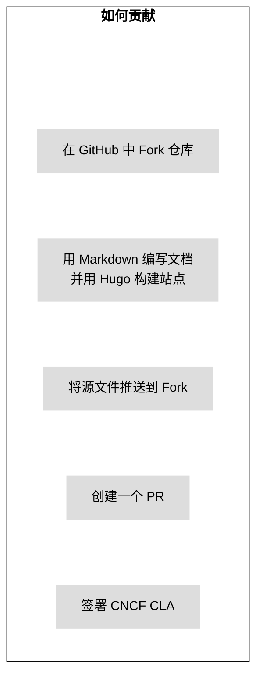
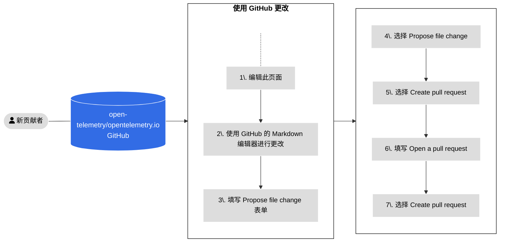
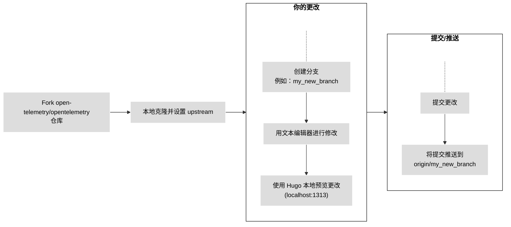
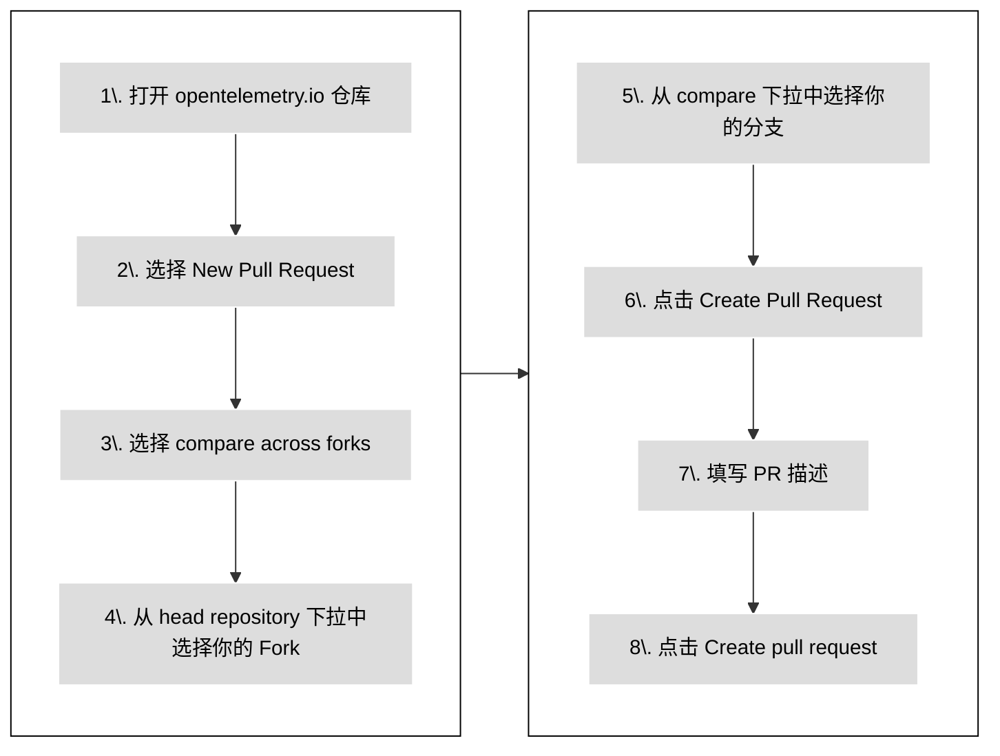

若要贡献新的或改进现有的文档，请提交一个 [pull request][PR]：

- 如果你的改动较小，或你不熟悉 [Git]，请参见[使用 GitHub](#changes-using-github) 了解如何编辑页面。
- 否则，请参见[从本地 Fork 开始工作](#fork-the-repo)了解如何在本地开发环境中进行更改。

{}

所有贡献者都需要在更改被审查和合并之前，签署[贡献者许可协议 (CLA)][CLA]。

[CLA]: ../prerequisites/#cla

{}

{}

将你的 PR 状态设为 **Draft**，以便让维护者知道内容尚未准备好进行审核。
维护者仍可能发表评论或进行高层次审查，但在你移除草稿状态之前，他们不会对内容进行完整审核。

{}

下图展示了如何贡献新文档内容。



图 1. 贡献新内容

## 使用 GitHub {#changes-using-github}

### 从浏览器编辑并提交更改 {#page-edit-from-browser}

如果你对 Git 工作流不太熟悉，可以使用以下更简单的方法来准备并提交新的 PR。
图 2 概述了操作步骤，下面是具体说明。



图 2. 使用 GitHub 提交 PR 的步骤

1. 在你看到问题的页面中，点击右侧导航栏的 **Edit this page**。
2. 如果你不是该项目的成员，GitHub 会提示你 Fork 仓库，点击 **Fork this repository**。
3. 在 GitHub 编辑器中进行更改。
4. 填写 **Propose file change** 表单。
5. 点击 **Propose file change**。
6. 点击 **Create pull request**。
7. 在 **Open a pull request** 页面中填写说明，帮助审阅者理解你的更改。
8. 点击 **Create pull request**。

在合并 PR 之前，OpenTelemetry 社区成员会对其进行审核并批准。

如果审阅者要求你进行更改：

1. 前往 **Files changed** 标签页。
2. 点击铅笔图标编辑 PR 中更改的文件。
3. 按要求修改。如果有代码建议，可直接应用。
4. 提交更改。

审阅完成后，审阅者将合并你的 PR，更改将在几分钟后上线。

### 修复 PR 检查失败 {#fixing-prs-in-github}

提交 PR 后，GitHub 会运行一些构建检查。某些失败（如格式问题）可以自动修复。

在你的 PR 中添加以下评论：

```text
/fix:all
```

这将触发 OpenTelemetry 机器人尝试修复构建问题。你也可以使用以下命令修复特定问题：

```text
fix:dict
fix:expired
fix:filenames
fix:format
fix:htmltest-config
fix:i18n
fix:markdown
fix:refcache
fix:submodule
fix:text
```

{}

你也可以在本地运行 `fix` 命令。若要查看所有可用命令，请运行：

```bash
npm run -s '_list:fix:*'
```

{}

## 本地工作流程 {#fork-the-repo}

如果你熟悉 Git，或你的更改大于几行，建议从本地 Fork 开始工作。

请确保你已在本地安装 [`git`][`git` installed]。你也可以使用 Git 图形界面工具。



图 3. 从本地 Fork 修改内容

### Fork 仓库 {#fork-the-repository}

1. 打开 [`opentelemetry.io`](https://github.com/open-telemetry/opentelemetry.io/) 仓库。
2. 点击 **Fork**。

### 克隆并设置 Upstream {#clone-and-set-upstream}

1. 在终端中克隆你的 Fork 并安装依赖：

   ```shell
   git clone git@github.com:<你的 GitHub 用户名>/opentelemetry.io.git
   cd opentelemetry.io
   npm install
   ```

2. 设置 `open-telemetry/opentelemetry.io` 为 `upstream`：

   ```shell
   git remote add upstream https://github.com/open-telemetry/opentelemetry.io.git
   ```

3. 验证 `origin` 和 `upstream`：

   ```shell
   git remote -v
   ```

   示例输出：

   ```none
   origin	git@github.com:<你的用户名>/opentelemetry.io.git (fetch)
   origin	git@github.com:<你的用户名>/opentelemetry.io.git (push)
   upstream	https://github.com/open-telemetry/opentelemetry.io.git (fetch)
   upstream	https://github.com/open-telemetry/opentelemetry.io.git (push)
   ```

4. 拉取 origin 和 upstream 的更新：

   ```shell
   git fetch origin
   git fetch upstream
   ```

   这可以确保你在开始修改之前，本地仓库是最新的。请定期将 `upstream`
   的更改推送到 `origin`，以保持你的 Fork 与上游仓库同步。

### 创建分支 {#create-a-branch}

1. 基于 `upstream/main` 创建新分支：

   ```shell
   git checkout -b <my_new_branch> upstream/main
   ```

2. 使用代码或文本编辑器进行修改。

使用 `git status` 查看你更改了哪些文件。

### 提交更改 {#commit-your-changes}

当你准备提交 PR 时，请提交你的更改。

1. 在本地仓库中，检查你需要提交的文件：

   ```shell
   git status
   ```

   输出类似于：

   ```none
   On branch <my_new_branch>
   Your branch is up to date with 'origin/<my_new_branch>'.

   Changes not staged for commit:
   (use "git add <file>..." to update what will be committed)
   (use "git checkout -- <file>..." to discard changes in working directory)

   modified:   content/en/docs/file-you-are-editing.md

   no changes added to commit (use "git add" and/or "git commit -a")
   ```

2. 将 **Changes not staged for commit** 中列出的文件添加到提交中：

   ```shell
   git add <你的文件名>
   ```

   对每个文件重复此操作。

3. 添加完所有文件后，创建一次提交：

   ```shell
   git commit -m "你的提交信息"
   ```

4. 将你的本地分支及其新提交推送到远程 Fork：

   ```shell
   git push origin <新分支>
   ```

5. 更改推送完成后，GitHub 会提示你可以创建一个 PR。

### 创建新的 PR {#open-a-pr}

图 4 展示了如何从你的 Fork 仓库向
[opentelemetry.io](https://github.com/open-telemetry/opentelemetry.io)
提交一个 PR 的步骤。



图 4：从你的 Fork 仓库向
[opentelemetry.io](https://github.com/open-telemetry/opentelemetry.io) 提交 PR 的步骤

1. 在浏览器中，前往 [`opentelemetry.io`](https://github.com/open-telemetry/opentelemetry.io) 仓库。

2. 点击 **New Pull Request**。

3. 点击 **compare across forks**。

4. 在 **head repository** 下拉菜单中，选择你的 fork 仓库。

5. 在 **compare** 下拉菜单中，选择你要提交的分支。

6. 点击 **Create Pull Request**。

7. 添加你的PR的描述信息：
   - **Title**（50 个字符以内）：简要说明变更目的。
   - **Description**：更详细地说明你的变更内容。
     - 如果该变更关联某个 GitHub Issue，在描述中加入 `Fixes #12345` 或 `Closes #12345`，
       这样 GitHub 在合并 PR 后会自动关闭对应 issue。
     - 如果你有任何具体问题需要建议，可以在描述中写出你希望评审者关注的问题。

8. 点击 **Create pull request** 按钮。

你的 PR 将在 [Pull requests 页面](https://github.com/open-telemetry/opentelemetry.io/pulls)中显示。

提交 PR 后，GitHub 会自动运行测试，并尝试使用 [Netlify](https://www.netlify.com/) 部署预览版本：

- 如果 Netlify 构建失败，点击 **Details** 查看更多信息。
- 如果 Netlify 构建成功，点击 **Details** 可以打开已应用你改动的
  OpenTelemetry 网站预览版本。评审者会通过该预览来查看你的更改效果。

其他检查项也可能失败。详见所有 PR 检查项列表。

### 修复问题 {#fix-issues}

在提交更改到仓库之前，请运行以下命令，并完成以下两项操作：

1. 处理脚本报告的所有问题；
2. 提交脚本修改过的所有文件：

```sh
npm run test-and-fix
```

如果你希望分开进行检查和修复，可以分别运行以下命令：

```sh
npm run test    # 仅检查文件，不会修改任何内容
npm run fix:all # 可能会自动修改文件
```

要查看所有可用的 NPM 脚本，请运行：

```sh
npm run
```

更多关于拉取请求检查项及其自动修复方法的信息，请参见 PR 检查项。

### 预览更改 {#preview-locally}

本地预览可以帮助你在提交 PR 前发现构建或格式问题。

启动本地预览：

```shell
npm run serve
```

浏览器访问 [http://localhost:1313](http://localhost:1313) 查看预览。

要停止本地服务，在终端按下 `Ctrl+C`。

### 站点部署和 PR 预览 {#site-deploys-and-pr-previews}

当你提交 PR 时，Netlify 会创建一个[部署预览][deploy preview]，方便你查看所做的更改。
一旦你的 PR 被合并，Netlify 会将更新后的网站部署到生产服务器。

> **注意**：PR 预览包含**草稿页面**，但生产环境构建不包含草稿页面。

要查看部署日志等信息，请访问项目的[仪表盘][dashboard] —— 需要登录 Netlify。

### PR 提交流程建议 {#pr-guidelines}

为确保审核流程顺利进行，请注意以下几点：

- 除非是微小更改，否则请 **使用 Fork** 工作流。
- **不要直接使用 Fork 的 `main` 分支**，请新建分支。
- 确保你允许维护者[对 PR 分支进行更改](https://docs.github.com/en/pull-requests/collaborating-with-pull-requests/working-with-forks/allowing-changes-to-a-pull-request-branch-created-from-a-fork)。

### 来自审阅者的更改 {#changes-from-reviewers}

有时，审阅者会直接向你的 PR 提交更改。在你进行其他修改之前，需先获取这些提交。

1. 从你的远程 Fork 获取提交并将其变基到当前工作分支：

   ```shell
   git fetch origin
   git rebase origin/<你的分支名>
   ```

2. 变基完成后，将新更改强制推送到你的 Fork：

   ```shell
   git push --force-with-lease origin <你的分支名>
   ```

你也可以在 GitHub 的用户界面中解决合并冲突。

### 合并冲突与变基 {#merge-conflicts-and-rebasing}

如果其他贡献者在另一个 PR 中修改了同一个文件，就可能会产生合并冲突。
你必须在自己的 PR 中解决所有的合并冲突。

1. 更新你的 Fork，并对本地分支执行变基：

   ```shell
   git fetch origin
   git rebase origin/<你的分支名>
   ```

   然后强制推送变基后的更改到你的 Fork：

   ```shell
   git push --force-with-lease origin <你的分支名>
   ```

2. 从 `open-telemetry/opentelemetry.io` 项目的 `upstream/main` 获取更新，并对你的分支执行变基：

   ```shell
   git fetch upstream
   git rebase upstream/main
   ```

3. 检查变基后的状态：

   ```shell
   git status
   ```

   这会显示哪些文件存在冲突。

4. 打开每个有冲突的文件，查找冲突标记：`>>>`、`<<<` 和 `===`。解决冲突后删除这些标记。

   详情请参见 [Git 合并冲突的表现形式](https://git-scm.com/docs/git-merge#_how_conflicts_are_presented)。

5. 将已解决的文件加入暂存区：

   ```shell
   git add <文件名>
   ```

6. 继续变基过程：

   ```shell
   git rebase --continue
   ```

7. 如有必要，重复第 2 至第 5 步。

   当所有提交都已成功应用后，`git status` 命令会显示变基已完成。

8. 强制推送你的分支到 Fork：

   ```shell
   git push --force-with-lease origin <你的分支名>
   ```

   现在，PR 将不再显示冲突。

### 合并要求 {#merge-requirements}

PR 必须满足以下条件才能被合并：

- 所有由批准者、维护者、技术委员会成员或主题专家所做的审查都显示为 “Approved”（已批准）。
- 没有未解决的评论对话。
- 至少有一位批准者已批准。
- 没有失败的 PR 检查。
- PR 分支与目标分支保持最新。
- 文档页面的更改[不应跨多个语言][do not span locales]。

[do not span locales]: ../localization/#prs-should-not-span-locales

> **重要提示**
>
> 不必过于担心失败的 PR 检查。社区成员会协助你修复这些问题，可能会提供修复方法或直接帮你修复。

[dashboard]: https://app.netlify.com/sites/opentelemetry/overview
[deploy preview]: https://www.netlify.com/blog/2016/07/20/introducing-deploy-previews-in-netlify/
[Git]: https://docs.github.com/en/get-started/using-git/about-git
[`git` installed]: https://git-scm.com/book/en/v2/Getting-Started-Installing-Git
[PR]: https://docs.github.com/en/pull-requests
