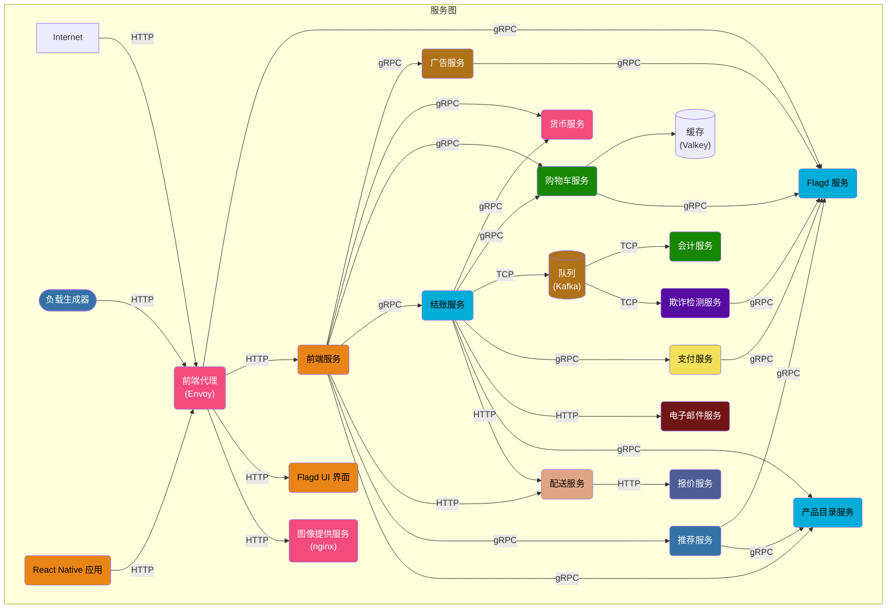
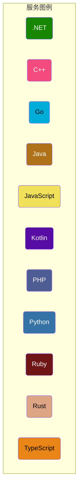
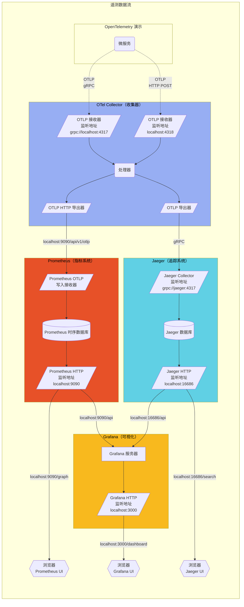

**OpenTelemetry 演示内容**由使用不同编程语言编写的微服务组成，
这些服务通过 gRPC 和 HTTP 相互通信；此外还包括一个使用
[Locust](https://locust.io/) 模拟用户流量的负载生成器。

点击以下链接可查看演示应用中目前的[指标](/docs/demo/telemetry-features/metric-coverage/)和[链路](/docs/demo/telemetry-features/trace-coverage/)监控覆盖情况。

Collector 的配置文件位于
[otelcol-config.yml](https://github.com/open-telemetry/opentelemetry-demo/blob/main/src/otel-collector/otelcol-config.yml)，
也可以在此配置不同的导出器（Exporter）。

你可以在 `/pb/` 目录中找到**协议缓冲定义** 。
