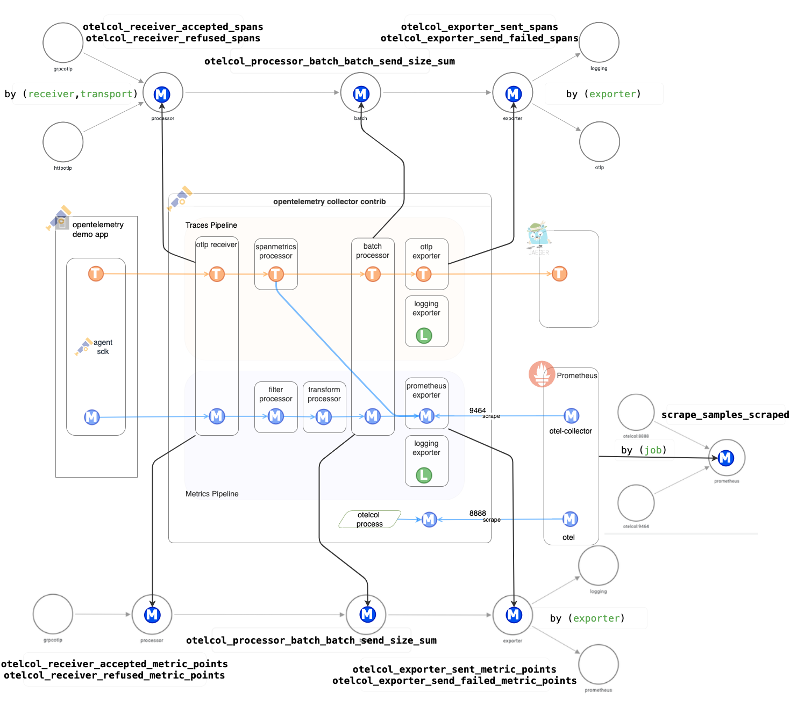

监控 OpenTelemetry Collector 中的数据流具有多重重要意义。
从宏观层面了解输入数据（如样本数量和基数）对于理解 Collector
的内部运行机制至关重要。然而，在深入研究细节时，组件之间的连接可能变得复杂。
Collector 数据流仪表盘旨在展示 OpenTelemetry 演示应用的功能，
为用户提供一个坚实的基础，便于他们进一步扩展。
Collector 数据流仪表盘还提供了有关应监控哪些指标的有价值建议。
用户可以根据自己的使用场景，添加必要的指标
（例如 memory_delimiter 处理器或其他数据流指示器），
以定制自己的仪表盘版本。该演示仪表盘是一个起点，
使用户能够探索各种使用场景，并根据自身的监控需求调整工具。

## 数据流概览 {#data-flow-overview}

下图展示了系统组件的整体视图，基于 OpenTelemetry Collector（otelcol）配置文件生成，
该文件由 OpenTelemetry 演示应用使用。
此外，它还展示了系统中的可观测性数据（链路与指标）的流动情况。

## 数据流入/流出指标 {ingress-egress-metrics}

下图所示的指标用于监控 Collector 的数据流入（ingress）与流出（egress）。
这些指标由 otelcol 进程生成，通过 8888 端口导出，随后被 Prometheus 抓取。
相关指标的命名空间为 "otelcol"，作业名（job name）为 `otel`。

标签是识别特定指标集（如 exporter、receiver 或 job）的有用工具，
有助于在整个命名空间中区分不同的指标集。需要注意的是，只有在 memory_delimiter
处理器中定义的内存限制被超过时，才会出现被拒绝的指标。

### 流入链路管道 {#ingress-traces-pipeline}

- `otelcol_receiver_accepted_spans`
- `otelcol_receiver_refused_spans`
- `by (receiver,transport)`

### 流入指标管道 {#ingress-metrics-pipeline}

- `otelcol_receiver_accepted_metric_points`
- `otelcol_receiver_refused_metric_points`
- `by (receiver,transport)`

### 处理器 {#processor}

目前，演示应用中仅使用了一个批处理器，它被同时用于链路和指标的管道中。

- `otelcol_processor_batch_batch_send_size_sum`

### 流出链路管道 {#egress-traces-pipeline}

- `otelcol_exporter_sent_spans`
- `otelcol_exporter_send_failed_spans`
- `by (exporter)`

### 流出指标管道 {#egress-metrics-pipeline}

- `otelcol_exporter_sent_metric_points`
- `otelcol_exporter_send_failed_metric_points`
- `by (exporter)`

### Prometheus 抓取指标 {#prometheus-scraping}

- `scrape_samples_scraped`
- `by (job)`

## 仪表盘 {#dashboard}

您可以通过进入 Grafana 用户界面（UI），点击左侧的浏览图标，选择
**OpenTelemetry Collector Data Flow** 仪表盘来查看数据流仪表盘。

该仪表盘包含四个主要部分：

1. 进程指标（Process Metrics）
2. 链路管道（Traces Pipeline）
3. 指标管道（Metrics Pipeline）
4. Prometheus 抓取（Prometheus Scraping）

第 2、3 和 4 部分使用上述提到的指标来表示整体数据流。
此外，每条管道还计算导出比率以帮助理解数据流状况。

### 导出比率 {#export-rate}

导出比率是接收端与导出端指标之间的比值。如上方仪表盘截图所示，
指标的导出比率远高于接收的指标数量。这是因为演示应用配置了生成 Span 指标，
这是一种处理器，会在 Collector 内部从 Span 生成指标，如数据流概览图中所示。

### 进程指标 {#process-metrics}

仪表盘中包含了一些有限但有参考价值的进程指标。例如，在系统重启或类似情况下，
您可能会看到多个 otelcol 实例在运行。这有助于分析数据流中的峰值变化。

