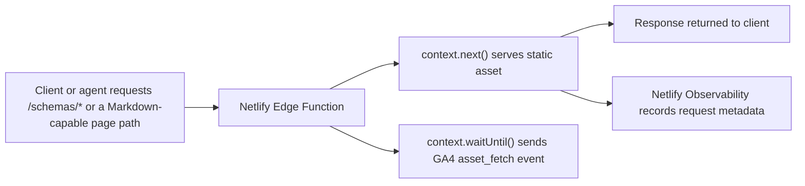

## Goal

Support analytics/observability for non-HTML assets served from
`opentelemetry.io`, including:

- Schema files under `/schemas/*`
- Future Markdown assets such as `*.md` variants of site pages
- Other non-HTML assets, including `llms.txt`

The chosen design keeps reporting accessible to the existing team through Google
Analytics while preserving a reliable operational view in Netlify.

## Summary

- Implement using Netlify Edge Function(s) to emit a GA4 custom event named
  `asset_fetch` for selected asset responses.
- Keep Netlify Observability enabled as the request-level validation and
  debugging surface.
- If/once a markdown-negotiation Edge Function is implemented, it may be used to
  emit `asset_fetch` events with `asset_path` for the returned Markdown resource
  and `original_path` when the request path differs.

We won't model asset requests as GA4 `page_view` events because asset requests
are not HTML page loads, and treating them as page views would pollute site
browsing metrics.

## Why this plan

### What does not work well

#### GA4 enhanced measurement

GA4 enhanced measurement is designed around browser behavior such as page loads,
history changes, outbound clicks, and common file-download link clicks. Raw
requests for `/schemas/1.40.0` or `/foo/index.md` are not page views and will
not be captured consistently by enhanced measurement.

#### Netlify Web Analytics

Netlify Web Analytics is page-oriented. It is useful for HTML pages, but it is
not the right source of truth for raw YAML or Markdown asset delivery.

#### Netlify log drains to GA4

GA4 is not a log drain destination. Netlify log drains emit log records, while
GA4 Measurement Protocol expects analytics events in GA4 payload format. A
separate adapter service would be required, which is more complex than sending
events directly from the edge.

### What fits the problem

#### GA4 custom events

GA4 custom events allow all asset analytics to remain in the analytics console
that the team already uses.

#### Netlify Edge Functions

An Edge Function can:

1. intercept selected asset requests
2. let Netlify serve the asset normally
3. read the response metadata
4. enqueue a post-response GA4 event send

This keeps asset delivery fast while capturing analytics close to the request.

#### Netlify Observability

Observability remains useful as the operational backstop:

- validate that asset traffic exists
- compare request counts against GA4 event counts
- inspect response status distribution
- inspect AI agent, crawler, browser, and tooling traffic classes

## Architecture

### Request flow

### System roles

- Netlify Edge Function: collection point for selected asset requests
- GA4: shared analytics surface for asset usage reporting
- Netlify Observability: request validation, debugging, and traffic inspection
- BigQuery export from GA4: optional long-term exact reporting when GA4 UI
  cardinality becomes limiting

## GA4 event design

### Event name

Use one custom event:

`asset_fetch`

This keeps reporting simple and avoids proliferating many event names.

### Required event parameters

Send the following GA4 event parameters for every tracked asset request:

- `asset_group`: one of: `schema`, `markdown`, `other`
- `asset_path`: path of the resource returned in the response, after Path
  resolution (for example `/schemas/1.40.0` or
  `/docs/concepts/context/index.md`)
- `asset_ext`: extension from `asset_path` when present; always `yaml` for
  schemas
- `content_type`: stable response content type, for example `application/yaml`
- `status_code`: response status as a string, for example `200`

### Markdown negotiation: `original_path`

- `original_path`: unmodified request path when it differs from `asset_path`,
  for example `/docs/concepts/context/` when the resolved `asset_path` is
  `/docs/concepts/context/index.md` (omit when request and resolution match).
  The `markdown-negotiation` Edge Function sends this today; other asset types
  may add it later.

### Optional event parameters

- `referrer_host`
- `ua_category`: coarse user-agent class such as `browser`, `ai-agent`,
  `crawler`, `tooling`, `other`

### Parameters to avoid

Do not send the following to GA4:

- Full user agent string
- Referrer URL
- Query strings by default
- IP address
- Request headers beyond coarse classification

These fields either create unnecessary cardinality, expose more data than
needed, or are poor fits for GA4 reporting.

### Path resolution

Apply the following when resolving paths for GA4:

**Always (all phases):**

- strip query strings
- preserve the route path
- keep the exact schema version path, for example `/schemas/1.40.0`

**Phase 2 (Markdown and other negotiated routes):**

- `asset_path` is the path of the returned resource after resolution.
- `original_path`, when sent, is the unmodified request path (only when it
  differs from `asset_path`).

#### Examples

- `/schemas/1.40.0?cache=1` -> `/schemas/1.40.0`
- `/docs/concepts/context/index.md` -> `/docs/concepts/context/index.md`

Markdown negotiation examples:

- `/docs/` resolves to `/docs/index.md` for `asset_path`; send `original_path`
  `/docs/` if it differs from the resolved path.
- `/docs/concepts/context/` with content negotiation: `asset_path` is the path
  of the returned Markdown file; send `original_path` when the request path
  differs

## GA4 configuration

### Stream choice

Recommended: use the existing GA4 web stream.

Reasons:

- aligns with GA4 guidance to use a single web stream for one website in most
  cases
- keeps asset analytics in the same GA property and console already used by the
  team
- avoids extra measurement IDs, connector setup, and dashboard wiring
- standard page reporting should remain clear because asset requests use a
  separate custom event name, `asset_fetch`, rather than `page_view`

Use a separate stream only if administrative separation becomes necessary.
Examples:

- a different ownership boundary
- a different tagging or governance model
- a need to isolate very large machine-only traffic volumes operationally

If stream-level separation is not enough for governance, use a separate GA4
property.

### Custom dimensions

Register these event-scoped custom dimensions in GA4:

- `asset_group`
- `asset_path`
- `asset_ext`
- `content_type`
- `status_code`
- `original_path` (phase 2)
- `referrer_host` if used
- `ua_category` if used

### Reporting model

The primary GA4 metric is:

- `Event count`

The main report slices are:

- event count by `asset_path`
- event count by `asset_group`
- event count by `asset_ext`
- event count by `status_code`
- event count by `ua_category` if implemented

### Retention and history

GA4 aggregated reports remain available in the GA UI, but event-level retention
used by Explorations is limited by GA4 retention settings. If exact long-term
path-level history matters, enable BigQuery export.

## Reporting examples

### Schema access counts

Example question:

How many times was `/schemas/1.40.0` fetched in the last 30 days?

GA4 answer shape:

- filter `event_name = asset_fetch`
- filter `asset_group = schema`
- breakdown by `asset_path`
- metric `Event count`

### Markdown asset access counts

Example question:

Which Markdown-rendered page assets were fetched most often this month?

GA4 answer shape:

- filter `event_name = asset_fetch`
- filter `asset_group = markdown`
- breakdown by `asset_path`
- metric `Event count`

For negotiated Markdown delivery, the `markdown-negotiation` Edge Function sets
`asset_path` to the path of the returned resource and sends `original_path` when
the request path differs.

### Bot and AI traffic split

Example question:

How much of Markdown asset traffic comes from AI agents vs browsers?

Two options:

1. In GA4, if `ua_category` is sent as an event parameter.
2. In Netlify Observability, which already classifies user agents and is better
   suited for validation and operational analysis.

## Looker Studio reporting

Use the existing GA4-backed Looker Studio reporting approach for asset
analytics. This should work well for the current goals:

- access counts
- top-accessed schema files
- top-accessed Markdown assets

### Top 10 schemas in the last 30 days

Recommended chart configuration:

- data source: GA4 property or dedicated asset stream
- chart type: table
- dimension: `asset_path`
- metric: `Event count`
- filters:
  - `event_name = asset_fetch`
  - `asset_group = schema`
- sort: `Event count` descending
- row limit: top `10`
- date range: last `30` days

### Top Markdown assets in the last 30 days

Recommended chart configuration:

- data source: GA4 property or dedicated asset stream
- chart type: table
- dimension: `asset_path`
- metric: `Event count`
- filters:
  - `event_name = asset_fetch`
  - `asset_group = markdown`
- sort: `Event count` descending
- row limit: top `10`
- date range: last `30` days

### Publishing and sharing

This reporting can be added to the existing public Looker Studio dashboard,
assuming:

- the report uses owner credentials for the GA4 data source
- the GA4 custom dimensions have been registered
- the new fields have propagated and the Looker data source fields have been
  refreshed

### Limits

This approach is a good fit for top-N reporting. If `asset_path` eventually
becomes too high-cardinality and GA4 starts collapsing values into `(other)`,
move the public path-level report to Looker Studio on top of GA4 BigQuery
export.

## Phase 1 runtime configuration (completed)

Configure the Netlify site with:

- `HUGO_SERVICES_GOOGLEANALYTICS_ID`
  - existing GA4 measurement ID for the site's current web stream
- `GA4_API_SECRET`
  - new GA4 Measurement Protocol API secret for `asset_fetch` events

Phase 1 should reuse the existing web stream and should not introduce a second
measurement ID.

Phase 1 should rely on environment-variable scoping rather than host-based
checks inside the Edge Function. If `GA4_API_SECRET` is only configured for
production, local and preview environments will not send GA4 events unless the
secret is intentionally provided there as well.

### Create the GA4 Measurement Protocol API secret

In GA4:

1. Open `Admin`.
2. Open `Data streams`.
3. Choose the site's existing web stream.
4. Open `Measurement Protocol`.
5. Create a new API secret for `asset_fetch` events.

Operational notes:

- keep the secret private
- store it only in Netlify site settings
- rotate it if there is any reason to suspect exposure

### Set the Netlify environment variable

In Netlify site settings:

1. Open the site's environment variable settings.
2. Add `GA4_API_SECRET`.
3. Paste the Measurement Protocol API secret value.
4. Redeploy after the variable is added or updated.

`HUGO_SERVICES_GOOGLEANALYTICS_ID` should already exist and should continue to
point at the existing web stream measurement ID.

### How to register GA4 custom dimensions

In GA4:

1. Open `Admin`.
2. Under `Data display`, open `Custom definitions`.
3. Open the `Custom dimensions` tab.
4. Create event-scoped custom dimensions for the `asset_fetch` parameters.

Suggested GA4 dimension definitions:

- Dimension name: `Asset group`
  - Scope: `Event`
  - Event parameter: `asset_group`
  - Description: Broad category for fetched non-HTML assets, such as `schema` or
    `markdown`
- Dimension name: `Asset path`
  - Scope: `Event`
  - Event parameter: `asset_path`
  - Description: Path of the resource returned for the fetch (after Path
    resolution), such as `/schemas/1.40.0`
- Dimension name: `Asset extension`
  - Scope: `Event`
  - Event parameter: `asset_ext`
  - Description: Extension from `asset_path` when present. Always `yaml` for
    schemas.
- Dimension name: `Content type`
  - Scope: `Event`
  - Event parameter: `content_type`
  - Description: Response content type returned for the fetched asset, such as
    `application/yaml`
- Dimension name: `Status code`
  - Scope: `Event`
  - Event parameter: `status_code`
  - Description: HTTP response status code returned when serving the asset
- Dimension name: `Original path`
  - Scope: `Event`
  - Event parameter: `original_path`
  - Description: Unmodified request path when it differs from `asset_path`.
    Register for Markdown negotiation; omit when unused (for example schemas do
    not send this parameter).

GA4 custom dimensions typically become available in reports and explorations 24
to 48 hours after the event data is sent and the custom dimension is created.

### Validate phase 1 after deploy

After deploying:

1. Fetch a known schema URL such as `/schemas/1.40.0`.
2. Confirm the response still returns YAML.
3. Check GA4 Realtime for the `asset_fetch` event.
4. After custom dimensions propagate, confirm `asset_group = schema` and the
   expected `asset_path` appear in GA4 and Looker Studio.

Validation note:

- GA4 `mp/collect` returns `2xx` even when a payload is malformed, so use the
  GA4 Measurement Protocol validation server during initial bring-up if payload
  validation is needed:
  <https://developers.google.com/analytics/devguides/collection/protocol/ga4/validating-events>

## Edge Function collection rules

### Tracked paths

Initial scope:

- `/schemas/*`
- Markdown asset responses, including direct `.md` requests and negotiated
  Markdown responses

Future optional scope:

- other machine-readable non-HTML assets that warrant analytics

### Response gating

Only send GA4 events when all of the following are true:

1. Request method is `GET`
2. Response status is in the `2xx` or `3xx` range
3. Response content type matches a tracked asset type
4. Path matches configured tracked routes

This avoids inflating counts with failed or irrelevant requests.

In the future we might broaden tracking to other HTTP methods, and for other
response status codes.

### Deduplication policy

Do not attempt request deduplication in the Edge Function. Count each served
request as one `asset_fetch` event.

Reason:

- request count is the simplest and most defensible metric
- GA4 user/session semantics are weak for server-side asset fetches anyway
- deduplication would add ambiguity and operational complexity

## Identity and privacy

### Client identity

GA4 Measurement Protocol for web data expects a `client_id`. For browser
requests, the Edge Function may be able to reuse the GA cookie value when it is
present. For bots, CLIs, CI systems, and many AI agents, no GA cookie will
exist.

Recommended approach:

- if a valid GA client identifier is present, forward it
- otherwise send a generated anonymous identifier only if required for event
  acceptance
- do not rely on GA users or sessions for asset analytics decisions

Interpretation rule:

Asset analytics should be treated primarily as event-count analytics, not
human-user analytics.

### Privacy constraints

Do not send:

- IP addresses
- raw user-agent strings
- full referrer URLs
- any user-entered content

If coarse origin analysis is useful, send only a stable `referrer_host`
(hostname, no path).

Phase 1 intentionally does not forward the original request `User-Agent` header
to GA4. The primary reporting goal is event counts and top-accessed asset paths,
not browser or device attribution, and Netlify Observability is the better
source for request-level traffic classification such as browsers, crawlers, and
AI agents.

## Cardinality controls

### Known GA4 risk

`asset_path` can become a high-cardinality dimension, especially once Markdown
assets are generated for many pages.

### Mitigations

- use one event name only
- use a small set of categorical parameters
- keep `asset_path` stable (Path resolution)
- do not send query strings
- use BigQuery export for exact long-term analysis

### When to move beyond GA4 UI

If the GA4 UI starts collapsing rows into `(other)` for `asset_path`, use:

- GA4 for high-level grouped reporting
- BigQuery for exact path-level analysis

## Netlify Observability role

Netlify Observability should remain enabled even after GA4 asset tracking is
added.

Use it for:

- sanity-checking request volumes
- short-term incident analysis
- debugging status-code spikes
- identifying traffic classes such as AI agents and crawlers

Do not treat it as the primary shared reporting surface for this initiative. It
is better suited to internal operational use than broad publishing.

## Implementation plan

### Phase 1 (completed)

1. Add a Netlify Edge Function that matches `/schemas/*`.
2. Send `asset_fetch` to GA4 with the required parameters only.
3. Create the GA4 custom dimensions.
4. Validate counts against Netlify Observability.

### Phase 2

Steps:

1. **Markdown asset tracking** — implemented in the `markdown-negotiation` Edge
   Function (`asset_path`, `original_path` when the request path differs, GET
   only, successful Markdown responses).
2. Extend tracking to plain-text assets such as `llms.txt` and other `*.txt`
   files.
3. Add `ua_category` if the classification is stable and low-cardinality.
4. Build a shared GA4 exploration or Looker Studio report for the team.

### Phase 3

1. Enable GA4 BigQuery export if exact long-term path-level reporting becomes
   important.
2. Add grouped dashboards for:
   - schema usage by version
   - Markdown asset usage by section
   - asset traffic by status code

## Open decisions

### Stream vs property

Default recommendation: use the existing web stream in the existing property.

Decision triggers for a separate property:

- stricter access control
- a need for stronger isolation than a separate event name provides
- desire to isolate machine traffic completely
- concern that asset events will confuse non-technical GA users

### Whether to send `ua_category`

Recommended default: not in phase 1.

Reason:

- Netlify already provides agent classification operationally
- it can be added later if needed

### Whether to count redirects

Recommended default: yes, if the request is a successful redirect for a tracked
asset route such as `/schemas/latest`.

If reports should reflect only terminal asset responses, change the gating rule
to only count `2xx`.

## Proposed dashboard questions

- Which schema versions are fetched most often?
- How often is `/schemas/latest` used compared to pinned schema versions?
- Which Markdown asset routes are fetched most often?
- Which documentation sections receive the most Markdown asset traffic?
- What share of asset traffic is non-`200`?

## References

- GA4 Measurement Protocol:
  <https://developers.google.com/analytics/devguides/collection/protocol/ga4>
- GA4 custom dimensions:
  <https://support.google.com/analytics/answer/14239696?hl=en>
- GA4 data retention:
  <https://support.google.com/analytics/answer/7667196?hl=en>
- GA4 BigQuery export:
  <https://support.google.com/analytics/answer/9358801?hl=en>
- Netlify Edge Functions API:
  <https://docs.netlify.com/build/edge-functions/api/>
- Netlify Observability overview:
  <https://docs.netlify.com/manage/monitoring/observability/overview/>
- Looker Studio table charts:
  <https://docs.cloud.google.com/looker/docs/studio/table-reference>
- Looker Studio sharing:
  <https://docs.cloud.google.com/looker/docs/studio/ways-to-share-your-reports>

## Tasks

This section broadly tracks the tasks for the implementation plan.

### In progress

All done for this iteration.

### Other tasks

- [ ] Extend tracking to plain-text assets such as `llms.txt` and other `*.txt`
      files.
- [ ] Add `ua_category` if the classification is stable and low-cardinality.
- [ ] Build a shared GA4 exploration or Looker Studio report for the team.

## Edit history

Reverse chronological: prepend a `### v…` section for each plan-changing PR; use
`-dev` on the version until that change set is merged.

### v0.2-dev - TBD (not merged yet)

- `asset_path` / `original_path` semantics (returned resource vs request when it
  differs); Path resolution wording; `original_path` documented as live for
  Markdown negotiation; section structure and examples; GET-only analytics (not
  HEAD/POST), with possible later broadening to other methods; `asset_ext`
  wording (path suffix vs `yaml` for schemas).

### v0.1 - 2026-04-03

- First version.
