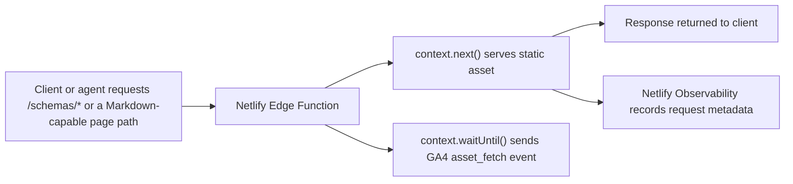

## Goal

Support essential GA4 analytics for non-HTML assets served from
`opentelemetry.io`, including:

- Schema files under `/schemas/*`
- Markdown assets such as `*.md` variants of site pages
- Other non-HTML assets, including `llms.txt`

The chosen design keeps reporting accessible to the existing team through Google
Analytics while preserving a reliable operational view in Netlify.

[Netlify Observability][] remains the operational backstop for request-level
validation and debugging.

## Summary

- Implement using Netlify Edge Function(s) to emit a GA4 custom event named
  `asset_fetch` for selected asset responses.
- Keep Netlify Observability enabled as the request-level validation and
  debugging surface.
- The `markdown-negotiation` Edge Function emits `asset_fetch` for Markdown
  delivery for negotiated page paths, with `original_path` when it differs from
  the resolved `*.md` path.
- The `asset-tracking` Edge Function emits `asset_fetch` for explicit `.md` and
  `*.txt` requests and skips internal subrequests marked with
  `X-Asset-Fetch-Ga-Info`.

We won't model asset requests as GA4 `page_view` events because asset requests
are not HTML page loads, and treating them as page views would pollute site
browsing metrics.

## Why this plan

### What does not work well

#### GA4 enhanced measurement

GA4 enhanced measurement is designed around browser behavior such as page loads,
history changes, outbound clicks, and common file-download link clicks. Raw
requests for `/schemas/1.40.0` or `/foo/index.md` are not page views and will
not be captured consistently by enhanced measurement.

#### Netlify Web Analytics

Netlify Web Analytics is page-oriented. It is useful for HTML pages, but it is
not the right source of truth for raw YAML or Markdown asset delivery.

#### Netlify log drains to GA4

GA4 is not a log drain destination. Netlify log drains emit log records, while
GA4 Measurement Protocol expects analytics events in GA4 payload format. A
separate adapter service would be required, which is more complex than sending
events directly from the edge.

### What fits the problem

#### GA4 custom events

GA4 custom events allow all asset analytics to remain in the analytics console
that the team already uses.

#### Netlify Edge Functions

An Edge Function can:

1. intercept selected asset requests
2. let Netlify serve the asset normally
3. read the response metadata
4. enqueue a post-response GA4 event send

This keeps asset delivery fast while capturing analytics close to the request.

#### Netlify Observability

Observability remains useful as the operational backstop:

- validate that asset traffic exists
- compare request counts against GA4 event counts
- inspect response status distribution
- inspect AI agent, crawler, browser, and tooling traffic classes

## Architecture

### Request flow

### System roles

- Netlify Edge Function: collection point for selected asset requests
- GA4: shared analytics surface for asset usage reporting
- Netlify Observability: request validation, debugging, and traffic inspection
- BigQuery export from GA4: optional long-term exact reporting when GA4 UI
  cardinality becomes limiting

## GA4 event design

### Event name

Use a single custom event: `asset_fetch`

### Event parameters

Event parameters correspond to the following GA4 custom dimensions:

- Dimension name: `Asset path`
  - Scope: `Event`
  - Event parameter: `asset_path`
  - Description: Path of the resource returned for the fetch (after Path
    resolution), such as `/schemas/1.40.0`
- Dimension name: `Original path`
  - Scope: `Event`
  - Event parameter: `original_path`
  - Description: Unmodified request path when it differs from `asset_path`.
    Register for Markdown negotiation; omit when unused (for example schemas do
    not send this parameter).
- Dimension name: `Content type`
  - Scope: `Event`
  - Event parameter: `content_type`
  - Description: Response content type returned for the fetched asset, such as
    `application/yaml`
- Dimension name: `Status code`
  - Scope: `Event`
  - Event parameter: `status_code`
  - Description: HTTP response status code returned when serving the asset
- Dimension name: `Event emitter`
  - Scope: `Event`
  - Event parameter: `event_emitter`
  - Description: Short stable id for the instrumentation scope that emitted the
    `asset_fetch` event.
  - Canonical values:
    - `negotiation` — Accept-negotiated page Markdown (`markdown-negotiation`)
    - `tracking` — direct `.md` / `.txt` paths (`asset-tracking`)
    - `schema` — `/schemas/*` responses (`schema-analytics`). **Note:** this
      value may be deprecated in the future.

Deprecated dimensions:

- Dimension name: `Asset extension`
  - Status: **DEPRECATED** since v0.4
  - Scope: `Event`
  - Event parameter: `asset_ext`
  - Description: Extension from `asset_path` when present. Always `yaml` for
    schemas.
- Dimension name: `Asset group`
  - Status: **DEPRECATED** since v0.4
  - Scope: `Event`
  - Event parameter: `asset_group`
  - Description: Broad category for fetched non-HTML assets, such as `schema` or
    `markdown`

Possible future event parameters:

- `referrer_host`
- `ua_category`: coarse user-agent class such as `browser`, `ai-agent`,
  `crawler`, `tooling`, `other`

### Parameters to avoid

Do not send the following to GA4:

- Full user agent string
- Referrer URL
- Query strings by default
- IP address
- Request headers beyond coarse classification

These fields either create unnecessary cardinality, expose more data than
needed, or are poor fits for GA4 reporting.

### Path resolution

Apply the following when resolving paths for GA4:

**Always (all phases):**

- strip query strings
- preserve the route path
- keep the exact schema version path, for example `/schemas/1.40.0`

**Phase 2 (Markdown and other negotiated routes):**

- `asset_path` is the path of the returned resource after resolution.
- `original_path`, when sent, is the unmodified request path (only when it
  differs from `asset_path`).

#### Examples

- `/schemas/1.40.0?cache=1` -> `/schemas/1.40.0`
- `/docs/concepts/context/index.md` -> `/docs/concepts/context/index.md`

Markdown negotiation examples:

- Path resolution is case-sensitive by design. URL paths are normally
  case-sensitive on the web, so only lowercase `index.html` participates in
  Markdown negotiation; unusual variants such as `index.HTML` fall through.
- `/docs/` resolves to `/docs/index.md` for `asset_path`; send `original_path`
  `/docs/` if it differs from the resolved path.
- `/docs/concepts/context/` with content negotiation: `asset_path` is the path
  of the returned Markdown file; send `original_path` when the request path
  differs

## GA4 configuration

### Stream choice

Recommended: use the existing GA4 web stream.

Reasons:

- aligns with GA4 guidance to use a single web stream for one website in most
  cases
- keeps asset analytics in the same GA property and console already used by the
  team
- avoids extra measurement IDs, connector setup, and dashboard wiring
- standard page reporting should remain clear because asset requests use a
  separate custom event name, `asset_fetch`, rather than `page_view`

Use a separate stream only if administrative separation becomes necessary.
Examples:

- a different ownership boundary
- a different tagging or governance model
- a need to isolate very large machine-only traffic volumes operationally

If stream-level separation is not enough for governance, use a separate GA4
property.

### Custom dimensions

Register these event-scoped custom dimensions in GA4:

- `asset_path`
- `content_type`
- `status_code`
- `event_emitter`
- `original_path` (phase 2)
- `referrer_host` if used
- `ua_category` if used

### Retention and history

GA4 aggregated reports remain available in the GA UI, but event-level retention
used by Explorations is limited by GA4 retention settings, which is set to 14
months (as of 2026-04-03).

## Reporting

- Google Analytics console:
  - Engagement > Events report. Select `asset_fetch` to view details of all
    asset fetch events.
- Looker Studio
  - Asset fetch event reporting can be added to the existing public Looker
    Studio dashboard.
    - For an example, see the Schema table (added around 2026-04-09)
  - Note: You may have to refresh the data source to see new custom dimensions.
  - Limits:
    - This approach is a good fit for top-N reporting. If `asset_path`
      eventually becomes too high-cardinality and GA4 starts collapsing values
      into `(other)`, move the public path-level report to Looker Studio on top
      of GA4 BigQuery export.

## Phase 1 runtime configuration (completed)

### Create a GA4 Measurement Protocol API secret

In GA4:

1. Open `Admin`.
2. Open `Data streams`.
3. Choose the site's existing web stream.
4. Open `Measurement Protocol`.
5. Create a new API secret for `asset_fetch` events.

Operational notes:

- Keep the secret private
- Store it only in Netlify site settings
- Rotate it if there is any reason to suspect exposure

### Set `GA4_API_SECRET`

In Netlify site Environment Variables settings:

1. Open the site's environment variable settings.
2. Add `GA4_API_SECRET` for **production only**.
3. Paste the Measurement Protocol API secret value.
4. Redeploy after the variable is added or updated.

`HUGO_SERVICES_GOOGLEANALYTICS_ID` should already exist and should continue to
point at the existing web stream measurement ID.

### How to register GA4 custom dimensions

In GA4:

1. Open `Admin`.
2. Under `Data display`, open `Custom definitions`.
3. Open the `Custom dimensions` tab.
4. Create event-scoped custom dimensions for each of the `asset_fetch`
   parameters listed in [Event parameters](#event-parameters).

> **Note:** GA4 custom dimensions typically become available in reports and
> explorations 24 to 48 hours after the event data is sent and the custom
> dimension is created.

### Validate phase 1 after deploy

After deploying:

1. Fetch a known schema URL such as `/schemas/1.40.0`.
2. Confirm the response still returns YAML.
3. Check GA4 Realtime for the `asset_fetch` event.
4. After custom dimensions propagate, confirm the expected `asset_path`,
   `content_type`, and `status_code` appear in GA4 and Looker Studio.

Validation note:

- GA4 `mp/collect` returns `2xx` even when a payload is malformed, so use the
  GA4 Measurement Protocol validation server during initial bring-up if payload
  validation is needed:
  <https://developers.google.com/analytics/devguides/collection/protocol/ga4/validating-events>

## Edge Function collection rules

### Tracked paths

- `/schemas/*`
- Request paths ending in `.md` or `.txt`
- Any path with content negotiation for Markdown

> **Note:** More extensions may be added in the future in support of [Download
> URLs #4079][#4079].

[#4079]: https://github.com/open-telemetry/opentelemetry.io/issues/4079

### Response gating

Only send GA4 events when all of the following are true:

1. Request method is `GET`
2. Path matches configured tracked routes
3. The response matches the route-specific tracking rules

Current route-specific rules:

- Negotiated Markdown: track only successful negotiated Markdown `GET 2xx`
  responses
- Explicit `.md` and `.txt`: track direct `GET` requests to tracked asset URLs
  regardless of response status, and skip any request marked with
  `X-Asset-Fetch-Ga-Info`
- Schemas: track `GET /schemas/*` for successful `2xx` YAML responses and
  successful `3xx` redirects under `/schemas/*`.

These rule help avoid emitting non-essential events to GA. Consult the site's
[Netlify Observability][] page for responses with other status codes such as
`4xx` or `5xx`, and other HTTP methods.

### Response header

For rollout and sanity-checking, add a response header:

- `X-Asset-Fetch-Ga-Info: <asset_path>[; <info-tag>[,<info-tag>]*]`
- `X-Asset-Fetch-Ga-Info: none[: <info-tag> [,<info-tag>]*]`

Where:

- `<asset_path>` is the derived GA `asset_path` that would be sent for the
  request; or `none` when there is no derived GA path

When `<asset_path>` is `none`, the info-tag offers a reason:

- `request method X is not currently tracked` (where X is the request method)
- `request path does not match a tracked route`
- `internal subrequest`
  - Request is an internal subrequest already marked with
    `X-Asset-Fetch-Ga-Info`.
- `response does not meet route-specific gating`
  - Request path matches, but the response does not meet route-specific gating.

When there is a path, possible info-tags include:

- `config-missing`
  - GA credentials are not present, so the request is only a local GA event
    candidate.
- `config-present`
  - GA credentials are present, so event enqueue will be attempted.
- `ga-event-candidate`
  - The request matches the current route/method/response gating and is a
    candidate to emit `asset_fetch`.

This header is for validating path derivation and coarse GA event
candidate/config state only. It does not indicate that GA accepted or reported
the event. The header might be dropped in the future.

### Deduplication policy

Edge Function design should ensure that at most one `asset_fetch` event is sent
for each request.

## Identity and privacy

### Client identity

GA4 Measurement Protocol for web data expects a `client_id`. For browser
requests, the Edge Function may be able to reuse the GA cookie value when it is
present. For bots, CLIs, CI systems, and many AI agents, no GA cookie will
exist.

Recommended approach:

- if a valid GA client identifier is present, forward it
- otherwise send a generated anonymous identifier only if required for event
  acceptance
- do not rely on GA users or sessions for asset analytics decisions

Interpretation rule:

Asset analytics should be treated primarily as event-count analytics, not
human-user analytics.

### Privacy constraints

Do not send:

- IP addresses
- raw user-agent strings
- full referrer URLs
- any user-entered content

If coarse origin analysis is useful, send only a stable `referrer_host`
(hostname, no path).

Phase 1 intentionally does not forward the original request `User-Agent` header
to GA4. The primary reporting goal is event counts and top-accessed asset paths,
not browser or device attribution, and Netlify Observability is the better
source for request-level traffic classification such as browsers, crawlers, and
AI agents.

## Cardinality controls

### Known GA4 risk

`asset_path` can become a high-cardinality dimension, especially once Markdown
assets are generated for many pages.

### Mitigations

- Use one event name only
- Use a small set of categorical parameters
- Keep `asset_path` stable (path resolution)
- Do not send query strings
- Use BigQuery export for exact long-term analysis

### When to move beyond GA4 UI

If the GA4 UI starts collapsing rows into `(other)` for `asset_path`, use:

- GA4 for high-level grouped reporting
- BigQuery for exact path-level analysis

## Implementation plan

### Phase 1 (completed)

1. Add a Netlify Edge Function that matches `/schemas/*`.
2. Send `asset_fetch` to GA4 with the required parameters only.
3. Create the GA4 custom dimensions.
4. Validate counts against Netlify Observability.

### Phase 2

**Status:** In progress. Completed steps: 1, 2.

Steps:

1. **Negotiated Markdown tracking** — implemented in the `markdown-negotiation`
   Edge Function (`asset_path`, `original_path` when the request path differs,
   GET only, successful Markdown responses).
2. **Asset tracking** — implemented in the `asset-tracking` Edge Function for
   explicit `.md` and `*.txt` requests. It tracks `GET` requests to tracked
   asset URLs regardless of response status. Rationale: keeps
   `markdown-negotiation` focused on `Accept`-based negotiation; direct asset
   routes use only `context.next()` (no alternate fetch), so a small dedicated
   handler is simpler to test; a single combined entrypoint can be revisited
   later if preferred.

   Internal fetches from `markdown-negotiation` should carry
   `X-Asset-Fetch-Ga-Info`; the direct-asset handler should treat the presence
   of that request header as an internal subrequest marker and skip tracking to
   avoid double-counting negotiated page requests. The same header can also
   expose compact debug info on responses, which keeps the mechanism simple and
   live-testable.

3. **Debug response header** — add `X-Asset-Fetch-Ga-Info` to responses using
   the format described in [Debug response header](#debug-response-header).
   Purpose: validate derived GA path plus coarse trackability/config state in
   production without implying GA ingestion.

4. (optional) Add `ua_category` if the classification is stable and
   low-cardinality.

### Phase 3

This phase is optional.

1. Build a shared GA4 exploration or Looker Studio report for the team.
1. Enable GA4 BigQuery export if exact long-term path-level reporting becomes
   important.
1. Add grouped dashboards for:
   - schema usage by version
   - Markdown asset usage by section
   - asset traffic by status code

## Prior art

Useful prior art for phase 2.2 and related documentation:

- Cloudflare Workers subrequests:
  <https://developers.cloudflare.com/workers/platform/limits/#subrequests>
- Cloudflare analytics with Workers:
  <https://developers.cloudflare.com/analytics/account-and-zone-analytics/analytics-with-workers/>
- Envoy `x-envoy-internal` header:
  <https://www.envoyproxy.io/docs/envoy/latest/configuration/http/http_conn_man/headers.html#x-envoy-internal>
- Envoy header sanitizing / internal headers:
  <https://www.envoyproxy.io/docs/envoy/latest/configuration/http/http_conn_man/header_sanitizing.html>
- NGINX subrequests:
  <https://nginx.org/en/docs/dev/development_guide.html#subrequests>
- Next.js middleware docs:
  <https://nextjs.org/docs/pages/api-reference/file-conventions/middleware>

## References

- GA4 Measurement Protocol:
  <https://developers.google.com/analytics/devguides/collection/protocol/ga4>
- GA4 custom dimensions:
  <https://support.google.com/analytics/answer/14239696?hl=en>
- GA4 data retention:
  <https://support.google.com/analytics/answer/7667196?hl=en>
- GA4 BigQuery export:
  <https://support.google.com/analytics/answer/9358801?hl=en>
- Netlify Edge Functions API:
  <https://docs.netlify.com/build/edge-functions/api/>
- Netlify Observability overview:
  <https://docs.netlify.com/manage/monitoring/observability/overview/>
- Looker Studio table charts:
  <https://docs.cloud.google.com/looker/docs/studio/table-reference>
- Looker Studio sharing:
  <https://docs.cloud.google.com/looker/docs/studio/ways-to-share-your-reports>

## Tasks

This section broadly tracks the tasks for the implementation plan.

### In progress

Add support for `X-Asset-Fetch-Ga-Info` header.

### Other tasks

In no particular order:

- Add `ua_category` if the classification is stable and low-cardinality.
- Build a shared GA4 exploration or Looker Studio report for the team.
- Report non-2XX and non-3XX responses from internal markdown-negotiation
  subrequests.

## Edit history

Plan changes in reverse chronological order. Prepend a `### v…` section for each
plan-changing PR; use `-dev` on the version until that change set is merged.

### v0.4-dev - TBD (not merged yet)

- Added `event_emitter` with canonical values `negotiation`, `tracking`, and
  `schema`, and updated the implementation/tests to emit and validate it.
- Deprecated `asset_group` and `asset_ext`, and removed them from the emitted
  GA4 payloads and related test assertions.
- Added support for `X-Asset-Fetch-Ga-Info` response headers using
  `<asset_path>[;<info-tag>[,<info-tag>]*]` or
  `none[: <info-tag> [,<info-tag>]*]`, and updated tests to validate the initial
  GA event candidate and non-candidate cases, including integration tests and
  deployed-host live checks.
- Added dedicated `/site/testing/tests/` content fixtures for live checks,
  including a regular page and an HTML-only page that does not publish Markdown.

### v0.3 - 2026-04-10

- Implemented phase 2.2/2.3 with a generic `asset-tracking` Edge Function for
  explicit `.md` and `.txt` requests, with direct tracked asset URLs counted
  regardless of response status.
- Added `X-Asset-Fetch-Ga-Info` as the shared marker for internal subrequests,
  with direct asset tracking skipping any request where the header is present.
- Added unit and live tests for explicit `.md` and `.txt` delivery, plus
  internal-marker behavior.
- Added cross-function integration tests for negotiated Markdown deduplication
  and direct `.md` pass-through into asset tracking.
- Updated routing, summary, and tracked-path documentation to reflect explicit
  `.md` and `.txt` tracking as live.

### v0.2 - 2026-04-10

- Clarified GA4 parameter semantics, especially `asset_path` and
  `original_path`, plus path-resolution wording and examples.
- Documented current Markdown behavior: negotiated Markdown tracking is live,
  direct `.md` pass-through tracking is deferred to a separate step, and
  `original_path` is specific to negotiated Markdown.
- Refined tracking rules: GET-only analytics for now, route-specific response
  gating, and `asset_ext` wording that keeps schemas as `yaml`.
- Captured implementation/testing work: README notes, unit-test rationale,
  negotiated Markdown live checks, and schema delivery live checks.
- Updated deployment/config notes: removed the fallback `/schemas/:version`
  header rule from `netlify.toml` and added a follow-up task for a temporary
  debug response header.

### v0.1 - 2026-04-03

- First version.

[Netlify Observability]:
  https://app.netlify.com/projects/opentelemetry/logs-and-metrics/observability
