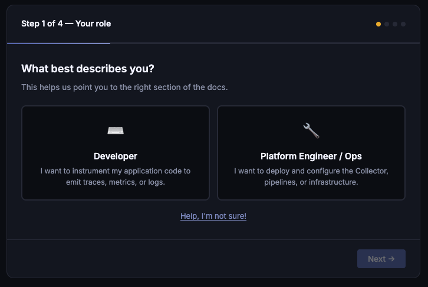
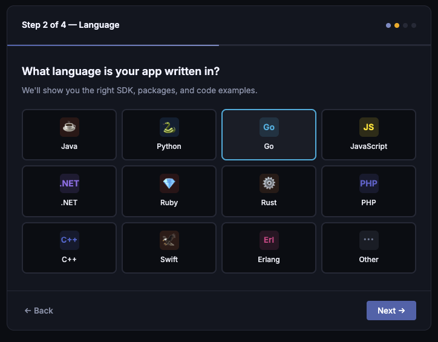
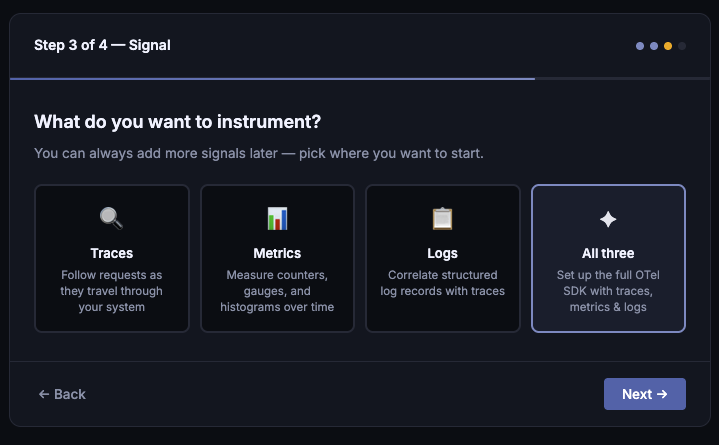
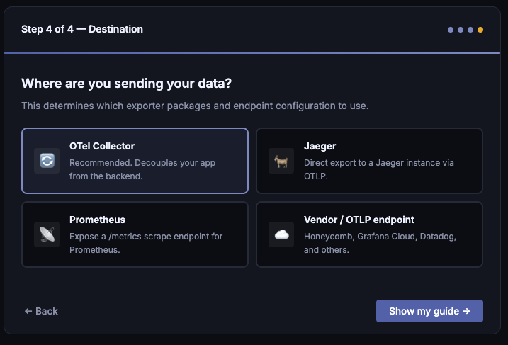
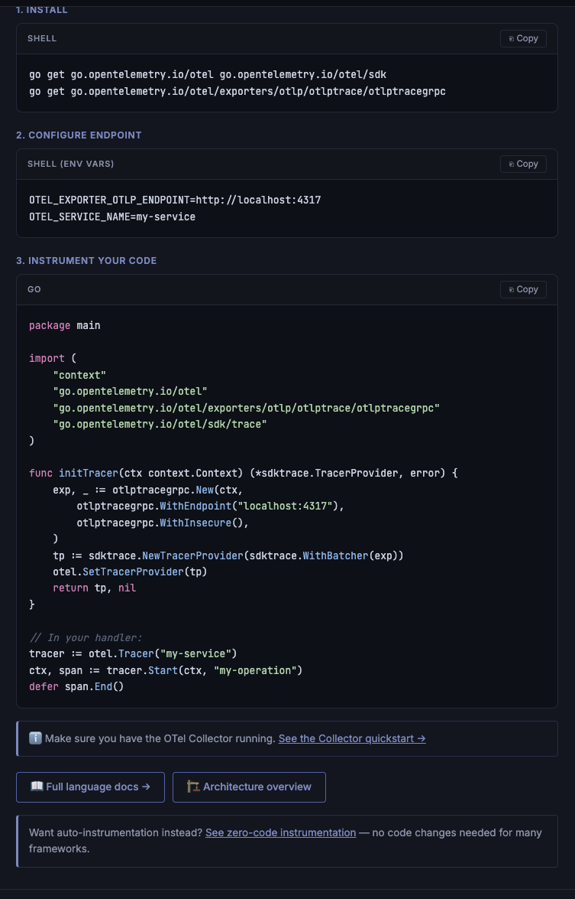

## Description

This oproject redesigns the Getting Started experience on opentelemetry.io by
replacing the current content with a guided, step-by-step wizard. Inspired by
[Certbot's instruction generator](https://certbot.eff.org/instructions), the
wizard collects a few key choices from the user, such as their role, programming
language, telemetry signals of interest, and export destination. Based on these
inputs, the wizard generates a customized set of instructions that are tailored
to the user's specific needs and preferences.

The project resumes the efforts from the [New Getting Started Documentation and
Reference Application][], which was previously started in
[open-telemetry/community#2427][].

## Current Challenges

Before seeing any instrumentation code, users currently navigate from:

1. [Getting Started][]
2. Role selection: Dev / Ops
3. Language documentation index
4. Language getting-started page

However, the language-specific getting started pages are often overwhelming for
users, as they contain a lot of information that may not be relevant to their
specific use case. Those pages are also heavy-focused on **manual
instrumentation**, which may not be the best fit for all users, especially those
who are new to observability.

## Goals, Objectives, and Requirements

### The Wizard

The wizard presents a short sequence of choices and generates a tailored
getting-started guide. The following concept mockups illustrate the flow:

> [!NOTE]
>
> These mockups are a starting point for discussion and are not intended to be
> final designs. The actual implementation may differ based on feedback and
> technical constraints.

#### Step 1: Role Selection

The user identifies as either a Developer or Platform Engineer / Ops.

#### Step 2: Language Selection

The language grid only displays languages that have a completed reference
application implementation. Languages without a reference app are not shown, as
the reference app is a core part of the getting-started experience.

#### Step 3: Signal Selection

The user picks which signals to start with: Traces, Metrics, Logs, or all three.

> [!NOTE]
>
> Baggage and Profiles are intentionally left out of the initial wizard scope,
> as they could be confusing for unexperienced users.

#### Step 4: Export Destination

The user picks where to send telemetry: OTel Collector, Jaeger, Prometheus, or a
Vendor / OTLP endpoint. The generated guide includes exporter configuration
inline and links to setup documentation for the chosen destination.

#### Step 5: Output

Based on the selections, the wizard produces a guide that includess install
commands, environment variables, and instrumentation code for the rolldice
reference application.

### The Reference Application

The rolldice reference application (defined by the [Reference Application
Specification][]) remains the core example used in the wizard guides. Each
supported language needs an implementation that follows the spec.

### Alternative path: OpenTelemetry Demo

For users who prefer to explore a full system before writing coe, the
[OpenTelemetry Demo][demo] remains available as an alternative path within the
wizard — e.g., a "Try the demo instead" option on the first step.

## Deliverables

| Category           | Deliverable                                                                                                    |
| ------------------ | -------------------------------------------------------------------------------------------------------------- |
| **Wizard UX**      | Interactive guided experience on the website that collects user choices and renders a tailored guide           |
| **Reference apps** | Per-language implementations of the rolldice app following the existing spec, built through mentorship program |
| **Guide content**  | Tailored getting-started content for each language / signal / destination combination                          |

## Open Questions

The following details are intentionally deferred for community discussion:

- The Platform Engineer / Ops path needs its own set of wizard steps (deployment
  target, Collector configuration, zero-code instrumentation options, etc). What
  does that flow should look like?
- Does selecting a single signal filter the output content, reorder sections, or
  just set expectations? The answer to this question may impact the amount of
  content we need to create for each combination of options.
- ...

## Timeline

This proposal intentionally does not include a detailed timeline, as the project
is expected to secure conceptual buy-in on the overall approach before diving
into implementation details. Once the high-level design is agreed upon, we can
define a more concrete timeline with the milestones.

## Related Resources

- [New Getting Started Documentation and Reference Application][]
- [Reference Application Specification][]

[New Getting Started Documentation and Reference Application]:
  https://github.com/open-telemetry/community/blob/main/projects/new-getting-started-docs-and-reference-application.md
[open-telemetry/community#2427]:
  https://github.com/open-telemetry/community/pull/2427
[Getting Started]: /docs/getting-started/
[Reference Application Specification]:
  /docs/getting-started/reference-application-specification/
[demo]: /docs/demo
