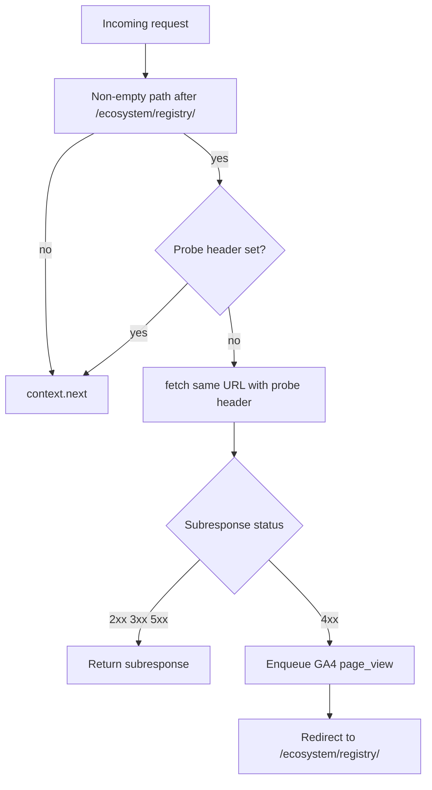

# Registry component redirect edge function (revised)

## Context

The Hugo `redirects` catch-all for old registry paths interacted badly with
markdown negotiation when `Accept: text/markdown` was set, producing unstable
redirect / `cache-status` behavior
([opentelemetry.io#9633](https://github.com/open-telemetry/opentelemetry.io/issues/9633)).
Dropping that rule in favor of **`registry-component-redirect`** removed the
loop while preserving redirects for missing component URLs.

## Desired behavior (authoritative)

1. **Path gate**: Only handle requests whose pathname has a **non-empty path
   segment** after `/ecosystem/registry/`—equivalently match
   `/ecosystem/registry/(.+)` for **any** captured suffix, including
   `index.html`, `index.md`, and `index.json`. Bare `/ecosystem/registry` and
   `/ecosystem/registry/` do **not** match (no subrequest; `context.next()`
   only). Real assets under those paths are served via the **probe** (`fetch`
   with the probe header → `context.next()` on the subrequest).
2. **Probe**: For matching requests, perform a **subrequest** to the same URL
   (typical pattern: `fetch()` with the incoming URL, same method where
   appropriate—usually **GET** or **HEAD** aligned with the client request).
3. **Interpret subresponse status**:
   - **2xx, 3xx, or 5xx**: return that subresponse to the client (pass through
     status, headers, and body as needed—mirror “what the origin returned”).
   - **4xx**: enqueue a GA4 **`page_view`** via Measurement Protocol (same
     endpoint/credentials as `asset_fetch`; see
     [`enqueueGa4PageViewEvent`](../../netlify/edge-functions/lib/ga4-mp.ts)),
     then respond with a **redirect to `/ecosystem/registry/`** (preserve
     incoming **query string** unless product says otherwise).

   **Note (GA4 `page_view` dimensions):** These Measurement Protocol `page_view`
   events do **not** mirror every dimension a browser `gtag` `page_view` would
   collect (referrer, document title, enhanced measurement, full session
   stitching, etc.). That is **by design**—keep the edge payload simple while
   still recording **`client_id`**, **`page_location`**, and
   **`engagement_time_msec`** for the missed URL. Extend
   [`enqueueGa4PageViewEvent`](../../netlify/edge-functions/lib/ga4-mp.ts) later
   if you need closer parity.

4. **Non-matching** paths: bare `/ecosystem/registry` and `/ecosystem/registry/`
   only—**`context.next()`** with no outer `fetch` (the registry index page and
   its normal pipeline, including markdown negotiation when applicable).

## Recursion / double-fetch guard

The path gate does **not** replace a probe guard: a subrequest uses the **same**
pathname as the client (e.g. `/ecosystem/registry/old-component-slug` or
`/ecosystem/registry/index.json`), so it still matches the gate. Without a
distinguisher, the handler would run again on that `fetch` and recurse.

**Required** (unless Netlify documents that same-origin `fetch` from an edge
function bypasses edge for that URL—do not assume): send a dedicated **internal
request header** on the subrequest (e.g. `X-Otel-Registry-Component-Probe: 1`)
and, at the **top** of this handler, if that header is present **immediately**
`return context.next()` so the probe hits static / downstream logic without
probing again.

## Netlify registration

- Add `[[edge_functions]]` in [`netlify.toml`](../../netlify.toml) **above**
  `markdown-negotiation` so this runs first on overlapping paths.
- Use **`path = "/ecosystem/registry/*"`**
  ([`URLPattern`](https://developer.mozilla.org/en-US/docs/Web/API/URL_Pattern_API)
  wildcard, same style as `/schemas/*` in this repo). Per MDN, `*` is greedy and
  matches zero or more characters after that slash, so `/ecosystem/registry/`
  also matches; the handler’s path gate immediately `next()`s there. The probe
  header still prevents inner `fetch` recursion.

## Remove legacy Hugo redirect

- Delete
  `redirects: [{ from: /ecosystem/registry*, to: '/ecosystem/registry?' }]` and
  the Netlify self-loop commentary from
  [`content/en/ecosystem/registry/_index.md`](../../content/en/ecosystem/registry/_index.md)
  once the edge function is deployed, so routing is defined in one place.

## Files to add / touch

- [`netlify/edge-functions/registry-component-redirect.ts`](../../netlify/edge-functions/registry-component-redirect.ts)
  — barrel export.
- [`netlify/edge-functions/registry-component-redirect/index.ts`](../../netlify/edge-functions/registry-component-redirect/index.ts)
  — handler + small helpers (path parse, build redirect URL, build probe
  `Request`).
- [`netlify/edge-functions/registry-component-redirect/index.test.ts`](../../netlify/edge-functions/registry-component-redirect/index.test.ts)
  — unit tests (`node:test`); see **Unit tests** below.
- [`netlify/edge-functions/registry-component-redirect/live-check.test.mjs`](../../netlify/edge-functions/registry-component-redirect/live-check.test.mjs) +
  registration in
  [`netlify/edge-functions/tests/live-check.test.mjs`](../../netlify/edge-functions/tests/live-check.test.mjs);
  [`package.json`](../../package.json) /
  [`netlify/edge-functions/README.md`](../../netlify/edge-functions/README.md)
  if other functions document live runners.

## Unit tests (required; same as other edge functions)

Ship
[`netlify/edge-functions/registry-component-redirect/index.test.ts`](../../netlify/edge-functions/registry-component-redirect/index.test.ts)
alongside the handler, using **`node:test`** and the same import/style patterns
as [`markdown-negotiation`](../../netlify/edge-functions/markdown-negotiation/),
[`asset-tracking`](../../netlify/edge-functions/asset-tracking/), and
[`schema-analytics`](../../netlify/edge-functions/schema-analytics/). Discovery
is automatic: root script [`npm run test:edge-functions`](../../package.json)
runs `node --test "netlify/edge-functions/**/*.test.ts"`—no new npm script is
required once the file exists.

### Test-writing guidance (site)

Follow
[**Testing — Test assertions**](../../content/en/site/testing/_index.md#test-assertions):
prefer **`assert.strictEqual`** with a **short third-argument label** (for
example `HTTP status`, `Location`, `Content-Type`), use **`assert.match`** when
a regex expresses intent better than `includes` chains, and **avoid** long
custom `assert.ok` failure strings. Keep tests **DRY**: reuse
[`netlify/edge-functions/lib/test-helpers.ts`](../../netlify/edge-functions/lib/test-helpers.ts)
(and any other shared edge-test utilities) where appropriate; add **new shared
helpers** next to this function’s tests (for example
`registry-component-redirect/test-helpers.ts`) when the same setup or assertions
repeat—do not copy-paste large blocks across cases.

Use **`t.mock.method(globalThis, 'fetch', ...)`** (or the repo’s prevailing mock
pattern) once in a helper if multiple cases need the same `fetch` stub shape.

**Cover at minimum:**

- **Path gate**: `/ecosystem/registry` and `/ecosystem/registry/` → `next()`
  only (no `fetch`); `/ecosystem/registry/foo` → probe path taken.
- **Probe header**: incoming request with probe header → immediate `next()`.
- **Subresponse passthrough**: mocked `fetch` returns 2xx / 3xx / 5xx → client
  sees that status (and body/headers where relevant).
- **4xx branch**: mocked `fetch` returns 4xx → redirect `Location` is
  `/ecosystem/registry/` (plus preserved query); MP **`page_view`** captured via
  `setupGa4CapturingFetchMock` / `firstMpEventNamed` (see
  [`netlify/edge-functions/lib/test-helpers.ts`](../../netlify/edge-functions/lib/test-helpers.ts)).

## Redirect semantics

- **Location**: origin-relative **`/ecosystem/registry/`** (trailing slash per
  your spec).
- **Status**: Prefer **301** for permanent “slug removed” unless analytics
  prefers **302**; keep consistent with existing site redirects.

## Out of scope

- Localized `/es/ecosystem/registry/...` trees unless you extend the same
  pattern later.
