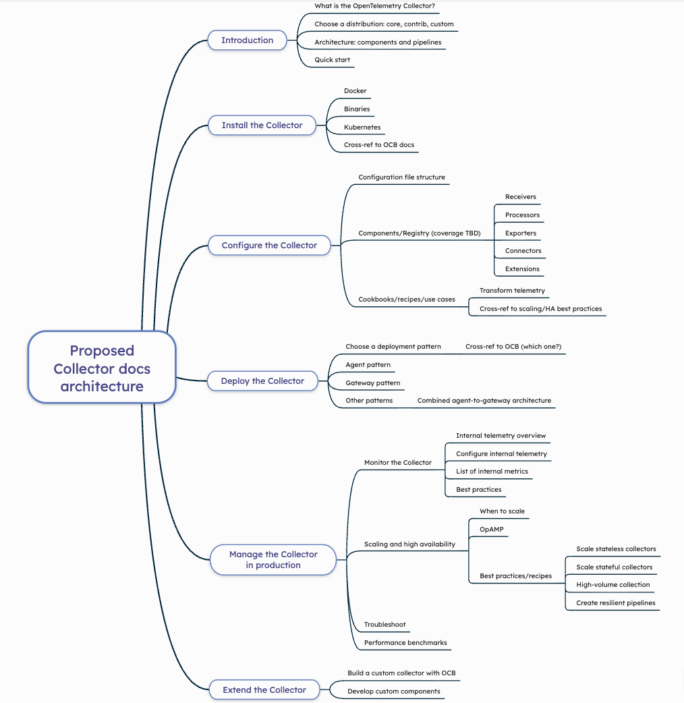
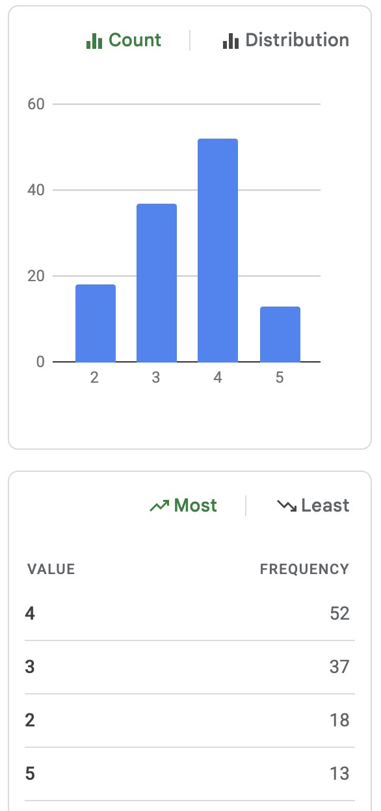
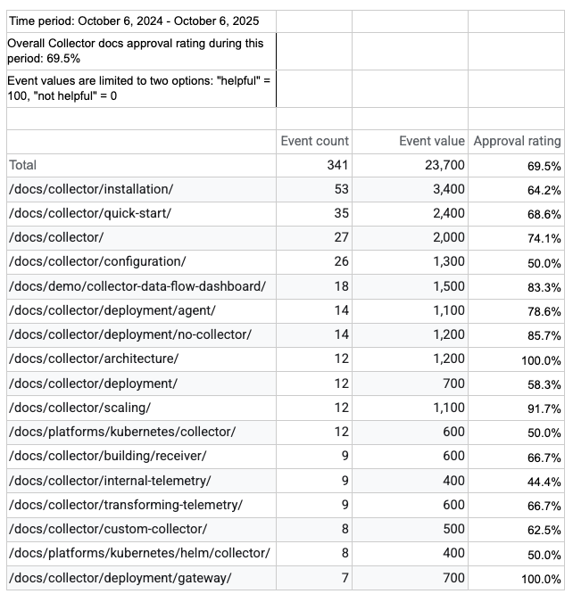
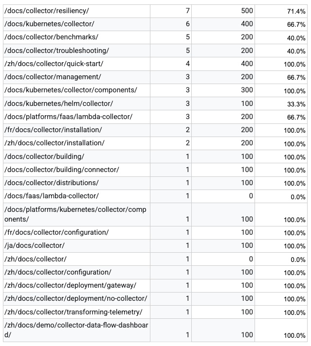

# OpenTelemetry Collector Documentation Refactoring

A cross-SIG effort by Communications and Collector SIGs.

## Description

The Communications SIG is prioritizing a refactor of the Collector
documentation. Our 2024 survey and usage data prove that the Collector docs are
a heavily referenced component of opentelemetry.io. This refactoring should
address user requests, such as adding more examples for end users and improving
access to component documentation housed in code repos. The information
architecture also needs to be thoughtfully redesigned to enhance findability. We
hope to leverage the experiences of end-user volunteers and Collector approvers
and maintainers to create a better docs set in preparation for the v1.0
Collector release and OpenTelemetry project graduation.

### Current challenges

This refactoring is necessary for several reasons:

- The Collector docs have grown organically, which means there is no longer a
  clear information architecture and the top-level Table of Contents (TOC) is a
  bit sprawling.
- Many recent changes to the Collector are not reflected in the docs. An audit
  hasn't been conducted in a long time.
- We've received feedback from docs users:
  - The quickstart is confusing.
  - What actually _is_ the Collector?
  - We need more examples, including diagrams.
  - Where are the component docs?

### Goals, objectives, and requirements

Our primary goals are as follows:

- Restructure the architecture to increase findability and reflect the user
  journey we want users to follow.
- Clarify and distinguish concepts and features.
- Unify terminology.
- Add examples and visual aids.
- Improve the troubleshooting documentation.
- Incorporate the component documentation into opentelemetry.io.
- Identify areas for future improvement that are beyond the scope of this
  project.

## Deliverables

The project will occur in four phases.

### Phase 1: Rearchitect the docs and begin moving pages

In this phase, we propose a new architecture for the documentation based on
analysis of 4+ years of Slack threads.

The architecture was proposed and approved by stakeholders at the Collector SIG
meeting on 3 September 2025. Here is the approved architecture:

Following approval of the new IA, we begin the rearchitecture with sections that
require moving only existing pages or breaking up existing pages into multiple
pages. The following sections don't need new content immediately in order to
make sense:

- Install the Collector
- Deploy the Collector
- Extend the Collector

In addition to moving and breaking up pages, we must copy edit all of the
content as follows:

- Style guide compliance
  - Standardize Collector-related terminology
  - Sentence case headings
  - Capitalization of some terms and not of others
  - Using “for example” instead of e.g. and “in other words” (or similar) for
    i.e.
  - Using “using”, “with”, “by”, etc. for via
- Clarity
- Grammar
  - Unnecessary passive voice
  - Unnecessary adverbs and general wordiness
  - Future tense - should almost always be present tense
- Tone/voice continuity
- Short code admonitions instead of Markdown notes

Finally, we can ask the Collector SMEs to review the content for accuracy.

### Phase 2: Create sections that require new content

In this phase, we begin work on sections that need significant changes:

- Introduction
  - New: Introduction landing page
  - New: What is the Collector?
  - New: Choose a distribution
  - Changes?: Architecture
- Configure the Collector
  - New: Configuration file structure
  - New: Components landing page
  - New: Receivers/Processors/Exporters/etc - add a hyperlinked list?
  - New: Recipes landing page
- Deploy the Collector (follow up)
  - New: Choose a deployment pattern
  - New: Other patterns landing page
  - New: Combined agent-to-gateway pattern
- Manage the Collector
  - New: Monitor the Collector landing page
  - New: Scaling and HA landing page
  - New: OpAMP docs
  - New: Scaling best practices landing page and child pages?

### Phase 3: Identify and fix what's missing or incorrect

The Collector docs haven’t been audited in a long time, if ever. Lots of content
is outdated or incorrect and lots of new stuff is missing.

Users are also clamoring for more examples of all types, including visuals.

We can check Google analytics website usage information to help prioritize the
page-by-page gap analysis.

We can also use AI to help us:

- Prioritize which pages to focus on first.
- Identify the most common questions.
- Create examples? Might be interesting to try.

The following are potential sources to identify gaps that lead to user
questions:

- Comms repo issues (both open and closed) for Collector docs
- Slack channel (#otel-collector)
- Collector survey responses to the question "If you could improve one part of
  the Collector documentation, what would it be and why?"
- Kapa.ai website search information and coverage gap analytics
- User interviews - solicit participants from Slack?
- Maintainer interviews - we could also ask them to identify gaps as they review
  docs pages during the rearchitecture
- Results of Collector survey question “If you could improve one part of the
  Collector documentation, what would it be and why?”
- Reddit, StackOverflow, HackerNews, ??

The following are potential sources for examples, recipes, tutorials, etc.:

- Third-party blog posts about the Collector
- End-user OTel Me interviews
- `https://www.otelbin.io/` for diagrams of Collector configurations

We should audit the core and contrib repositories to see if any docs content can
be ported to the website. Component documentation must stay in the code repos,
but we are exploring ways to incorporate it into the website. We have
implemented an MVP called the
[Collector Watcher](https://github.com/jaydeluca/collector-watcher) to
automatically update hyperlinked lists of component metadata in the official
docs, and we will iterate on this process, data scope, and visualizations.

### Phase 4: Measure success and identify opportunities for future improvement

We are refactoring the documentation to improve the Collector user experience.
But how do we measure whether we’ve succeeded? Unfortunately, as an open source
project without a backend, we don’t have access to some of the more telling
statistics. For example, we can't tell if a docs user installed the
SDK/Collector/etc. they read about or if they are sending data. Instead, here
are some of the options we do have to measure success:

#### Measure No. 1: Survey questions

One gauge we have is a question included in the annual Collector survey:

> Overall, how satisfied are you with the Collector documentation on
> opentelemetry.io? Very dissatisfied 1 2 3 4 5 Very satisfied

The 2025 results show that users are generally satisfied with the documentation.
Out of 120 respondents:

- The majority (65) rated the documentation 4 or 5.
- No one rated the documentation 1.
- The average rating was 3.5.

We should ask the question in future surveys to determine if users are overall
_more_ satisfied with the documentation.

#### Measure No. 2: Was this page helpful?

We can use the results of the “Was this page helpful?” feedback buttons on each
page as tracked in Google Analytics.

During the 12-month period October 6, 2024 to October 6, 2025, the overall
approval rating (of the visitors who hit a feedback button, the percent who
selected “yes, this page was helpful”) for page paths containing “collector” was
**69.5%**, though some pages scored considerably lower.

#### Measure No. 3: Polling data

Conduct a poll in the #otel-collector Slack channel. But what and how should we
ask?

## Staffing / Help Wanted

Project lead: [Tiffany Hrabusa](https://github.com/tiffany76)

Support provided by: Collector approvers and maintainers

## Meeting Times

No dedicated meeting. If synchronous discussion is required, we will raise
topics in the Communications and/or Collector SIG meetings.

### Meeting Links

The Communications SIG
[meets](https://zoom.us/j/93342444192?pwd%3DUVZSS2t4cHNpNFozUldKeXNQYTZIdz09)
every other Tuesday at 09:00 PT.

The Collector SIG
[meets](https://zoom.us/j/97380657643?pwd%3DRzJhQUp2ZHc0aHlma1dPRDNsVWlNQT09)
weekly on an alternating schedule to accommodate all time zones.

See the
[Community Special Interest Group list](https://github.com/open-telemetry/community?tab=readme-ov-file#special-interest-groups)
and
[OpenTelemetry calendar](https://calendar.google.com/calendar/u/0/embed?src=c_2bf73e3b6b530da4babd444e72b76a6ad893a5c3f43cf40467abc7a9a897f977@group.calendar.google.com)
for more details.

## Discussion

Join the following CNCF Slack channels:

- [#otel-comms](https://cloud-native.slack.com/archives/C02UN96HZH6)
- [#otel-collector](https://cloud-native.slack.com/archives/C01N6P7KR6W)
- [#otel-collector-dev](https://cloud-native.slack.com/archives/C07CCCMRXBK)

## Timeline

The following list of completion dates is tentative and subject to change.

- Phase 1: 31 December 2025
- Phase 2: 27 February 2026
- Phase 3: 20 March 2026
- Phase 4: 15 May 2026

## Labels

`sig:collector:refactor`

## Linked Issues and PRs

- [Open issues](https://github.com/open-telemetry/opentelemetry.io/issues?q=is%3Aissue%20state%3Aopen%20label%3Asig%3Acollector%3Arefactor)
- [Closed issues](https://github.com/open-telemetry/opentelemetry.io/issues?q=is%3Aissue%20state%3Aclosed%20label%3Asig%3Acollector%3Arefactor)
- [Open PRs](https://github.com/open-telemetry/opentelemetry.io/pulls?q=is%3Aopen+is%3Apr+label%3Asig%3Acollector%3Arefactor)
- [Closed PRs](https://github.com/open-telemetry/opentelemetry.io/pulls?q=is%3Apr+label%3Asig%3Acollector%3Arefactor+is%3Aclosed)

## Project Board

[SIG Comms + SIG Collector: Doc refactoring project board](https://github.com/orgs/open-telemetry/projects/174/views/2)
